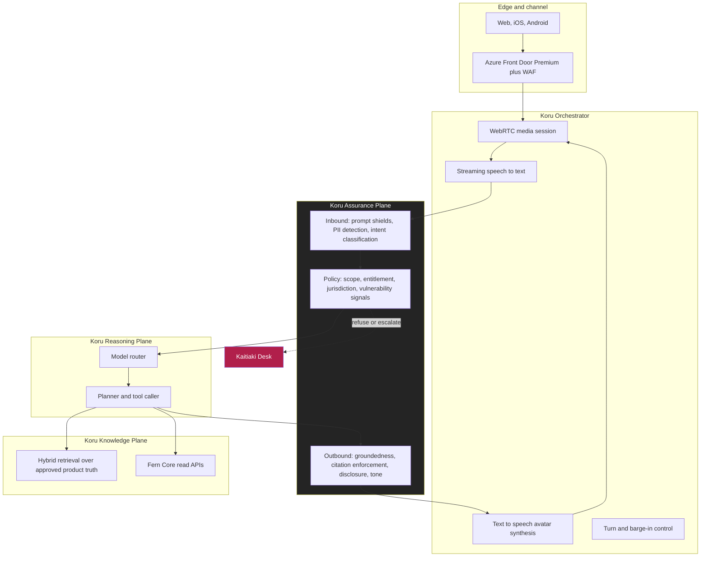

# Architecture Review Board Submission

**Document ID:** FB-KORU-001
**Version:** 1.0
**Date:** 27 August 2026
**Owner:** Fern Bank Enterprise Architecture
**Status:** Submitted for decision
**Board date requested:** 10 September 2026
**Decision sought:** Design Approval, Phase 0 and Phase 1, with conditions

---

## 1. Submission summary

| Field | Detail |
|---|---|
| Programme | Project Koru |
| Initiative | Real-time conversational avatar for personal retail banking |
| Jurisdictions | New Zealand (Fern Bank Limited), Australia (Fern Bank Australia Limited) |
| Accountable executive | Chief Technology Officer |
| Business sponsor | Chief Executive, Personal Banking |
| Architecture owner | Chief Architect, Digital Channels |
| Risk classification | **High**, on the basis of customer-facing generative AI in a regulated financial context |
| Model risk tier | **Tier 1**, per FB-KORU-430 |
| Change classification | Major, new platform capability |
| Prior ARB engagement | Concept briefing, 4 June 2026. Board directed a full submission with explicit regulatory mapping and a phased risk position. This document responds to that direction. |

---

## 2. The decision we are asking for

We request **Design Approval for Phase 0 and Phase 1 only**, subject to the conditions in section 8.

**In scope of this decision**

| Phase | Capability | Risk exposure |
|---|---|---|
| Phase 0, Foundations | Platform build, guardrails, evaluation harness, red team, internal staff pilot with synthetic data. No customer traffic. | Nil customer exposure |
| Phase 1, Koru Informs | Read-only conversation for authenticated customers. Balance and transaction enquiry, product and fee explanation, rate questions, general servicing navigation. | Information only. No value movement, no data mutation, no advice |

**Explicitly out of scope of this decision**

| Phase | Capability | Why not now |
|---|---|---|
| Phase 2, Koru Assists | Low-risk servicing actions such as card freeze and dispute lodgement | Requires proven Phase 1 guardrail performance and a write-path threat model refresh |
| Phase 3, Koru Acts | Payments and value movement inside limits | Requires step-up authentication design, signed intent, and a fraud model that does not yet exist |
| Phase 4, Koru Advises | Budgeting and goal coaching | Requires a financial advice licensing determination in both jurisdictions |

We are deliberately asking for less than the programme ambition. The Board should read Phases 2 to 4 as context for judging whether these foundations are sound, not as an approval request.

---

## 3. What Koru is

Koru is a conversational avatar. A customer opens Fern Bank on web or mobile, taps to talk, and speaks with a synthesised presenter that listens, answers, and shows supporting information on screen alongside the conversation.

Underneath, it is five planes.

The full design is in [FB-KORU-200](docs/02-architecture/solution-architecture.md).

---

## 4. Why this design, in four decisions

The Board's time is best spent on the decisions that were genuinely contested. All fourteen are recorded in [the ADR set](docs/02-architecture/adr/README.md). These four shaped everything else.

### 4.1 The Assurance Plane is a service, not a library

We rejected the common pattern of embedding safety checks as SDK calls inside the application. Instead, every inbound and outbound turn crosses a separately deployed, separately owned policy service that fails closed.

This costs us roughly 90 milliseconds of added latency per turn. We accepted that cost because it gives us one enforceable choke point, one audit surface, and the ability to change policy without redeploying the application. Under CPS 234 and the RBNZ cyber resilience guidance, "we can demonstrate the control was applied to every interaction" is worth far more than 90 milliseconds.

See [ADR-0006](docs/02-architecture/adr/ADR-0006-assurance-plane-as-a-service.md).

### 4.2 Grounded or silent

Koru may not generate a substantive answer about a product, fee, rate, term or entitlement unless that answer is supported by a retrieved, approved, versioned source. If groundedness falls below threshold, Koru says it does not know and offers a human.

We tested the alternative. A model permitted to answer from parametric knowledge produced plausible, fluent and materially wrong statements about fee structures in our evaluation set. In a regulated context that is a conduct failure, and it would be a conduct failure at conversational speed and conversational scale.

See [ADR-0007](docs/02-architecture/adr/ADR-0007-grounded-response-only.md).

### 4.3 Voice is not an authentication factor

Koru hears the customer's voice on every turn. It would be architecturally convenient to use that voice as a factor. We will not.

Generative voice cloning is now cheap, fast and effective from a few seconds of reference audio, which social media supplies for a large share of our customers. Treating a voiceprint as a possession or inherence factor for financial authorisation would be building on sand. Authentication remains with Fern ID, passkeys and step-up challenges, and the voice channel is treated as untrusted input throughout.

See [ADR-0004](docs/02-architecture/adr/ADR-0004-no-voice-biometric-authentication.md).

### 4.4 Two sovereign deployments, no shared plane

New Zealand and Australia run as fully separate deployments with no cross-Tasman replication of customer content, transcripts, embeddings or model telemetry. Resilience is delivered through availability zones within jurisdiction, not through regional failover across it.

This is more expensive and operationally heavier than a single trans-Tasman platform. It is the only design we could defend simultaneously to the RBNZ under BS11 and to APRA under CPS 230, and the only one that gives a clean answer to a customer asking where their conversation is stored.

See [ADR-0003](docs/02-architecture/adr/ADR-0003-jurisdictional-isolation.md).

---

## 5. Regulatory position

Full analysis is in the [compliance set](docs/04-compliance/regulatory-landscape.md). Summary position for the Board.

| Instrument | Jurisdiction | Position | Evidence |
|---|---|---|---|
| APRA CPS 230 Operational Risk Management | AU | Koru is assessed as supporting, not constituting, a critical operation in Phase 1. Microsoft Azure is registered as a **material service provider**. Tolerance levels defined, degradation ladder tested. | [FB-KORU-410](docs/04-compliance/apra/cps-230-operational-risk.md) |
| APRA CPS 234 Information Security | AU | Information assets classified, controls mapped, testing programme defined, 72 hour notification path wired into incident response. | [FB-KORU-411](docs/04-compliance/apra/cps-234-information-security.md) |
| APRA CPG 235 Managing Data Risk | AU | Data risk assessed across the full AI lifecycle including retrieval corpora and evaluation sets. | [FB-KORU-412](docs/04-compliance/apra/cpg-235-data-risk.md) |
| RBNZ BS11 Outsourcing | NZ | Arrangement recorded in the outsourcing compendium. Separation plan extended to cover Koru. Basic banking services remain available without Koru by design. | [FB-KORU-420](docs/04-compliance/rbnz/bs11-outsourcing.md) |
| RBNZ Cyber Resilience Guidance | NZ | Board oversight path, framework self-assessment, and material incident reporting defined. | [FB-KORU-421](docs/04-compliance/rbnz/cyber-resilience.md) |
| Privacy Act 2020 (NZ) | NZ | PIA complete. IPP 1 to 13 assessed, including IPP 12 cross-border disclosure, which the sovereign design largely avoids. | [FB-KORU-440](docs/04-compliance/privacy/privacy-impact-assessment.md) |
| Privacy Act 1988 and APPs (AU) | AU | PIA complete. APP 1 to 13 assessed, with specific attention to APP 8 and APP 11. | [FB-KORU-440](docs/04-compliance/privacy/privacy-impact-assessment.md) |
| CoFI fair conduct (NZ) | NZ | Koru behaviour mapped to the fair conduct programme, including vulnerable customer handling. | [FB-KORU-400](docs/04-compliance/regulatory-landscape.md) |
| ISO/IEC 42001 AI management | Both | Used as the AI management system backbone. Gap assessment complete. | [FB-KORU-431](docs/04-compliance/ai-governance/responsible-ai-assessment.md) |

**The single most important regulatory statement in this pack:** basic banking services never depend on Koru. If Koru is entirely unavailable, every customer can still see balances, move money and reach a human through existing channels. This is what makes the BS11 and CPS 230 position defensible, and it is enforced architecturally, not by policy.

---

## 6. Risk position

Top risks. Full register in [FB-KORU-602](docs/06-delivery/raid-log.md).

| ID | Risk | Inherent | Residual | Primary treatment |
|---|---|---|---|---|
| KORU-R-01 | Koru gives a confidently incorrect answer on fees, rates or terms | High | **Medium** | Grounded-only responses, citation enforcement, refusal thresholds, continuous evaluation |
| KORU-R-02 | Prompt injection via retrieved content or customer input causes policy bypass | High | **Medium** | Prompt shields, content provenance, tool allow-listing, output policy independent of model |
| KORU-R-03 | Concentration risk on a single AI platform provider | High | **High** | Registered material service provider, tested non-generative fallback, portability layer. **Accepted and escalated to the Board** |
| KORU-R-04 | Vulnerable customer harmed by an efficient but unempathetic interaction | High | **Medium** | Distress signal detection, mandatory human offer, no-pressure design, Kaitiaki Desk |
| KORU-R-05 | Deepfaked customer voice used to social engineer the channel | High | **Low** | Voice is never an authentication factor. All authorisation via Fern ID and step-up |
| KORU-R-06 | Customer believes Koru is human | Medium | **Low** | Mandatory disclosure at session start, on request, and at every handoff |
| KORU-R-07 | Latency makes the experience worse than the phone it replaces | Medium | **Medium** | Sub-second first-token budget, streaming synthesis, explicit SLO with error budget |
| KORU-R-08 | Retrieval corpus drifts out of date and Koru quotes a withdrawn product | Medium | **Low** | Corpus is versioned, owned and expiry-checked. Stale content fails closed |

**KORU-R-03 is presented to the Board as an accepted risk requiring explicit endorsement, not as a solved problem.** We can mitigate concentration. We cannot eliminate it while delivering this capability at this quality.

---

## 7. What we are not confident about

The Board is better served by candour than by polish.

1. **Our latency budget is modelled, not measured, under real network conditions on mid-range Android devices in regional New Zealand.** The design assumes 1.2 seconds to first audible word at p95. If field testing in Phase 0 shows that is unachievable, the experience thesis weakens materially and we will return to the Board.

2. **We do not yet know the true escalation rate.** We have modelled 18 to 25 percent of Phase 1 sessions ending in a human handoff. If it is 45 percent, the Kaitiaki Desk staffing model and the business case both need rebuilding.

3. **Evaluation of conversational safety is an immature discipline.** Our harness covers groundedness, refusal correctness, tone, disclosure and a red team suite. We are confident it catches known failure classes. We are not confident it catches unknown ones, and we do not think anyone credibly is.

4. **The advice boundary is genuinely blurry.** "What is my balance" is information. "Can I afford this" is advice. Customers will not respect the line, and our classifier will sometimes get it wrong. Phase 1 handles this by refusing broadly, which will occasionally frustrate customers who asked a reasonable question.

---

## 8. Conditions we propose

We ask the Board to attach these conditions to any approval. We have written them to be testable rather than aspirational.

| # | Condition | Gate | Evidence |
|---|---|---|---|
| C1 | No customer traffic until the evaluation harness demonstrates groundedness at or above 0.95 and unsafe-response rate at or below 0.1 percent across the full regression suite | Phase 0 exit | Evaluation report, signed by Model Risk |
| C2 | Independent red team exercise completed, with all critical and high findings closed or formally accepted | Phase 0 exit | Red team report and remediation register |
| C3 | Degradation ladder tested end to end, including full AI platform loss, with basic banking services proven unaffected | Phase 0 exit | Continuity test evidence, per FB-KORU-503 |
| C4 | Azure registered as a material service provider, contract uplifted to CPS 230 minimum content, and BS11 compendium and separation plan updated | Before Phase 1 | Legal and Compliance attestation |
| C5 | Phase 1 launches to a capped cohort of no more than 5 percent of digitally active customers, with a documented ramp gate | Phase 1 entry | Release plan and cohort controls |
| C6 | Regulator pre-engagement letters issued to APRA and RBNZ describing the capability, controls and phasing before customer traffic | Before Phase 1 | Correspondence record |
| C7 | Kaitiaki Desk staffed and trained to the modelled escalation rate plus 100 percent headroom for the first 90 days | Phase 1 entry | Workforce plan |
| C8 | Monthly Koru assurance report to the Technology and Operational Risk Committee, including groundedness, refusal, escalation, complaint and vulnerability-flag metrics | Ongoing | Committee papers |
| C9 | Any expansion of tool scope, any model change to a different family, or any change to the refusal policy returns to ARB | Ongoing | Change control record |
| C10 | Phase 2 requires a fresh submission including a write-path threat model and fraud assessment | Phase 2 gate | New ARB submission |

---

## 9. Options considered

| Option | Description | Assessment |
|---|---|---|
| **A. Do nothing** | Continue with current IVR, chat and contact centre | Rejected. Does not address the service gap, and cost to serve continues to rise with volume |
| **B. Text-only assistant** | Grounded chatbot without avatar or voice | Viable and lower risk, but delivers materially less for accessibility, low-literacy and older customers, who are the cohorts our research says benefit most |
| **C. Avatar, vendor SaaS** | Buy a packaged banking avatar product | Rejected. Unacceptable data residency and model governance positions, and no ability to evidence controls to APRA and RBNZ at the required depth |
| **D. Avatar on our own platform, phased** | **Recommended.** Build on Azure inside our landing zones, read-only first | Selected. Highest control, clearest regulatory story, highest build cost |
| **E. Full capability at launch** | Deliver Phases 1 to 3 together | Rejected. Concentrates all risk at a single gate with no evidence base to justify write access |

Option B remains our documented fallback. If Phase 0 evidence does not support the conversational thesis, we can descend to a text-only grounded assistant while reusing the Assurance, Reasoning and Knowledge planes unchanged. That is a deliberate property of the architecture, not a happy accident.

---

## 10. Financial summary

Detail and sensitivities in [FB-KORU-601](docs/06-delivery/cost-model.md).

| Item | Phase 0 | Phase 1 (12 months) |
|---|---|---|
| Build, internal and partner | NZ$4.1m | NZ$3.4m |
| Cloud platform run | NZ$0.6m | NZ$2.9m |
| Kaitiaki Desk uplift | Nil | NZ$1.8m |
| Assurance, model risk, legal | NZ$0.7m | NZ$0.9m |
| **Total** | **NZ$5.4m** | **NZ$9.0m** |

Modelled Phase 1 cost per contained session is NZ$0.38 against a blended assisted-channel cost to serve of NZ$6.10. The business case does not rely on headcount reduction. It relies on absorbing volume growth without proportional cost growth, and on the retention effect of resolving simple questions immediately.

---

## 11. Recommendation

Enterprise Architecture recommends **Design Approval for Phase 0 and Phase 1, subject to conditions C1 through C10**.

The design is sound, the regulatory position is defensible in both jurisdictions, and the risk is bounded by the deliberate decision to withhold write access until the guardrails have been proven against real traffic.

We do not recommend approval beyond Phase 1 at this time, and we would regard a Board decision to grant it as inconsistent with the evidence currently available.

---

## 12. Board decision

| Field | Entry |
|---|---|
| Decision | ☐ Approved ☐ Approved with conditions ☐ Deferred ☐ Rejected |
| Conditions accepted | C1 ☐ C2 ☐ C3 ☐ C4 ☐ C5 ☐ C6 ☐ C7 ☐ C8 ☐ C9 ☐ C10 ☐ |
| Additional conditions | |
| KORU-R-03 concentration risk formally accepted | ☐ Yes ☐ No |
| Next gate | Phase 0 exit review |
| Date | |

| Role | Name | Signature | Date |
|---|---|---|---|
| Chair, Architecture Review Board | | | |
| Chief Technology Officer | | | |
| Chief Risk Officer | | | |
| Chief Information Security Officer | | | |
| General Counsel | | | |
| Chief Executive, Personal Banking | | | |

---

## Appendix A. Reviewer routing

| Reviewer | Read these |
|---|---|
| Chief Information Security Officer | FB-KORU-300, FB-KORU-301, FB-KORU-302, FB-KORU-411 |
| Chief Risk Officer | FB-KORU-401, FB-KORU-410, FB-KORU-430, FB-KORU-602 |
| General Counsel | FB-KORU-400, FB-KORU-420, FB-KORU-440, ADR-0011 |
| Head of Data | FB-KORU-203, FB-KORU-412, FB-KORU-440 |
| Head of Infrastructure | FB-KORU-205, FB-KORU-201, terraform/ |
| Head of Customer Experience | FB-KORU-100, FB-KORU-101, FB-KORU-102, FB-KORU-103 |
| Head of Operations | FB-KORU-500, FB-KORU-502, FB-KORU-503, FB-KORU-504 |

## Appendix B. Reality disclaimer

Fern Bank is fictional. This submission is an illustrative, exercise-grade artefact for architecture review practice and demonstration. Regulatory references are to real published instruments and reflect their intent as understood at the date of writing, but this is not legal or regulatory advice. Verify every citation against the current instrument and obtain qualified professional review before any real-world reliance. See the [programme canon](docs/programme-canon.md#9-reality-disclaimer).
