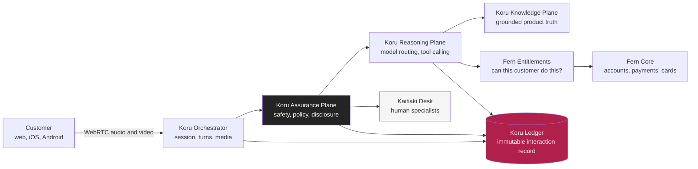

# Project Koru

### The Fern Bank Personal Banking Avatar
**Architecture Review Board submission pack, version 1.0, 27 August 2026**

---

> Every year, Fern Bank has around 14 million conversations with the people who bank with us.
> Roughly nine million of them are someone asking a simple question and waiting too long for a simple answer.
>
> Koru is our answer to those nine million.

---

## What this is

This repository is the complete architecture and governance submission for **Koru**, a real-time conversational avatar for Fern Bank personal retail banking customers in New Zealand and Australia.

It is written to be read by an Architecture Review Board. That means it is not a pitch. It contains the design, the dependencies, the failure modes, the regulatory position, the things we do not yet know, and the specific conditions we are asking the Board to hold us to.

It also contains the infrastructure as code that builds the platform, because an architecture that cannot be provisioned is an opinion, not a design.

## The ask

We are seeking **Design Approval for Phase 0 and Phase 1 only**.

| | |
|---|---|
| **Phase 0, Foundations** | Build the platform, guardrails and evaluation harness. No customer traffic. |
| **Phase 1, Koru Informs** | Read-only conversations. Balances, transactions, product explanations, fees and rates. No money moves. No advice. |

Phases 2 through 4 are described so the Board can see where this leads and can judge whether the foundations are right. **They are not being requested today.** Each is a separate gate.

The full submission, including the conditions we propose the Board attach to any approval, is in **[ARB-SUBMISSION.md](ARB-SUBMISSION.md)**.

---

## The idea in one diagram

Two things in that picture matter more than the rest.

**The Assurance Plane sits between the customer and the model, in both directions.** Nothing reaches the model without passing policy. Nothing reaches the customer without passing policy. It is not a filter bolted onto the end. It is the control point, and it fails closed.

**The Ledger is written to by every plane.** Every prompt, every retrieval, every tool call, every model version, every guardrail decision and every word Koru said is recorded immutably and can be replayed. When a regulator, a dispute resolution scheme or a customer asks "what happened in that conversation and why", we can answer with evidence rather than recollection.

---

## How to read this pack

**If you have fifteen minutes**, read these three:

1. [ARB submission and conditions](ARB-SUBMISSION.md)
2. [Executive summary](docs/00-executive/executive-summary.md)
3. [Solution architecture](docs/02-architecture/solution-architecture.md)

**If you are reviewing a specific domain**, go to your section below.

---

## The pack

### Programme

| Document | ID | What it covers |
|---|---|---|
| [Programme canon](docs/programme-canon.md) | FB-KORU-000 | Names, regions, phases, drafting rules. The source of truth. |
| [ARB submission](ARB-SUBMISSION.md) | FB-KORU-001 | The formal ask, conditions, and sign-off block. |

### 00. Executive

| Document | ID | What it covers |
|---|---|---|
| [Executive summary](docs/00-executive/executive-summary.md) | FB-KORU-010 | The problem, the design, the risk posture, the ask. |
| [Business case](docs/00-executive/business-case.md) | FB-KORU-011 | Benefits, costs, sensitivities, and what would make this a bad idea. |

### 01. Experience

| Document | ID | What it covers |
|---|---|---|
| [Product vision and persona](docs/01-experience/product-vision.md) | FB-KORU-100 | Who Koru is, how she behaves, and what she refuses to do. |
| [Customer journey](docs/01-experience/customer-journey.md) | FB-KORU-101 | End to end journeys, including the ones that go wrong. |
| [Conversation design](docs/01-experience/conversation-design.md) | FB-KORU-102 | Turn taking, grounding, disclosure, repair, and handoff language. |
| [Accessibility and inclusion](docs/01-experience/accessibility-and-inclusion.md) | FB-KORU-103 | WCAG position, te reo Māori, cultural governance, vulnerable customers. |

### 02. Architecture

| Document | ID | What it covers |
|---|---|---|
| [Solution architecture](docs/02-architecture/solution-architecture.md) | FB-KORU-200 | The whole system, plane by plane, with failure behaviour. |
| [Cloud services catalogue](docs/02-architecture/cloud-services-catalogue.md) | FB-KORU-201 | Every Azure service, why it was chosen, its tier, and its exit path. |
| [AI architecture](docs/02-architecture/ai-architecture.md) | FB-KORU-202 | Models, routing, grounding, prompt lifecycle, evaluation. |
| [Data architecture](docs/02-architecture/data-architecture.md) | FB-KORU-203 | Classification, residency, retention, lineage, the Ledger. |
| [Integration architecture](docs/02-architecture/integration-architecture.md) | FB-KORU-204 | APIs, idempotency, compensation, degradation. |
| [Network and connectivity](docs/02-architecture/network-and-connectivity.md) | FB-KORU-205 | Topology, private connectivity, egress control, sovereignty. |
| [Decision records](docs/02-architecture/adr/README.md) | ADR-0001+ | Fourteen decisions, including the ones we argued about. |

### 03. Security

| Document | ID | What it covers |
|---|---|---|
| [Security architecture](docs/03-security/security-architecture.md) | FB-KORU-300 | Zero trust position, controls, key management, secure SDLC. |
| [Threat model](docs/03-security/threat-model.md) | FB-KORU-301 | STRIDE plus adversarial AI threats, with mitigations and residual risk. |
| [Identity and authentication](docs/03-security/identity-and-authentication.md) | FB-KORU-302 | Customer identity, step-up, transaction signing, and why we rejected voice biometrics. |

### 04. Compliance and regulatory

| Document | ID | What it covers |
|---|---|---|
| [Regulatory landscape](docs/04-compliance/regulatory-landscape.md) | FB-KORU-400 | Every instrument that applies, both jurisdictions. |
| [Control matrix](docs/04-compliance/control-matrix.md) | FB-KORU-401 | Master traceability. Obligation to control to evidence to owner. |
| [APRA CPS 230](docs/04-compliance/apra/cps-230-operational-risk.md) | FB-KORU-410 | Critical operations, tolerances, material service providers, 24 hour notification. |
| [APRA CPS 234](docs/04-compliance/apra/cps-234-information-security.md) | FB-KORU-411 | Information security capability, control testing, 72 hour notification. |
| [APRA CPG 235](docs/04-compliance/apra/cpg-235-data-risk.md) | FB-KORU-412 | Data risk management across the AI lifecycle. |
| [RBNZ BS11](docs/04-compliance/rbnz/bs11-outsourcing.md) | FB-KORU-420 | Outsourcing, compendium, separation plan, continuity of basic banking services. |
| [RBNZ cyber resilience](docs/04-compliance/rbnz/cyber-resilience.md) | FB-KORU-421 | Board oversight, framework assessment, incident reporting. |
| [Model risk management](docs/04-compliance/ai-governance/model-risk-management.md) | FB-KORU-430 | Model inventory, validation, monitoring, challenge, retirement. |
| [Responsible AI assessment](docs/04-compliance/ai-governance/responsible-ai-assessment.md) | FB-KORU-431 | Fairness, transparency, contestability, human oversight, ISO 42001. |
| [Privacy impact assessment](docs/04-compliance/privacy/privacy-impact-assessment.md) | FB-KORU-440 | NZ Privacy Act 2020 and Australian Privacy Act 1988, both mapped. |

### 05. Operations

| Document | ID | What it covers |
|---|---|---|
| [Service levels](docs/05-operations/service-levels.md) | FB-KORU-500 | SLOs, SLIs, error budgets, and what we do when we burn one. |
| [Observability and evaluation](docs/05-operations/observability-and-evaluation.md) | FB-KORU-501 | Telemetry, online and offline evaluation, drift detection. |
| [Incident response](docs/05-operations/incident-response.md) | FB-KORU-502 | Severity model, AI-specific incidents, regulator notification clocks. |
| [Business continuity](docs/05-operations/business-continuity.md) | FB-KORU-503 | Tolerance levels, degradation ladder, separation plan, exit. |
| [Runbook](docs/05-operations/runbook.md) | FB-KORU-504 | The commands you run at 3am. |

### 06. Delivery

| Document | ID | What it covers |
|---|---|---|
| [Roadmap](docs/06-delivery/roadmap.md) | FB-KORU-600 | Phases, gates, dependencies, critical path. |
| [Cost model](docs/06-delivery/cost-model.md) | FB-KORU-601 | Build and run cost, unit economics, cost control levers. |
| [RAID log](docs/06-delivery/raid-log.md) | FB-KORU-602 | Risks, assumptions, issues, dependencies. Honest version. |

### Infrastructure as code

| Path | What it covers |
|---|---|
| [terraform/](terraform/README.md) | Eleven Azure modules and three environments, sovereign by construction. |

---

## What we are deliberately not doing

An architecture is defined as much by its refusals as its features. These are ours, and each one is a decision record, not a gap.

| We are not | Why | Decision |
|---|---|---|
| Using voice as an authentication factor | Generative voice cloning has made voiceprints an unacceptable single factor for financial authorisation | [ADR-0004](docs/02-architecture/adr/ADR-0004-no-voice-biometric-authentication.md) |
| Letting the model speak un-grounded about products, fees or rates | A confidently wrong answer about a rate is a conduct breach, not a bug | [ADR-0007](docs/02-architecture/adr/ADR-0007-grounded-response-only.md) |
| Moving money in Phase 1 | Earn the trust on read-only traffic before we accept the risk of write | [ADR-0005](docs/02-architecture/adr/ADR-0005-read-only-first.md) |
| Giving financial advice | Personalised advice is a licensed activity with its own duties. It needs its own approval, not a side effect of a chatbot | [ADR-0011](docs/02-architecture/adr/ADR-0011-no-personal-advice.md) |
| Training foundation models on customer data | Customer conversations are not training data. Retrieval, not absorption | [ADR-0008](docs/02-architecture/adr/ADR-0008-no-customer-data-in-training.md) |
| Replicating customer data across the Tasman | Two regulators, two sovereign deployments, no shortcuts | [ADR-0003](docs/02-architecture/adr/ADR-0003-jurisdictional-isolation.md) |
| Hiding that Koru is not human | Disclosed at the start of every session, and on request, always | [ADR-0012](docs/02-architecture/adr/ADR-0012-mandatory-ai-disclosure.md) |

---

## The uncomfortable part

We think the Board should weigh three risks that we cannot fully engineer away.

1. **A confidently wrong answer at scale.** Grounding, citation enforcement and refusal thresholds reduce this. They do not eliminate it. Our position is that the residual risk is acceptable in Phase 1 because the blast radius is information, not money, and because every answer is replayable from the Ledger. That argument does not survive contact with Phase 3, which is why Phase 3 is a separate gate.

2. **Concentration on a single AI vendor.** We are building on Microsoft Azure. That is a genuine concentration risk under both CPS 230 and BS11. We treat it honestly in [ADR-0009](docs/02-architecture/adr/ADR-0009-model-portability.md) and the [exit strategy](docs/05-operations/business-continuity.md), including a tested fallback to a degraded, non-generative service that keeps basic banking answers flowing if the AI platform is unavailable.

3. **Customers forming a relationship with something that is not a person.** This is the risk nobody puts in the architecture pack. An avatar that is warm, always available and endlessly patient will be trusted more than it deserves by exactly the customers who can least afford to be wrong. Our vulnerable customer detection and mandatory disclosure design in [conversation design](docs/01-experience/conversation-design.md) is our attempt to take this seriously. We would welcome the Board's challenge on whether it goes far enough.

---

## Status

| Item | Status |
|---|---|
| Document set | Complete for Phase 0 and Phase 1 review |
| Security review | Complete, findings in threat model |
| Privacy impact assessment | Complete, both jurisdictions |
| APRA and RBNZ pre-engagement | **Planned**, ahead of Phase 1 traffic |
| Terraform | Provisioning modules complete, validated |
| ARB decision | **Pending** |

---

## A note on what this is

Fern Bank is a fictional institution. This package is an illustrative, exercise-grade submission built for architecture review practice, training and demonstration.

The regulatory analysis references real published instruments from APRA and the RBNZ, and reflects their intent as understood at the date of writing. It is not legal or regulatory advice. Every citation must be verified against the current instrument, and reviewed by qualified legal, risk and compliance professionals, before any real-world use.

See the [reality disclaimer](docs/programme-canon.md#9-reality-disclaimer) for the full statement.
