# Diagram Set

**Document ID:** FB-KORU-220
**Version:** 1.0
**Date:** 27 August 2026
**Owner:** Chief Architect, Digital Channels
**Status:** Submitted for review

**Related documents:** [Solution architecture](../docs/02-architecture/solution-architecture.md) (FB-KORU-200), [ARB submission](../ARB-SUBMISSION.md) (FB-KORU-001)

---

## Purpose

The canonical diagrams for the Project Koru ARB walkthrough, in presentation order. All diagrams are Mermaid so they version, diff and review like code. There are no binary image dependencies in this repository.

Every diagram here is also embedded in its source document. This file exists so the Board can be walked through the architecture in a single pass, in a deliberate order, without page-turning across nine documents.

**Suggested walkthrough:** diagrams 1, 2, 4, 6, 8 and 11. Roughly twenty minutes.

---

## 1. Context. Where Koru sits

The first thing the Board should see is that Koru is beside the bank, not in front of it.

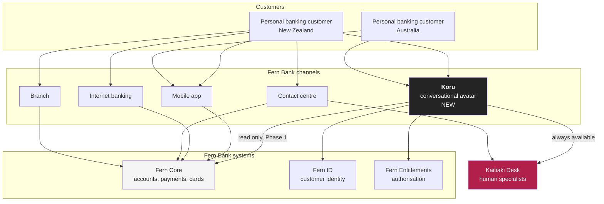

**The point of this diagram.** Every other channel reaches Fern Core independently of Koru. Remove Koru entirely and every customer can still bank. This is the architectural fact underpinning both the APRA CPS 230 critical operations position and the RBNZ BS11 basic banking services position.

---

## 2. The five planes

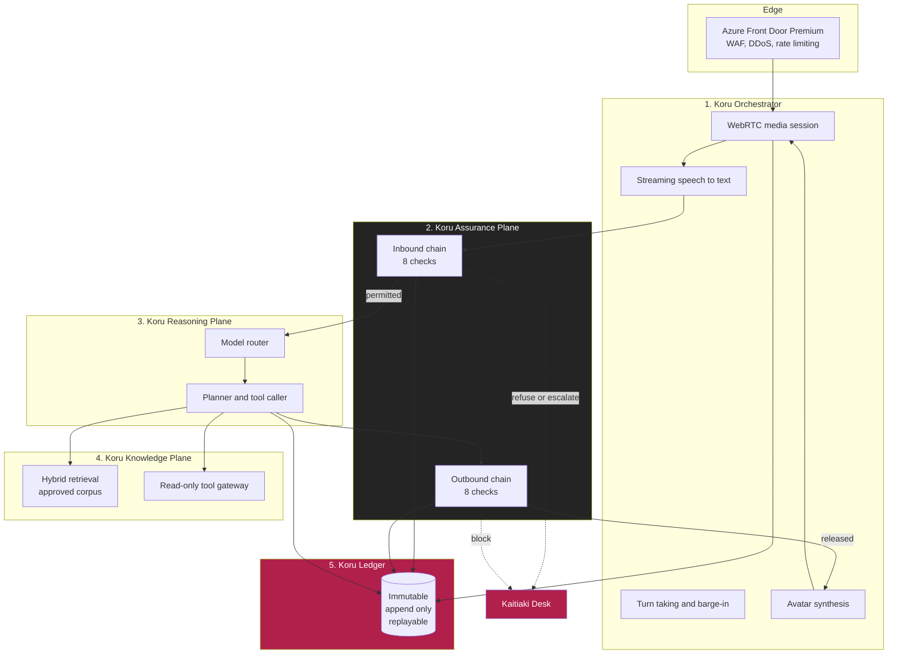

**The point of this diagram.** There is no arrow from the Reasoning Plane to the customer. The only path out is through the Assurance Plane, and that is enforced by network policy, not by application code. See [ADR-0006](../docs/02-architecture/adr/ADR-0006-assurance-plane-as-a-service.md).

---

## 3. The Assurance Plane in detail

```mermaid
flowchart LR
    U["Customer<br/>utterance"] --> I1

    subgraph IN["Inbound, parallel where possible"]
        I1["Session and<br/>identity validity"]
        I2["Rate and<br/>cost limits"]
        I3["Prompt shield<br/>injection detection"]
        I4["PII detection<br/>and minimisation"]
        I5["Intent and<br/>scope check"]
        I6["Advice boundary<br/>classifier"]
        I7["Distress and<br/>vulnerability signals"]
        I8["Jurisdiction and<br/>entitlement pre-check"]
    end

    I1 --> I2 --> I3 --> I4 --> I5 --> I6 --> I7 --> I8
    I8 -->|permitted| R["Reasoning Plane"]
    R --> O1

    subgraph OUT["Outbound, streaming where possible"]
        O1["Groundedness<br/>score >= 0.95"]
        O2["Citation<br/>binding"]
        O3["Content<br/>safety"]
        O4["Protected<br/>material"]
        O5["Advice boundary<br/>on output"]
        O6["Disclosure<br/>obligations"]
        O7["Tone and<br/>reading level"]
        O8["Numeric<br/>verification"]
    end

    O1 --> O2 --> O3 --> O4 --> O5 --> O6 --> O7 --> O8
    O8 -->|released| S["Avatar synthesis"]

    I3 -.-> REF["Refuse<br/>and offer<br/>a human"]
    I5 -.-> REF
    I6 -.-> REF
    I7 -.-> VP["Vulnerability<br/>protocol"]
    O1 -.-> REF
    O8 -.-> REF

    style IN fill:#242424,color:#ffffff
    style OUT fill:#242424,color:#ffffff
    style REF fill:#b11f4b,color:#ffffff
    style VP fill:#b11f4b,color:#ffffff
```

**The point of this diagram.** The advice boundary is checked twice, on the way in and on the way out. The outbound check exists because the most likely advice breach is Koru adding a helpful recommendation to an otherwise legitimate answer, after the inbound check has already passed. See [ADR-0011](../docs/02-architecture/adr/ADR-0011-no-personal-advice.md).

---

## 4. One conversational turn, with the latency budget

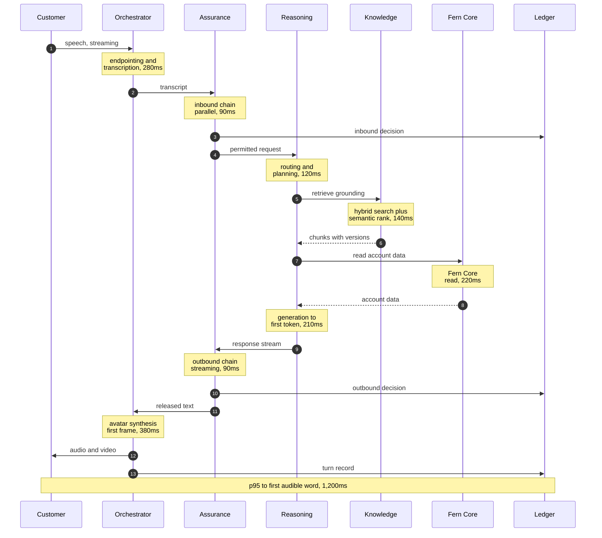

| Hop | Budget | Notes |
|---|---:|---|
| Speech recognition and endpointing | 280ms | Streaming, overlaps with speech |
| Assurance inbound | 90ms | Checks run in parallel |
| Reasoning, routing and planning | 120ms | |
| Knowledge retrieval | 140ms | Hybrid plus semantic ranking |
| Fern Core read | 220ms | **Currently measuring 340ms. Issue KORU-I-03** |
| Generation to first token | 210ms | |
| Assurance outbound | 90ms | Streams against tokens |
| Avatar synthesis, first frame | 380ms | Overlaps with generation |
| Network and client | 60ms | |
| **Effective p95, accounting for overlap** | **1,200ms** | Assumption KORU-A-01, **unproven** |

**The point of this diagram.** The two numbers most likely to break the design are the Fern Core read at 220ms, which currently measures 340ms, and the overall 1.2 second target, which is modelled rather than measured. Both are open items in the [RAID log](../docs/06-delivery/raid-log.md).

---

## 5. The refusal path

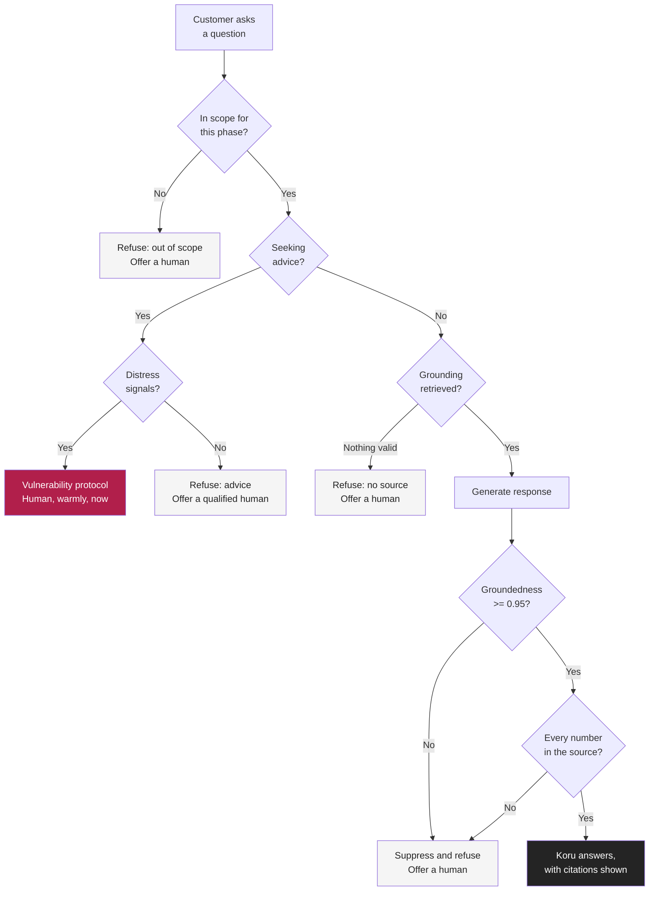

**The point of this diagram.** Note the ordering at the advice branch. A distressed customer asking for advice gets a human, not a lecture about licensing. That ordering is explicit policy and is tested. See [ADR-0011](../docs/02-architecture/adr/ADR-0011-no-personal-advice.md).

---

## 6. Sovereignty. Two deployments, no bridge

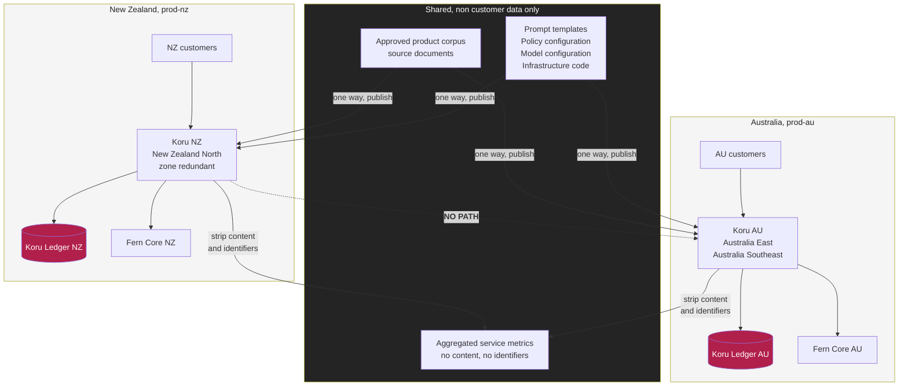

**The point of this diagram.** The dotted line is the whole diagram. There is no network path, no shared identity, no shared state backend and no peering between the two deployments. Enforced by Azure Policy, Terraform validation and network topology, not by a written rule. See [ADR-0003](../docs/02-architecture/adr/ADR-0003-jurisdictional-isolation.md).

---

## 7. Three-layer write prevention

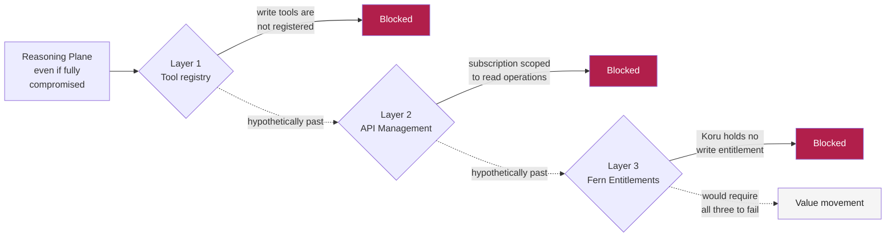

**The point of this diagram.** A complete compromise of the Reasoning Plane through prompt injection cannot move money in Phase 1, because the Reasoning Plane never held the authority to do so. Three independent layers, three independent owners. See [ADR-0005](../docs/02-architecture/adr/ADR-0005-read-only-first.md).

---

## 8. The degradation ladder

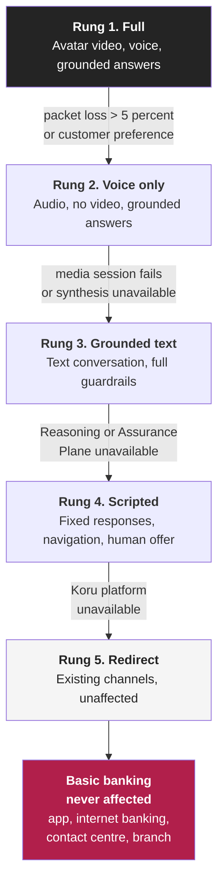

| Rung | Invocation | Customer impact | Tested |
|---|---|---|---|
| 1 to 2 | Automatic, or customer choice | Loses video presence | Continuously |
| 2 to 3 | Automatic on media failure | Loses voice | Phase 0 exit, ARB C3 |
| 3 to 4 | Automatic on plane failure, fails closed | Loses conversation | Phase 0 exit, ARB C3 |
| 4 to 5 | Automatic or manual kill switch | Loses Koru entirely | Phase 0 exit, ARB C3 |
| Any to 5 | Kill switch, per-tool, per-cohort, per-model or global | Loses Koru entirely | Quarterly |

**The point of this diagram.** Rung 5 is not an outage. It is Fern Bank as it exists today. See [FB-KORU-503](../docs/05-operations/business-continuity.md).

---

## 9. Regulator notification clocks

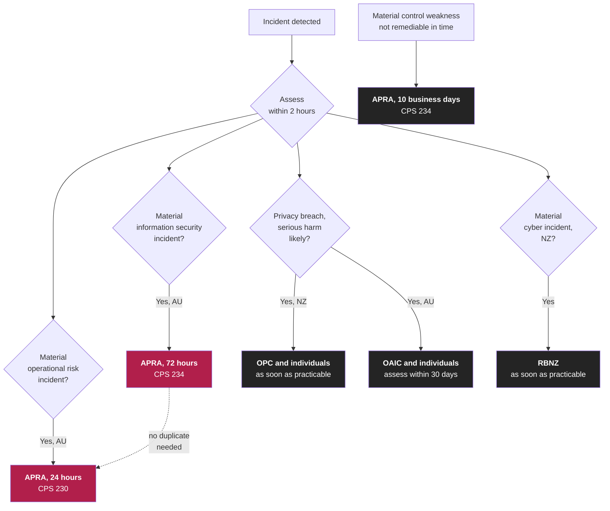

**The point of this diagram.** The tightest clock is 24 hours. Triage must therefore complete within 2 hours, which drives the on-call and escalation model. See [FB-KORU-502](../docs/05-operations/incident-response.md).

---

## 10. Model risk and evaluation loop

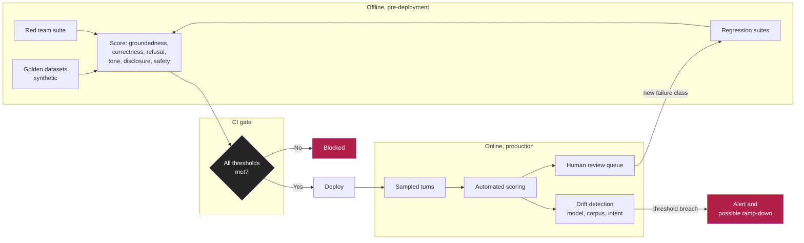

**The point of this diagram.** The feedback arrow from human review back into the regression suite is the mechanism by which a novel failure becomes a known failure. It is also the honest admission behind risk KORU-R-19: novel failures are found in production, not before.

---

## 11. The phased risk position

```mermaid
flowchart LR
    P0["<b>Phase 0</b><br/>Foundations<br/><br/>Customer exposure: nil<br/>Blast radius: none"] --> G0{"Gate<br/>15 criteria"}
    G0 --> P1["<b>Phase 1</b><br/>Koru Informs<br/><br/>Read only<br/>Blast radius: <b>information</b>"]
    P1 --> G1{"New ARB<br/>submission"}
    G1 --> P2["<b>Phase 2</b><br/>Koru Assists<br/><br/>Reversible actions<br/>Blast radius: <b>inconvenience</b>"]
    P2 --> G2{"New ARB<br/>submission"}
    G2 --> P3["<b>Phase 3</b><br/>Koru Acts<br/><br/>Value movement<br/>Blast radius: <b>money</b>"]
    P3 --> G3{"Advice licensing<br/>determination"}
    G3 --> P4["<b>Phase 4</b><br/>Koru Advises<br/><br/>Blast radius: <b>life outcomes</b>"]

    style P0 fill:#f5f5f5,color:#242424
    style P1 fill:#242424,color:#ffffff
    style G0 fill:#b11f4b,color:#ffffff
    style G1 fill:#b11f4b,color:#ffffff
    style G2 fill:#b11f4b,color:#ffffff
    style G3 fill:#b11f4b,color:#ffffff
    style P2 fill:#f5f5f5,color:#242424
    style P3 fill:#f5f5f5,color:#242424
    style P4 fill:#f5f5f5,color:#242424
```

**The point of this diagram, and the point of the whole submission.** The blast radius grows at every phase, and so does the evidence required to enter it. We are asking the Board to approve the two phases where the blast radius is nil and information respectively. Everything to the right is context, not a request.

---

## 12. Reality disclaimer

Fern Bank is a fictional institution and these diagrams are illustrative, exercise-grade material for architecture review practice. See the [programme canon](../docs/programme-canon.md#9-reality-disclaimer).
