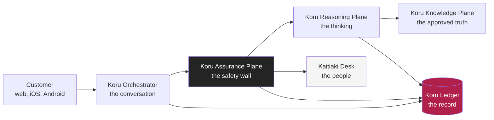
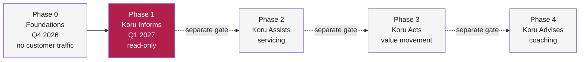

# Executive Summary

**Document ID:** FB-KORU-010
**Version:** 1.0
**Date:** 27 August 2026
**Owner:** Chief Executive, Personal Banking
**Status:** Submitted for review

**Related documents:** [ARB submission](../../ARB-SUBMISSION.md) (FB-KORU-001), [Business case](business-case.md) (FB-KORU-011), [Product vision](../01-experience/product-vision.md) (FB-KORU-100), [Solution architecture](../02-architecture/solution-architecture.md) (FB-KORU-200), [Regulatory landscape](../04-compliance/regulatory-landscape.md) (FB-KORU-400)

---

## The ask, at a glance

| Field | Detail |
|---|---|
| What | Design Approval for Phase 0 and Phase 1 of Project Koru, a read-only conversational avatar for personal banking |
| For whom | Fern Bank Limited (NZ) and Fern Bank Australia Limited (AU), two sovereign deployments, no cross-Tasman data |
| Phase 1 scope | Read-only. Balances, transactions, product, fee and rate explanation, servicing navigation. No money moves, no advice |
| Phase 1 exposure | Capped at 5 percent of digitally active customers, ramped |
| Cost | NZ$5.4m Phase 0, NZ$9.0m Phase 1 over twelve months |
| Not relying on | Headcount reduction. The case rests on absorbing volume growth and a retention effect |
| The one non-negotiable | Basic banking never depends on Koru |
| Decision the Board must make | Approve with conditions C1 to C10, and formally accept concentration risk KORU-R-03 |

---

## 1. Start with one person

It is 9:40 on a Tuesday night. Raewyn is 68, she lives on her own in Whanganui, and she has just opened her banking app because a payment she did not recognise has left her account. It is 47 dollars. She does not know what it is. She thinks it might be the insurance she cancelled, or it might be something worse, and the not knowing is the part that keeps her awake.

The branch closed at 4. The contact centre closed at 8. The chat assistant in the app offers her a list of help articles about "understanding your transactions", none of which is about her 47 dollars. So Raewyn does what hundreds of thousands of our customers do every week. She waits. She holds the worry overnight, she sleeps badly, and she rings us at 8:31 the next morning, joining a queue, to ask a question that takes ninety seconds to answer.

The answer, when she finally gets it, is reassuring. The 47 dollars was an annual account fee she had genuinely forgotten about, disclosed and legitimate, and a person explains it to her kindly in under two minutes. The problem was never the answer. The problem was the fourteen hours of worry in front of it.

This submission is about those fourteen hours. Koru is our attempt to give Raewyn her answer at 9:41 on Tuesday night, grounded in the truth, honest about what it is, and one tap from a human being if that is what she would rather have.

---

## 2. The nine million

Raewyn is not unusual. She is typical.

Every year, Fern Bank has around **14 million conversations** with the people who bank with us, across the contact centre, secure messaging, chat and the branch network. When we looked hard at what those conversations actually contain, we found something uncomfortable and clarifying in equal measure.

**Roughly nine million of them are simple.** "What is my balance." "Did my pay go in." "What is this fee." "What is the interest rate on that account." "How do I set up a payment." These are not complaints, they are not advice, they are not complex problems. They are someone asking a small, factual question and waiting too long for a small, factual answer, because our channels for answering them are staffed by people who are also trying to help the customer whose home loan has fallen over and the customer whose card has been skimmed.

The nine million are not the customers we are failing most severely. They are the customers we are failing most often, in small ways, at scale, and every one of those small failures is a person like Raewyn holding a worry she should never have had to hold.

The remaining five million conversations are the hard ones: distress, hardship, fraud, complex products, life events. Those conversations need a person, and they will continue to have one. **Koru exists so that our people can spend their time on the five million, by answering the nine million in the moment they are asked.**

### 2.1 The shape of a year of conversations

We looked at twelve months of contact, across the contact centre, secure messaging, chat and branch, and sorted it by what the customer actually needed. The pattern is consistent across both jurisdictions.

| Conversation type | Approximate annual volume | Needs a person today | Could be answered in the moment |
|---|---:|---|---|
| Balance, transaction and "did it go through" | 4.9m | Rarely | Yes |
| Fee, rate, product and term explanation | 2.6m | Sometimes | Yes, grounded |
| Servicing navigation, "how do I" | 1.5m | Rarely | Yes |
| Card, dispute and statement servicing | 1.8m | Sometimes | Phase 2, not now |
| Fraud, scam and security | 0.9m | Yes | Signal and route |
| Hardship, distress and complaints | 0.7m | **Always** | Never automated |
| Advice, suitability and "what should I do" | 0.8m | **Always** | Redirected, never answered |
| Complex products and life events | 0.8m | Yes | No |
| **Total** | **~14.0m** | | |

The top three rows are the nine million. They are not trivial to the customer, they are simply factual, and they are exactly the conversations a grounded, read-only assistant can answer well. Everything from row five down stays with a person, by design, forever.

### 2.2 The customers we fail most often

The nine million are not evenly spread. When we weight for who waits longest and who is hurt most by the wait, four groups stand out, and they are the same four groups our accessibility research keeps returning to.

- **Older customers**, who are more likely to phone, more likely to worry, and least well served by a self-service help article.
- **Customers with low digital confidence or a disability**, for whom a menu of links is a barrier and a spoken answer is not.
- **Time-poor working customers**, who cannot phone during contact-centre hours and give up rather than wait.
- **Customers in regional New Zealand and Australia**, whose nearest branch may be an hour away and whose network may be slow.

These are not edge cases to be handled later. They are the reason Koru is a voice-and-video avatar rather than another text box, and they shape every decision in [FB-KORU-103](../01-experience/accessibility-and-inclusion.md).

---

## 3. What Koru is, in plain language

Koru is a conversational avatar. In practical terms, a customer opens the Fern Bank app or website, taps a button to talk, and has a spoken conversation with a calm, synthesised presenter who listens, answers in plain language, and shows the supporting detail on screen while she speaks. It works on the web, on iPhone and on Android.

For a director who will never read the architecture, three sentences capture it.

**Koru answers questions using only Fern Bank's own approved information, never from memory or guesswork, and if it cannot find an approved answer it says so and offers you a person.** It tells you at the start of every conversation that it is an AI assistant and not a human, and it will never pretend otherwise. And in this first release it can only ever show you information, it cannot move a single dollar, because we intend to earn your trust on the safe things before we ask you to trust us with anything more.

That is the whole idea. Everything else in this pack is the discipline required to make those three sentences true at the scale of a bank, under two regulators, without cutting a corner.

The name is deliberate. The koru is the unfurling frond of the silver fern, a symbol of new growth that stays anchored to where it began. It is the natural expression of the Fern Bank brand, and it carries an obligation we take seriously. Our Te Ao Māori engagement is a gating condition on brand launch, not a marketing afterthought. That commitment is set out in [FB-KORU-103](../01-experience/accessibility-and-inclusion.md).

### 3.1 What Koru can and cannot do in Phase 1

Concretely, in the release we are asking to approve, this is the line.

| A customer can ask Koru to | A customer cannot ask Koru to |
|---|---|
| Tell them their balance across their accounts | Move any money, between their own accounts or anyone else's |
| Explain a transaction or a fee they do not recognise | Change any account setting, limit or detail |
| Explain a product, its fees, its rates and its terms | Freeze a card, lodge a dispute or order a statement (that is Phase 2) |
| Compare two products on their published facts | Recommend which product suits them, or judge what they can afford |
| Find where a task lives in the app and how to do it | Receive personal financial advice of any kind |
| Reach a human at any moment, for any reason | Authenticate using their voice |

Everything in the right-hand column is either a later phase behind its own gate, or a permanent refusal by design. None of it is a missing feature we ran out of time for. Each one is a deliberate boundary explained in the pack.

---

## 4. How it works, in five parts

Under the calm face, Koru is five planes. Each one does a single job, and each one can be reasoned about, tested and, if necessary, switched off on its own. A director does not need the engineering. A director does need to know that the safety is not a setting inside the model, it is a separate wall the conversation has to pass through in both directions.

**The Koru Orchestrator** runs the conversation itself. It handles the audio and video, works out when the customer has finished speaking and when Koru should, and lets the customer interrupt at any time, the way people do when they talk. It is the part that makes Koru feel like a conversation rather than a form.

**The Koru Assurance Plane** is the safety wall, and it is the most important component in the design. Nothing the customer says reaches the thinking part of Koru without passing through it, and nothing Koru says reaches the customer without passing through it again. It checks scope, it enforces disclosure, it verifies that answers are grounded in approved sources, it detects distress, and it fails closed, which means if it is ever unsure, the safe thing happens rather than the convenient thing. It costs us around 90 milliseconds in each direction and it is worth every one of them.

**The Koru Reasoning Plane** is the thinking. It decides what the customer is actually asking, which tools to use, and how to compose an answer. Critically, it is not trusted to be right on its own. It proposes, and the Assurance Plane disposes.

**The Koru Knowledge Plane** is the approved truth. When a customer asks about a product, a fee, a rate or a term, the answer comes from a retrieved, owned, versioned source that a named person in the bank is accountable for keeping current. If there is no approved source, Koru does not invent one. It stays silent and offers a human. We call this rule grounded or silent, and it is the difference between a helpful bank assistant and a confident liar.

**The Koru Ledger** is the record. Every prompt, every retrieval, every decision the safety wall made, every word Koru said, is written down immutably and can be replayed. When a customer, a regulator or a dispute scheme asks "what happened in that conversation and why", we answer with evidence, not with recollection.

When Koru reaches its limits, it does not trap the customer. It hands them to the **Kaitiaki Desk**, a team of specialist people. Kaitiaki means guardian or steward, and the name is a design statement. Our people are not a fallback for a broken robot. They are the guardians of the customer relationship, and Koru is the front door to them.

### 4.1 The two things in that picture that matter most

If a director remembers only two facts about how Koru is built, they should be these.

**The safety wall sits between the customer and the model, in both directions, and it fails closed.** It is not a filter bolted onto the end of a clever model, and it is not a setting the model can be talked out of. It is a separately built, separately owned control point that every single turn has to cross, and if it cannot confirm that a response is safe and grounded, the safe thing happens by default. Under CPS 234 and the RBNZ cyber resilience guidance, being able to demonstrate that a control was applied to every interaction is worth more than the 90 milliseconds it costs.

**The Ledger is written to by every plane, and it is immutable.** Every prompt, retrieval, tool call, model version, guardrail decision and spoken word is recorded and can be replayed. This is the difference between a bank that can answer a regulator with evidence and a bank that answers with an apology. It is also what lets a customer, months later, find out exactly what Koru told them and why.

---

## 5. The phased risk posture, and why read-only is the whole point

We are not asking the Board to approve a banking robot that moves money. We are asking to approve one that can only talk, and only about things it can prove.

The request in front of the Board is **Phase 0 and Phase 1 only**.

| Phase | What Koru can do | Risk exposure |
|---|---|---|
| **Phase 0, Foundations** | Build the platform, guardrails and evaluation harness. Internal staff pilot on synthetic data. No customer traffic at all. | Nil customer exposure |
| **Phase 1, Koru Informs** | Read-only conversation for authenticated customers. Balances, transactions, product and fee explanation, rate questions, servicing navigation. | Information only. No money moves, no data changes, no advice |

Phases 2 to 4 are described in this pack so the Board can judge whether these foundations are right, not because we are asking for them. Each is a separate ARB gate with its own evidence bar. Approving Phase 1 does not approve Phase 2.

The reason read-only comes first is simple and it is the spine of the entire submission. **The worst thing Koru can do in Phase 1 is give someone wrong information, and that is bad, but it is recoverable and it is replayable.** The worst thing a money-moving assistant can do is move money wrongly, and that is a different category of harm. We will not accept the second category of risk until we have proven, against real customers and real traffic, that we have earned the right to. Read-only first is not caution for its own sake. It is how you build something trustworthy: on evidence, one gate at a time.

Three consequences follow, and each one is deliberate.

- **The blast radius of any failure in Phase 1 is information, never money.** A wrong answer can be corrected, apologised for and learned from. A wrong payment cannot be un-sent as cleanly.
- **The evidence we gather in Phase 1 is exactly the evidence Phase 2 needs.** How well the guardrails hold against real traffic is the thing that tells us whether we have earned write access, and we cannot know it in advance.
- **Stopping stays cheap.** Because we have not built the money-moving capability, a decision to stop at the end of Phase 1 costs us a read-only assistant, not a half-finished payments engine.

---

## 6. The regulatory position

Koru operates across two entities and two regulators. Fern Bank Limited is a registered bank in New Zealand, supervised by the RBNZ and the FMA. Fern Bank Australia Limited is an authorised deposit-taking institution, supervised by APRA and ASIC. The architecture is one logical platform with two sovereign deployments, and **customer data does not cross the Tasman**.

| Instrument | Jurisdiction | Our position | Detail |
|---|---|---|---|
| APRA CPS 230 Operational Risk | AU | Koru supports, and does not constitute, a critical operation in Phase 1. Microsoft Azure is registered as a material service provider. Tolerances set, degradation ladder tested. | [FB-KORU-410](../04-compliance/apra/cps-230-operational-risk.md) |
| APRA CPS 234 Information Security | AU | Information assets classified, controls mapped and tested, 72 hour notification path wired into incident response. | [FB-KORU-411](../04-compliance/apra/cps-234-information-security.md) |
| RBNZ BS11 Outsourcing | NZ | Arrangement in the outsourcing compendium, separation plan extended, basic banking proven available without Koru. | [FB-KORU-420](../04-compliance/rbnz/bs11-outsourcing.md) |
| RBNZ Cyber Resilience Guidance | NZ | Board oversight, framework self-assessment, material incident reporting defined. | [FB-KORU-421](../04-compliance/rbnz/cyber-resilience.md) |
| Privacy Act 2020 | NZ | Privacy impact assessment complete, IPP 1 to 13 assessed, cross-border disclosure largely designed out. | [FB-KORU-440](../04-compliance/privacy/privacy-impact-assessment.md) |
| Privacy Act 1988 and APPs | AU | Privacy impact assessment complete, APP 1 to 13 assessed, particular attention to APP 8 and APP 11. | [FB-KORU-440](../04-compliance/privacy/privacy-impact-assessment.md) |
| CoFI fair conduct | NZ | Koru behaviour mapped to the fair conduct programme, including vulnerable customer handling. | [FB-KORU-400](../04-compliance/regulatory-landscape.md) |
| ISO/IEC 42001 AI management | Both | Used as the backbone of the AI management system. Gap assessment complete. | [FB-KORU-431](../04-compliance/ai-governance/responsible-ai-assessment.md) |

**The single most important regulatory sentence in this pack:** basic banking never depends on Koru. If Koru is entirely unavailable, every customer can still see their balance, move their money and reach a human through the channels they already use. This is enforced by the architecture, not by a policy, and it is what makes the position defensible to both regulators at once.

---

## 7. The risks, and how they are bounded

We would rather the Board hear the risks from us, plainly, than discover them in a review. The full register is in [FB-KORU-602](../06-delivery/raid-log.md). These are the ones that matter at Board level.

| ID | Risk | How it is bounded |
|---|---|---|
| KORU-R-01 | Koru gives a confidently wrong answer on a fee, rate or term | Grounded or silent. No answer without an approved source. Citation enforced, refusal thresholds set, every answer replayable from the Ledger. Residual bounded because the blast radius is information, not money |
| KORU-R-02 | Prompt injection bends Koru's behaviour | The safety wall evaluates every input and output independently of the model, tools are allow-listed, and there is no write path to abuse in Phase 1 |
| KORU-R-03 | Concentration on a single AI platform provider | Cannot be engineered away. Bounded by a tested non-generative fallback and by the fact that basic banking does not depend on Koru. **Presented to the Board for explicit acceptance, not as a solved problem** |
| KORU-R-04 | A vulnerable customer is harmed by an efficient but unfeeling interaction | Distress detection, a mandatory and proactive human offer, no-pressure design, and the Kaitiaki Desk |
| KORU-R-05 | A deepfaked customer voice is used to socially engineer us | Voice is never an authentication factor. All authorisation stays with Fern ID and step-up. Residual Low |
| KORU-R-06 | A customer believes Koru is human | Disclosure at session start, on request and at every handoff, plus drift detection that re-discloses warmly |
| KORU-R-07 | Latency makes Koru worse than the phone it replaces | A sub-second first-word budget, an explicit availability SLO, and a text fallback. **Modelled, not yet measured in the field** |
| KORU-R-08 | The information corpus goes stale and Koru quotes a withdrawn product | The corpus is versioned and owned, expired content fails closed and is not retrievable |

**KORU-R-03 requires a Board decision, not just a Board reading.** We are building on Microsoft Azure. That is genuine concentration risk under both CPS 230 and BS11. We can bound the consequence and we have. We cannot remove the dependency while delivering this capability at this quality, and we are asking the Board to accept that residual risk with its eyes open, or to direct us to fund a second provider at approximately 780,000 dollars per year.

### 7.1 The risk nobody puts in an architecture pack

There is one risk that does not fit in a table, and we want the Board to sit with it rather than skim past it. It is catalogued as KORU-R-18, and it is the one with the weakest treatment in the whole register.

An avatar that is warm, always available, endlessly patient and never rushed will be trusted more than it deserves by exactly the customers who can least afford to be wrong. An isolated older customer who used to ring the contact centre partly to hear another human voice may talk to Koru instead. Koru will be more available than we are, more patient than we are, and, for that customer, worse than we are, because the value of that call was never the balance enquiry.

We do not have a complete answer to this. Mandatory disclosure helps but does not reach the customer who knows and prefers Koru anyway. Drift detection and a proactive human offer help but catch only some cases. Our honest position is that this is a responsibility we are taking on, not a problem we have solved, and we have committed to longitudinal outcome research with the Phase 1 cohort because it is the only thing that will tell us the true size of it. We would welcome the Board's challenge on whether Phase 1 should proceed without a stronger treatment. Building something this capable for the people who trust most easily is the opportunity and the responsibility in a single sentence.

---

## 8. What we are deliberately not doing

An architecture is defined as much by its refusals as its features. Each of these is a decision, not a gap, and each one is a feature of the design rather than a limitation of it.

| We will not | Why it is a feature |
|---|---|
| Move money in Phase 1 | The trust has to be earned on read-only traffic first. It caps the worst case at misinformation |
| Speak about products, fees or rates without a retrieved approved source | A confidently wrong answer about a rate is a conduct breach, not a bug. Grounded or silent removes the whole failure class |
| Give personal financial advice | Advice is a licensed, duty-bearing activity. It deserves its own approval, not a side effect of a chatbot |
| Use the customer's voice as an authentication factor | Voice cloning is cheap and effective. A voiceprint is sand to build authorisation on |
| Hide that Koru is not human | Disclosed at the start of every session and on request, always. Deception is corrosive and, at scale, a conduct failure |
| Train models on customer conversations | Customer conversations are not training data. Retrieval, not absorption |
| Replicate customer data across the Tasman | Two regulators, two sovereign deployments, no shortcuts |

Every one of those refusals costs us something in convenience, cost or capability. We are paying those costs on purpose, because they are what make Koru a bank's assistant rather than a demo.

---

## 9. The three things we are not confident about

Candour serves the Board better than polish. There are three things we genuinely do not yet know, and we would rather say so now.

1. **Our latency is modelled, not measured.** The whole experience thesis rests on Koru answering fast, at 1.2 seconds to first audible word at the 95th percentile, on a mid-range Android phone on a regional New Zealand network. If Phase 0 field testing shows that is not achievable, the experience weakens materially, and we will return to the Board rather than push on. Our documented fallback is a text-only grounded assistant that reuses the same safety wall.

2. **We do not know the true escalation rate.** We have modelled that 18 to 25 percent of Phase 1 conversations will end with a human. If it turns out to be 45 percent, both the Kaitiaki Desk staffing and the business case need rebuilding. The closed beta is designed to find this number early.

3. **Evaluating conversational safety is an immature discipline.** Our harness reliably catches the failure classes we thought of. We are not confident it catches the ones we did not, and we do not think anyone credibly is. Our honest answer to this is the read-only phase itself: when a novel failure occurs in Phase 1, nobody's money moved.

---

## 10. The financials

Full detail and sensitivities are in the [business case](business-case.md) (FB-KORU-011) and [cost model](../06-delivery/cost-model.md) (FB-KORU-601).

| Item | Phase 0 | Phase 1 (12 months) |
|---|---:|---:|
| Build, internal and partner | NZ$4.1m | NZ$3.4m |
| Cloud platform run | NZ$0.6m | NZ$2.9m |
| Kaitiaki Desk uplift | Nil | NZ$1.8m |
| Assurance, model risk, legal | NZ$0.7m | NZ$0.9m |
| **Total** | **NZ$5.4m** | **NZ$9.0m** |

Modelled cost per contained session is **NZ$0.38**, against a blended assisted-channel cost to serve of **NZ$6.10**. The Board should understand clearly what the case does and does not rest on. **It does not rely on reducing headcount.** It relies on absorbing years of rising conversation volume without a proportional rise in cost, and on the retention value of resolving a customer's simple question in the moment they ask it rather than the next morning. If this programme is ever justified by cutting the Kaitiaki Desk, it has been misunderstood.

---

## 11. Recommendation and the ask

Enterprise Architecture and Personal Banking jointly recommend **Design Approval for Phase 0 and Phase 1, subject to conditions C1 through C10** set out in the [ARB submission](../../ARB-SUBMISSION.md).

Concretely, we are asking the Board to:

1. **Approve Phase 0**, the build of the platform, guardrails and evaluation harness, with no customer traffic.
2. **Approve Phase 1**, read-only conversations to a capped cohort of no more than 5 percent of digitally active customers, subject to the Phase 0 exit gate being passed.
3. **Formally accept the concentration risk KORU-R-03**, or direct us to fund the second-provider option.
4. **Hold us to the ten conditions**, which we wrote to be testable rather than aspirational, including the requirement that no customer sees Koru until the evaluation harness proves groundedness at or above 0.95 and an unsafe-response rate at or below 0.1 percent.

We are deliberately asking for less than the programme's ambition. That is the point.

### 11.1 The options we considered

So the Board can see that "build an avatar" was a conclusion and not a starting assumption, these are the five options we weighed. The full assessment is in the [ARB submission](../../ARB-SUBMISSION.md).

| Option | Description | Why we did or did not choose it |
|---|---|---|
| A. Do nothing | Keep the current contact centre, chat and IVR | Rejected. The service gap persists and cost to serve rises with volume every year |
| B. Text-only assistant | A grounded chatbot, no voice or avatar | Viable, lower risk, and kept as our documented fallback. Delivers materially less for the older, low-literacy and disabled customers who benefit most |
| C. Buy a packaged avatar | A vendor banking-avatar product | Rejected. Unacceptable data residency and model governance, and no way to evidence controls to APRA and the RBNZ at the depth required |
| D. Build on our own platform, phased | Read-only first, on Azure, inside our landing zones | **Recommended.** Highest control, clearest regulatory story, highest build cost |
| E. Full capability at launch | Deliver Phases 1 to 3 together | Rejected. Concentrates all the risk at a single gate with no evidence base to justify moving money |

Option B is not a consolation prize. It is a deliberate property of the design: if Phase 0 evidence does not support the conversational thesis, we can descend to a text-only assistant while reusing the safety wall, the reasoning and the knowledge planes unchanged.

---

## 12. What success looks like at the end of Phase 1

We will hold ourselves to outcomes the Board can check, not adjectives.

| Measure | Target at end of Phase 1 |
|---|---|
| Groundedness across the regression suite | >= 0.95, sustained |
| Unsafe response rate | <= 0.1 percent |
| p95 to first audible word | <= 1.2 seconds on representative devices and networks |
| Escalation success, meaning a customer who wanted a human got one | >= 0.99 |
| Koru availability SLO | 99.5 percent, with basic banking never dependent on it |
| Cost per contained session | At or below NZ$0.38 |
| Cohort reached | Up to 5 percent of digitally active customers, deliberately representative of age, accessibility need, language and rurality |
| Complaints upheld against Koru conduct | Zero systematic, each individual case replayable from the Ledger |

And one measure that is not a number.

### 12.1 The oversight the Board will keep

Approval is the start of the accountability, not the end of it. These are the reporting commitments that come with a yes, drawn from conditions C8 to C10.

| What the Board and its committees receive | Cadence | Condition |
|---|---|---|
| Koru assurance report: groundedness, refusal, escalation, complaint and vulnerability-flag metrics | Monthly, to the Technology and Operational Risk Committee | C8 |
| Any tool-scope expansion, model-family change or refusal-policy change returns to ARB before it ships | On change | C9 |
| Phase 2 requires a fresh submission with a write-path threat model and fraud assessment | At the Phase 2 gate | C10 |
| KORU-R-03 concentration risk position | Quarterly, to the Board Risk Committee | Standing |
| Any SEV1 conduct incident | Immediately, with a halt and a return to ARB before resumption | Standing |

The commitment underneath all of these is simple: if the evidence turns against us, we stop, and stopping is cheap and early by design rather than expensive and late.

**At the end of Phase 1, Raewyn gets her answer at 9:41 on Tuesday night.** She learns that the 47 dollars was a disclosed annual fee, she hears it in plain language from something that told her honestly it was not a person, she is offered someone from our team and decides she does not need them this time, and she goes to sleep. The fourteen hours of worry never happen. That is the outcome this whole submission exists to produce, and it is the one we will be proudest of if the Board lets us build it.

---

## 13. Reality disclaimer

Fern Bank is a fictional institution. This document is illustrative, exercise-grade material created for architecture review practice, training and demonstration. The regulatory analysis references real published instruments from APRA and the RBNZ and reflects their intent as understood at the date of writing. It is not legal or regulatory advice. Every citation must be verified against the current instrument and reviewed by qualified legal, risk and compliance professionals before any real-world use. See the [programme canon](../programme-canon.md#9-reality-disclaimer).
