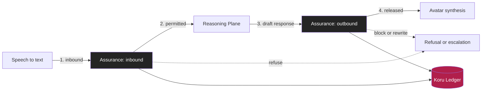

# ADR-0006: The Assurance Plane is a separate service, not a library

| Field | Value |
|---|---|
| **Status** | Accepted |
| **Date** | 1 July 2026 |
| **Decision makers** | Chief Architect, CISO, Head of Model Risk |
| **Contested** | Yes. Engineering objected to the latency cost, correctly. |
| **Reversibility** | **Moderate.** One to two quarters to collapse into the runtime if it proves unjustified. |
| **Related risks** | KORU-R-02 prompt injection, KORU-R-01 wrong answer, KORU-R-07 latency |

---

## Context

Every generative system needs guardrails: input filtering, prompt injection defence, PII detection, scope enforcement, output safety, groundedness checking, disclosure enforcement.

The industry default is to implement these as SDK calls inside the application that calls the model. It is fast, simple and requires no additional infrastructure.

It also means the guardrail runs inside the same process, under the same identity, in the same deployment unit, as the code it is supposed to constrain. The control and the thing being controlled share a fate. A developer can bypass a library call in a pull request. A configuration flag can disable it. A code path can be added that forgets to invoke it. And critically, when a regulator asks "can you demonstrate that this control was applied to every single interaction", the honest answer is "we believe so, based on code review".

That answer is not good enough under CPS 234, where control effectiveness must be systematically tested, and it is not good enough for a Tier 1 model risk rating.

## Decision

**The Assurance Plane is deployed as a separate service, with its own identity, its own repository, its own deployment pipeline and its own owner. Every inbound turn and every outbound turn crosses it over the network. It fails closed.**

### Non-negotiable properties

1. **The Reasoning Plane cannot reach the customer.** There is no network path from the Reasoning Plane to the Orchestrator's synthesis endpoint. The only egress is through the Assurance Plane. This is enforced by network security groups and by the Azure Firewall egress policy, not by application code.
2. **Fail closed.** If the Assurance Plane is unavailable, unhealthy, or times out, the turn is refused and Koru offers a human. It never falls through. This is control KORU-C-31.
3. **Separate ownership.** The Assurance Plane is owned by the Model Risk and Security functions jointly, not by the product engineering team. A product team cannot ship a change that weakens a guardrail.
4. **Every decision is written to the Ledger** before the turn completes, including allow decisions. An unrecorded turn is a failed turn.
5. **Policy is configuration, not code.** Refusal thresholds, scope rules and disclosure requirements are versioned configuration that can be changed and rolled back in minutes without a Reasoning Plane deployment.

### The inbound chain, in order

| Step | Check | Fail behaviour |
|---|---|---|
| 1 | Session and identity validity | Terminate session |
| 2 | Rate and cost limits per session and per customer | Throttle, then refuse |
| 3 | Prompt shield, direct injection detection | Refuse, log, count toward session risk score |
| 4 | PII detection and minimisation before the prompt is assembled | Redact |
| 5 | Intent classification and scope check against the phase capability set | Refuse with the correct refusal class |
| 6 | Advice boundary classifier | Route to the advice refusal (ADR-0011) |
| 7 | Distress and vulnerability signal detection | Trigger the protocol in FB-KORU-102 |
| 8 | Jurisdiction and entitlement pre-check | Refuse |

### The outbound chain, in order

| Step | Check | Fail behaviour |
|---|---|---|
| 1 | Groundedness score against retrieved sources | Below 0.95, suppress and refuse |
| 2 | Citation presence and validity for every factual claim | Suppress |
| 3 | Content safety categories | Suppress, raise incident if repeated |
| 4 | Protected material and verbatim leakage check | Suppress |
| 5 | Advice boundary check on the generated text, independent of the inbound check | Rewrite to refusal |
| 6 | Disclosure obligations satisfied for this turn | Inject required disclosure |
| 7 | Tone, reading level and prohibited language | Rewrite or suppress |
| 8 | Numeric and figure consistency against the source | Suppress |

Step 5 appearing on both chains is deliberate. The inbound classifier catches the customer asking for advice. The outbound classifier catches Koru drifting into advice while answering a legitimate question. These are different failure modes and need independent controls.

## Consequences

### Positive

- **One enforceable choke point.** "Was the control applied?" is answered by a Ledger query, not by an argument about code coverage. This is the single most valuable property for CPS 234 control testing and for the Tier 1 model validation.
- **Policy changes in minutes.** If a failure mode is discovered in production, we tighten a threshold and roll it forward without touching the Reasoning Plane. During an incident, this is the difference between minutes and hours.
- **Separation of duties is real.** The team that wants the model to be helpful is not the team that decides what it is allowed to say.
- **Model independence.** Because the outbound policy evaluates the generated text rather than trusting the model's own safety behaviour, swapping models does not invalidate the guardrails. This is what makes ADR-0009 portability credible.
- **Independently testable and independently attackable.** The red team can target the Assurance Plane directly.

### Negative

- **Latency.** Approximately 90ms per direction, so roughly 180ms of the 1,200ms p95 budget, which is 15 percent. This is a real cost and it was the principal objection.
- **Additional operational surface.** Another service to deploy, scale, monitor, patch and page someone about.
- **A hard availability dependency.** Because it fails closed, an Assurance Plane outage is a full Koru outage. This is accepted, and is the correct failure mode.
- **Organisational friction by design.** Product cannot unilaterally relax a guardrail. This will occasionally be frustrating and that is the intent.

### Neutral

- Cost is not material relative to model inference cost.

## Alternatives considered

| Option | Assessment |
|---|---|
| **In-process SDK library** | Rejected. Fastest and simplest, but the control shares fate and identity with the controlled code, and cannot be independently evidenced. |
| **Sidecar container in the same pod** | Considered seriously. Lower latency, roughly 15ms, with better isolation than a library. Rejected because the sidecar is deployed by the same pipeline under the same team's control, which loses the separation of duties benefit that motivated the decision. |
| **Gateway policy at API Management only** | Rejected. API Management can enforce coarse policy but cannot perform groundedness scoring or semantic intent classification. Insufficient. Retained as a complementary layer. |
| **Model-native safety only** | Rejected. Relying on the model to police itself means the control fails exactly when the model fails, which is the correlated failure we most need to avoid. |

## The latency argument, resolved

Engineering's objection was legitimate and we tested it rather than overruling it.

| Configuration | Added latency | Control evidence quality |
|---|---|---|
| Library | ~5ms | Weak. Code review only |
| Sidecar | ~15ms | Moderate. Same deployment authority |
| Separate service | ~90ms per direction | Strong. Independent, ledgered, per-turn provable |

We accepted 180ms of a 1,200ms budget in exchange for provable control application. The mitigations that made this affordable:

1. Inbound checks run **in parallel**, not in sequence, so the chain costs the slowest check, not the sum.
2. Outbound checks that do not depend on the full response run **against the token stream** as it is generated, overlapping with generation.
3. The Assurance Plane is co-located in the same subnet as the Reasoning Plane with no gateway hop between them.
4. Disclosure and tone checks on cached or templated content short-circuit.

**Assumption.** The 90ms figure is from load testing against synthetic traffic. Owner: Head of Platform Engineering. Resolve by Phase 0 exit with production-representative measurement.

## Compliance implications

| Obligation | Implication |
|---|---|
| APRA CPS 234 | Enables systematic control effectiveness testing. Every turn produces evidence that each control executed and what it decided. |
| APRA CPS 230 | The fail-closed behaviour is a designed, tested degradation, not an unplanned failure. |
| Model risk (FB-KORU-430) | Provides the independent challenge layer required for a Tier 1 model. The model's output is assessed by something other than the model. |
| ISO/IEC 42001 | Supports the operational control and monitoring clauses of the AI management system. |
| Conduct | Disclosure and advice-boundary enforcement are provable per interaction, which is what a conduct regulator will ask for. |

## Reversibility

Moderate. Collapsing the Assurance Plane into the runtime as a sidecar or library is roughly a quarter of work. We would only do so if measured latency proved unacceptable and no other mitigation existed, and it would require ARB approval because it materially weakens the control evidence position.

---

## Related documents

- [AI architecture](../ai-architecture.md) (FB-KORU-202)
- [Threat model](../../03-security/threat-model.md) (FB-KORU-301)
- [Conversation design](../../01-experience/conversation-design.md) (FB-KORU-102)
- [APRA CPS 234 assessment](../../04-compliance/apra/cps-234-information-security.md) (FB-KORU-411)
- [ADR-0007 Grounded response only](ADR-0007-grounded-response-only.md)
