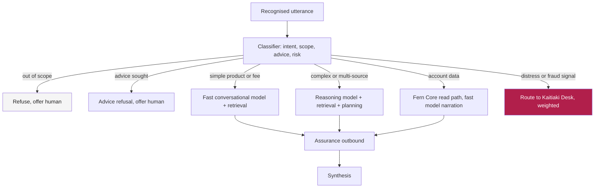
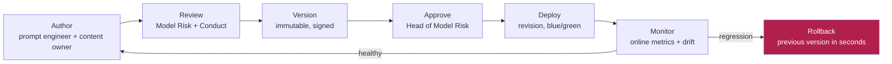
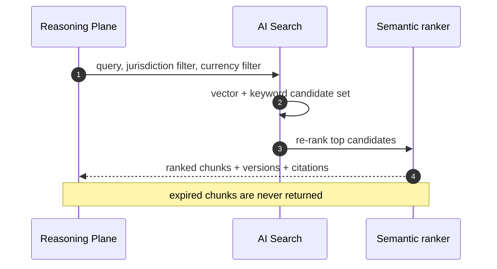
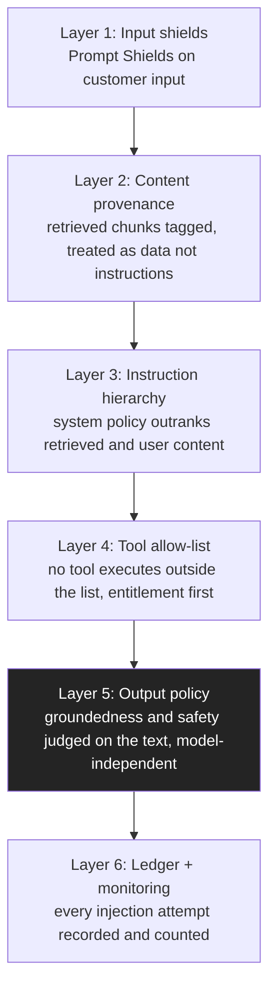
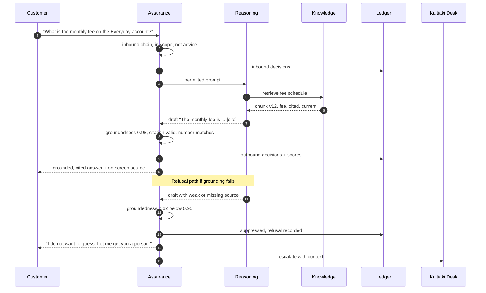
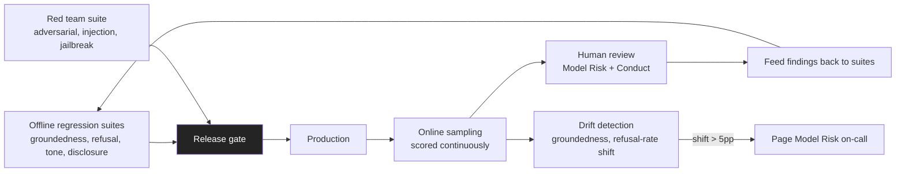

# AI Architecture

**Document ID:** FB-KORU-202
**Version:** 1.0
**Date:** 27 August 2026
**Owner:** Head of AI Engineering, Digital Channels
**Status:** Submitted for review

**Related documents**

- [Programme canon](../programme-canon.md) (FB-KORU-000)
- [Solution architecture](solution-architecture.md) (FB-KORU-200)
- [Data architecture](data-architecture.md) (FB-KORU-203)
- [ADR-0006 Assurance Plane as a service](adr/ADR-0006-assurance-plane-as-a-service.md)
- [ADR-0007 Grounded response only](adr/ADR-0007-grounded-response-only.md)
- [ADR-0008 No customer data in training](adr/ADR-0008-no-customer-data-in-training.md)
- [ADR-0009 Model portability](adr/ADR-0009-model-portability.md)
- [ADR-0011 No personal advice](adr/ADR-0011-no-personal-advice.md)
- [ADR-0012 Mandatory AI disclosure](adr/ADR-0012-mandatory-ai-disclosure.md)
- [Model risk management](../04-compliance/ai-governance/model-risk-management.md) (FB-KORU-430)
- [Responsible AI assessment](../04-compliance/ai-governance/responsible-ai-assessment.md) (FB-KORU-431)
- [Observability and evaluation](../05-operations/observability-and-evaluation.md) (FB-KORU-501)

---

## 1. Purpose and principles

This document describes how Koru uses language models: which model handles which turn, how prompts are authored and governed, how grounding and retrieval work, how tools are called safely, how the guardrail chain enforces policy in both directions, how prompt injection is defended, and how the whole system is evaluated and changed over time.

Five principles govern every decision below.

| # | Principle | Consequence |
|---|---|---|
| P1 | Grounded or silent | Koru asserts no Fern Bank fact without an approved, current, cited source, per [ADR-0007](adr/ADR-0007-grounded-response-only.md) |
| P2 | The model is never the control | Safety is enforced outside the model, in the Assurance Plane, per [ADR-0006](adr/ADR-0006-assurance-plane-as-a-service.md) |
| P3 | Customer data is not training data | Retrieval, not absorption. No fine-tuning on customer content, per [ADR-0008](adr/ADR-0008-no-customer-data-in-training.md) |
| P4 | Portability by abstraction | The Reasoning Plane targets an internal model interface, not a vendor SDK, per [ADR-0009](adr/ADR-0009-model-portability.md) |
| P5 | No personal advice | Koru explains, it does not advise, per [ADR-0011](adr/ADR-0011-no-personal-advice.md) |

---

## 2. Model inventory

Koru uses three model classes, each hosted on Azure AI Foundry and Azure OpenAI in-jurisdiction. Model identities and versions are recorded to the Ledger on every turn, so any answer can be traced to the exact model that produced it.

| Class | Role | Turn share, modelled | Latency profile | Hosting |
|---|---|---|---|---|
| Fast conversational | The default for most turns: grounded answers, navigation, small talk within scope | ~80 percent | Time to first token budgeted at 320 ms | Provisioned throughput, Azure OpenAI |
| Reasoning | Complex, multi-step or ambiguous turns needing planning across several sources | ~15 percent | Higher latency, allowed a larger budget | Standard plus provisioned burst |
| Classifier | Routing, intent detection, advice-boundary and scope classification, fast and cheap | Every turn | Budgeted at 40 ms | Small hosted model, Azure AI Foundry |

**Assumption.** The 80 to 15 to 5 turn distribution across fast, reasoning and refused-or-other classes is modelled from contact centre enquiry analysis. Owner: Head of AI Engineering. Resolve by Phase 1 ramp gate with production telemetry.

No model is fine-tuned on customer data. Where lightweight adaptation is used, it is confined to the classifier and trained only on synthetic and approved corpus-derived data, per [ADR-0008](adr/ADR-0008-no-customer-data-in-training.md).

---

## 3. Routing policy

Every turn is classified first, then routed. The classifier runs inside the Assurance inbound chain so that routing, scope and advice-boundary decisions are made before any generation model sees the turn. The router then selects a model class, or refuses, or routes to a human.

### 3.1 Routing decision table

| Turn class | Signals | Model | Grounding | Notes |
|---|---|---|---|---|
| Greeting and small talk in scope | Short, social, no factual claim | Fast | Not required | Disclosure obligations still apply |
| General financial concept | Conceptual, no Fern Bank specificity | Fast | Optional, generality marker | "Interest is what a lender charges" needs no source |
| Fern Bank product, fee, rate, term | Names a product or a number | Fast | Mandatory, cited | Numeric verification on output |
| Customer account data | Refers to the customer's own accounts | Fast for narration | Live Fern Core read, never model memory | Entitlement checked first |
| Process or how-to | Asks how to do something | Fast | Mandatory, cited | From approved corpus |
| Complex or multi-source | Multiple constraints, comparison, planning | Reasoning | Mandatory, cited across sources | Larger latency budget |
| Regulatory or legal statement | Asks about rights or obligations | Prefer human | Mandatory plus refusal preference | Route to a person by design |
| Advice sought | "Should I", "can I afford", "what's best for me" | None | Refuse | Advice boundary, [ADR-0011](adr/ADR-0011-no-personal-advice.md) |
| Out of scope | Outside the Phase capability set | None | Refuse | Correct refusal class |
| Distress, vulnerability, fraud | Protocol signals | Route to human | Not applicable | Weighted strongly, [ADR-0014](adr/ADR-0014-human-handoff-always-available.md) |

### 3.2 Load shedding

Under model-capacity pressure the router sheds from the reasoning class to the fast class, accepting a small quality reduction rather than a latency spike. If both generation classes are unavailable, Koru descends to Rung 3 scripted responses in the degradation ladder, per [FB-KORU-200](solution-architecture.md). The router never answers ungrounded to preserve latency; refusal is always preferred to an unsafe answer.

---

## 4. Prompt lifecycle

Prompts are governed artefacts, not code comments. A prompt change can alter behaviour as much as a model change, so it is versioned, reviewed, approved, deployed and rolled back through a controlled lifecycle. Prompt template versions and policy configuration versions are recorded to the Ledger on every turn.

| Stage | Owner | Control | Evidence |
|---|---|---|---|
| Author | Prompt engineer with the product content owner | Change is drafted against a template standard | Change request |
| Review | Model Risk and Conduct review jointly | Safety, scope, advice-boundary and tone review | Review record |
| Version | Platform | Immutable, signed, semantically versioned | Version register |
| Approve | Head of Model Risk | Any change to system prompts, refusal policy or thresholds is an ARB change under condition C9 | Approval record |
| Deploy | Platform Engineering | Container Apps revision, blue/green, instant rollback | Deployment record |
| Monitor | Model Risk on-call | Online metrics, refusal-rate and groundedness watch | Monthly assurance report |
| Rollback | Platform Engineering | Previous version restored in seconds via revision | Incident record |

Because prompts and thresholds are versioned configuration rather than application code, a discovered failure mode is corrected by rolling a threshold or template forward without a Reasoning Plane deployment, which during an incident is the difference between minutes and hours, per [ADR-0006](adr/ADR-0006-assurance-plane-as-a-service.md).

---

## 5. Grounding and retrieval

Grounding is the single largest risk reduction in the design. In Phase 0 evaluation, an ungrounded configuration produced materially wrong statements on 25 percent of a 400-question set drawn from real enquiries; the grounded configuration reduced that to 1 percent, per [ADR-0007](adr/ADR-0007-grounded-response-only.md). Koru is therefore grounded or silent.

### 5.1 Corpus sources

| Source | Content | Owner | Currency |
|---|---|---|---|
| Product disclosure and terms | Fees, rates, terms, conditions per product | Product owners | Versioned, expiry-checked |
| Fee and rate schedules | Current schedules per jurisdiction | Pricing | Dated, superseded on change |
| Process and servicing guides | How-to content, dispute and servicing steps | Servicing operations | Reviewed on change |
| Regulatory and rights summaries | Plain-language summaries, preference to refer to a human | Compliance | Controlled, conservative |
| Approved conversational scaffolding | Non-factual empathetic and procedural language | Conversation design | Reviewed for tone |

The corpus is authored centrally and published one way into each jurisdiction; it is not customer data and may cross for publication, but customer utterances and their embeddings never leave jurisdiction, per [ADR-0003](adr/ADR-0003-jurisdictional-isolation.md).

### 5.2 Chunking and embedding

| Step | Approach |
|---|---|
| Chunking | Semantic chunking on document structure, target 200 to 400 tokens, with overlap to preserve context across boundaries |
| Metadata | Every chunk carries an identifier, version, owner, jurisdiction, product, effective-from and expiry |
| Embedding | Vectorised with an approved embedding model, in-jurisdiction, no customer data in the embedding pipeline |
| Index | Azure AI Search hybrid index, one per jurisdiction |
| Refresh | Re-embedding on content change, full re-embed is a batch job of roughly 6 hours |

### 5.3 Hybrid retrieval and semantic ranking

Retrieval combines vector similarity with keyword (BM25) matching, then re-ranks with the semantic ranker. Keyword precision matters because product and fee terminology is exact; vector recall matters because customers phrase questions naturally. The combination beats either alone on the evaluation set.

### 5.4 Citation enforcement, groundedness and refusal

Grounding is enforced in the Assurance outbound chain, independently of the model, so a model change cannot silently weaken it.

| Control | Rule | Fail behaviour |
|---|---|---|
| Groundedness score | Generated response scored against retrieved context, threshold **0.95** | Below threshold, suppress and refuse |
| Citation binding | Every sentence classed as a Fern Bank factual assertion must map to a retrieved chunk | Orphan assertion suppresses the response |
| Numeric verification | Every number, rate, percentage, date and dollar figure string-matched to source | A number not in source suppresses the response |
| Corpus currency | Expired chunks are not retrieved | Empty retrieval causes refusal, addresses KORU-R-08 |
| Citation display | The source is shown on the info panel beside the spoken answer | Customer can verify without asking |

When grounding fails, Koru refuses honestly and offers a human rather than improvising. The refusal states why, because customers tolerate "I do not know" far better than being misled, and honesty about the reason preserves trust in every answer Koru does give. The refusal taxonomy is in [FB-KORU-102](../01-experience/conversation-design.md).

### 5.5 Context assembly per turn

The prompt sent to the generation model is assembled by the Reasoning Plane from ordered, bounded parts. Order matters because the instruction hierarchy in section 8 depends on it, and bounding matters because an unbounded context is both a latency cost and an injection surface.

| Part | Source | Trust | Token budget |
|---|---|---|---|
| System policy and role | Versioned system prompt, signed | Highest, immutable per turn | Fixed, small |
| Conversation summary | Rolling summary of the session from state | Trusted, derived | Capped, summarised beyond a window |
| Minimised customer input | The current utterance after PII minimisation | Untrusted | Bounded per turn |
| Retrieved chunks | Knowledge Plane, tagged as data | Untrusted content, trusted provenance | Top ranked, capped by count and tokens |
| Tool results | Allow-listed tool output, validated | Trusted, structured | Bounded |
| Disclosure state | Whether disclosure is due this turn | Trusted | Minimal |

Rules applied during assembly:

- The system policy always leads and is never overridden by later parts, which is layer 3 of the injection defence.
- Retrieved chunks are wrapped and labelled as reference data, never as instructions, so an instruction embedded in a document is not executed.
- The conversation summary is truncated and re-summarised beyond a bounded window rather than growing without limit, which keeps latency predictable and reduces the context an attacker can influence.
- The assembled prompt, with PII already minimised, is what is recorded to the Ledger, not the raw audio or the un-minimised input, per [ADR-0013](adr/ADR-0013-immutable-interaction-ledger.md).

**Assumption.** The retrieved-chunk cap balances answer quality against latency and injection surface; the exact cap is tuned in Phase 0. Owner: Head of AI Engineering. Resolve by Phase 0 exit.

---

## 6. Tool and function calling

The Reasoning Plane may call tools, but only from an allow-list, and every tool is risk-rated. In Phase 1 every tool is read-only; there is no tool that moves money or mutates data, by design, per [ADR-0005](adr/ADR-0005-read-only-first.md). Tool schemas are portable, mapped through the internal model interface.

### 6.1 Tool allow-list, Phase 1

| Tool | Purpose | Risk | Auth | Entitlement | Failure behaviour |
|---|---|---|---|---|---|
| `getBalances` | Read the customer's account balances | Low | Workload identity to Fern Core read | Checked per call | Return none, Koru explains it cannot see the account |
| `getTransactions` | Read recent transactions | Low | As above | Checked per call | As above |
| `getProductInfo` | Retrieve approved product corpus | Low | Search read | Not customer-specific | Refuse if empty |
| `getFeeSchedule` | Retrieve current fee or rate | Low | Search read | Not customer-specific | Refuse if empty or expired |
| `checkEntitlement` | Ask Fern Entitlements whether an action is permitted | Low | Workload identity | Is the entitlement check | Deny closed |
| `raiseEscalation` | Hand off to the Kaitiaki Desk with context | Medium | Workload identity | Always permitted | Escalate even if context transfer fails |
| `recordComplaint` | Record a complaint | Medium | Workload identity | Always permitted | Record regardless of path |

Explicitly not present in Phase 1: any payment, transfer, card action, limit change, profile change or data write. These are Phase 2 and Phase 3 and require a fresh threat model and ARB gate, per the ARB submission condition C10.

### 6.2 Tool call safety

| Control | Detail |
|---|---|
| Allow-list only | An unknown or unlisted tool name is rejected before execution |
| Entitlement first | Any customer-data tool calls Fern Entitlements before Fern Core, deny closed |
| Parameter validation | Tool parameters are validated and bounded, never passed raw from model output |
| Timeout and circuit breaker | Each tool has a timeout inside the turn budget, with a circuit breaker, per [FB-KORU-204](integration-architecture.md) |
| Ledgered | Every tool call, its parameters and its result status are recorded to the Ledger |

---

## 7. The guardrail chain

The Assurance Plane runs an ordered chain on every inbound and outbound turn, over the network, fail closed. The full ordering and fail behaviour are defined in [ADR-0006](adr/ADR-0006-assurance-plane-as-a-service.md); reproduced here as the AI control view.

### 7.1 Inbound chain, in order

| Step | Check | Fail behaviour |
|---|---|---|
| 1 | Session and identity validity | Terminate session |
| 2 | Rate and cost limits per session and per customer | Throttle, then refuse |
| 3 | Prompt Shield, direct and indirect injection detection | Refuse, log, add to session risk score |
| 4 | PII detection and minimisation before the prompt is assembled | Redact |
| 5 | Intent classification and scope check against the Phase capability set | Refuse with the correct class |
| 6 | Advice-boundary classifier | Advice refusal, [ADR-0011](adr/ADR-0011-no-personal-advice.md) |
| 7 | Distress and vulnerability signal detection | Trigger the protocol in [FB-KORU-102](../01-experience/conversation-design.md) |
| 8 | Jurisdiction and entitlement pre-check | Refuse |

### 7.2 Outbound chain, in order

| Step | Check | Fail behaviour |
|---|---|---|
| 1 | Groundedness score against retrieved sources | Below 0.95, suppress and refuse |
| 2 | Citation presence and validity for every factual claim | Suppress |
| 3 | Content safety categories | Suppress, raise incident if repeated |
| 4 | Protected material and verbatim leakage check | Suppress |
| 5 | Advice-boundary check on the generated text, independent of inbound | Rewrite to refusal |
| 6 | Disclosure obligations satisfied for this turn | Inject required disclosure, [ADR-0012](adr/ADR-0012-mandatory-ai-disclosure.md) |
| 7 | Tone, reading level and prohibited language | Rewrite or suppress |
| 8 | Numeric and figure consistency against source | Suppress |

The advice-boundary check appears on both chains deliberately. Inbound catches the customer asking for advice; outbound catches Koru drifting into advice while answering a legitimate question. These are different failure modes needing independent controls.

### 7.3 Fail-closed behaviour

If the Assurance Plane is unavailable, unhealthy or times out, the turn is refused and a human is offered. It never falls through. There is no network path from the Reasoning Plane to synthesis that bypasses the outbound chain, enforced by network security groups and the Azure Firewall egress policy, not by application code. This is control KORU-C-31.

---

## 8. Prompt injection defence in depth

Prompt injection is KORU-R-02. Because retrieved content and customer speech are both untrusted, defence is layered so that no single failure is sufficient.

| Layer | Defence | Why it holds when others fail |
|---|---|---|
| 1 Input shields | Prompt Shields detect direct injection in customer input | Stops the obvious attack early |
| 2 Content provenance | Retrieved content is tagged as data, never executed as instruction | An injected instruction in a document is not obeyed |
| 3 Instruction hierarchy | System policy outranks user and retrieved content | The model is told, structurally, what to trust |
| 4 Tool allow-list | Only allow-listed, entitlement-checked tools run | Even a hijacked plan cannot call a forbidden tool |
| 5 Output policy | Groundedness and safety judged on the generated text | A model that is fully subverted still cannot emit an ungrounded or unsafe answer past the outbound chain |
| 6 Ledger and monitoring | Every attempt is recorded and counted toward a session risk score | Repeated attempts escalate and are investigated |

Layer 5 is the decisive one. Because the outbound policy evaluates the generated text rather than trusting the model's own behaviour, a successful injection still cannot produce an ungrounded, uncited, unsafe or advice-giving answer that reaches the customer. This is the same property that makes model portability credible in [ADR-0009](adr/ADR-0009-model-portability.md).

---

## 9. Grounded turn with a refusal path

The sequence below shows a grounded turn and, on the same diagram, the refusal path taken when groundedness falls below threshold. Both paths write to the Ledger, and both keep a human one action away.

---

## 10. Evaluation harness

Evaluation is continuous, not a launch gate that is passed once. The harness combines offline regression, online sampling, human review, red teaming and drift detection. It is described operationally in [FB-KORU-501](../05-operations/observability-and-evaluation.md) and is the evidence base for ARB conditions C1 and C2.

| Layer | What it does | Threshold or trigger |
|---|---|---|
| Offline regression | Scores every change against a curated suite of enquiries with expert-scored answers | Groundedness >= 0.95, unsafe rate <= 0.1 percent, blocks release below |
| Red teaming | Independent adversarial testing, injection, jailbreak, scope evasion, advice elicitation | All critical and high findings closed or formally accepted, ARB condition C2 |
| Online sampling | Continuous scoring of a sample of live turns | Feeds human review and drift detection |
| Human review | Model Risk and Conduct review sampled turns and all flagged turns | Findings fed back into the suites |
| Drift detection | Watches groundedness distribution and refusal-rate | A sustained shift over 5 percentage points pages on-call, usually corpus decay |

**Assumption.** The evaluation harness is confident against known failure classes and is not proven against unknown ones; no credible party claims otherwise. This limitation is stated to the Board in the ARB submission and is recorded as a residual in [FB-KORU-430](../04-compliance/ai-governance/model-risk-management.md). Owner: Head of Model Risk. Resolve by: ongoing, reviewed monthly.

---

## 11. Model change management

Models change constantly: vendors deprecate and supersede, and Koru will move routinely within the Azure family. Because the outbound policy judges the text rather than trusting the model, a model swap cannot silently degrade factual accuracy, but it can change tone, latency and refusal behaviour, so every change is governed.

| Change type | Governance | Gate |
|---|---|---|
| Model version within the same family | Standard model lifecycle, evaluation comparison | Model Risk sign-off |
| Model to a different family | ARB change under condition C9 | ARB |
| New model in shadow mode for benchmarking | Runs against the evaluation suite without touching live traffic | Model Risk |
| Threshold or refusal-policy change | ARB change under condition C9 | ARB |
| Classifier retrain | Model Risk review, synthetic data only | Model Risk |

Model swaps are proven, not assumed. A model swap within provider is exercised quarterly as part of the normal lifecycle, an alternate provider is invoked in shadow mode half-yearly, and the full descent to the text-only fallback is exercised annually, per [ADR-0009](adr/ADR-0009-model-portability.md). Every model identity and version is recorded to the Ledger, so any past answer can be attributed to the exact model that produced it.

---

## 12. Compliance mapping

| Obligation | How the AI architecture supports it |
|---|---|
| APRA CPS 234 | The Assurance Plane produces per-turn evidence that each control executed, enabling systematic control-effectiveness testing |
| APRA CPG 235 | The retrieval corpus is a governed data asset with owners, quality and lifecycle, per [FB-KORU-203](data-architecture.md) |
| Model risk (FB-KORU-430) | Independent challenge layer, model inventory, validation, monitoring and retirement |
| ISO/IEC 42001 | Operational control, monitoring and human-oversight clauses of the AI management system |
| CoFI and ASIC RG 271 | Grounded-only answers and advice refusal reduce the risk of misleading a customer |
| Responsible AI (FB-KORU-431) | Transparency through disclosure and citation, contestability through the always-available human |

---

## 13. Assumptions and planned items

| Item | Type | Owner | Resolve by |
|---|---|---|---|
| Turn distribution across model classes | Assumption | Head of AI Engineering | Phase 1 ramp gate |
| Reasoning first-token latency under production load | Assumption | Head of AI Engineering | Phase 0 exit |
| Evaluation harness coverage of unknown failure classes | Assumption | Head of Model Risk | Ongoing |
| Permanent warm second model provider | Planned | Head of AI Engineering | Deferred, Phase 1 exit, per [ADR-0009](adr/ADR-0009-model-portability.md) |
| Classifier lightweight adaptation on synthetic data | Planned | Head of AI Engineering | Phase 0 exit |

---

## 14. Summary

Koru routes most turns to a fast model, complex turns to a reasoning model, and classifies every turn first with a small model inside the guardrail chain. It never asserts a Fern Bank fact without an approved, current, cited source, and grounding is enforced outside the model so a model change cannot weaken it. Prompts and thresholds are versioned, reviewed and instantly reversible configuration. Tools are read-only, allow-listed and entitlement-checked. Prompt injection is defended in six layers, the decisive one being that the outbound policy judges the text and not the model. Evaluation is continuous, adversarial and honest about what it cannot yet catch. Every model, prompt, retrieval and guardrail decision is recorded to the Ledger, so any answer Koru ever gives can be reconstructed and attributed with evidence.
