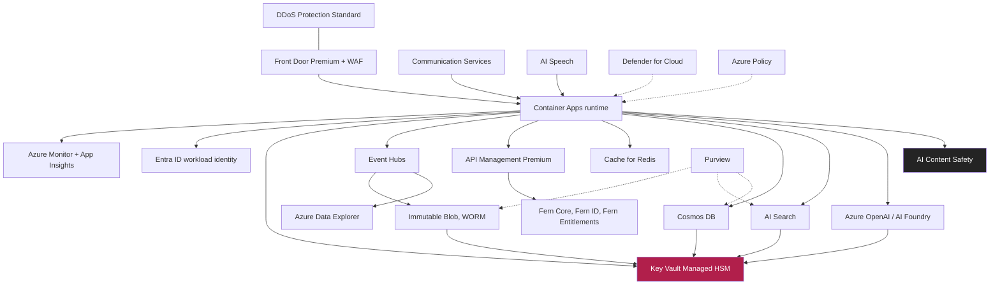

# Cloud Services Catalogue

**Document ID:** FB-KORU-201
**Version:** 1.0
**Date:** 27 August 2026
**Owner:** Head of Infrastructure
**Status:** Submitted for review

**Related documents**

- [Programme canon](../programme-canon.md) (FB-KORU-000)
- [Solution architecture](solution-architecture.md) (FB-KORU-200)
- [AI architecture](ai-architecture.md) (FB-KORU-202)
- [Data architecture](data-architecture.md) (FB-KORU-203)
- [Integration architecture](integration-architecture.md) (FB-KORU-204)
- [Network and connectivity](network-and-connectivity.md) (FB-KORU-205)
- [ADR-0001 Azure as AI platform](adr/ADR-0001-azure-as-ai-platform.md)
- [ADR-0009 Model portability](adr/ADR-0009-model-portability.md)
- [ADR-0010 Container Apps over AKS](adr/ADR-0010-container-apps-over-aks.md)
- [APRA CPS 230](../04-compliance/apra/cps-230-operational-risk.md) (FB-KORU-410)
- [RBNZ BS11](../04-compliance/rbnz/bs11-outsourcing.md) (FB-KORU-420)

---

## 1. Purpose

This catalogue lists every Azure service in the Koru design, grouped by plane, with a consistent entry for each: what it does in Koru, its tier or SKU, where it runs, how it is exposed to the network, how it authenticates, its encryption and customer managed key position, its resilience posture, its principal cost driver, the alternatives considered, and its exit or portability path.

It exists so that the Board, the Head of Infrastructure and the material service provider assessors can see the whole platform surface at once, understand why each service was chosen, and know how Fern Bank would leave each one if it had to. Service names, quotas and regional availability evolve; every entry must be confirmed against current vendor documentation at build time, per the reality disclaimer in the [programme canon](../programme-canon.md#9-reality-disclaimer).

---

## 2. Summary table

| Service | Plane | Tier or SKU | Network exposure | CMK | Resilience |
|---|---|---|---|---|---|
| Azure Front Door | Edge | Premium, with WAF | Public ingress, only public data plane | Vendor keys, TLS | Global anycast, zone resilient |
| Azure DDoS Protection | Edge | Network Protection Standard | Attached to public IPs | Not applicable | Regional |
| Azure Communication Services | Orchestrator | Standard, calling and streaming | Public media relay only | Platform, plus CMK where held | Zone redundant |
| Azure AI Speech | Orchestrator | Standard S0, avatar real-time | Private Endpoint | CMK | Zone redundant |
| Azure AI Content Safety | Assurance | Standard S0 | Private Endpoint | CMK | Zone redundant |
| Azure OpenAI | Reasoning | Provisioned plus Standard | Private Endpoint | CMK | Zone redundant, in region |
| Azure AI Foundry | Reasoning | Hub and project | Private Endpoint | CMK | Zone redundant |
| Azure AI Search | Knowledge | Standard S2 | Private Endpoint | CMK | 3 replicas, zone redundant |
| Azure Cosmos DB | State | Serverless and provisioned | Private Endpoint | CMK | Zone redundant, in region |
| Azure Cache for Redis | State | Premium P1 | Private Endpoint, VNet injected | Platform | Zone redundant |
| Azure Event Hubs | Ledger | Premium | Private Endpoint | CMK | Zone redundant |
| Azure Data Explorer | Ledger | Standard, engine v3 | Private Endpoint | CMK | Zone redundant |
| Azure Storage, immutable Blob | Ledger | General Purpose v2, ZRS | Private Endpoint | CMK | Zone redundant, WORM |
| Azure Container Apps | Compute | Dedicated workload profiles | Internal ingress, VNet integrated | Platform, plus CMK for state | Zone redundant |
| Azure API Management | Integration | Premium, VNet injected | Internal, plus self-hosted gateway | CMK for named values | Zone redundant, multi-unit |
| Azure Key Vault Managed HSM | Keys | Managed HSM pool | Private Endpoint | Is the key store, FIPS 140-2 L3 | Zone redundant |
| Microsoft Entra ID | Identity | P2 | Global control plane | Not applicable | Global |
| Microsoft Entra External ID | Identity | External ID | Global control plane | Not applicable | Global |
| Azure Monitor and Log Analytics | Observability | Per GB commitment tier | Private Link scope | CMK | Regional, zone resilient |
| Application Insights | Observability | Workspace based | Private Link scope | CMK | Regional |
| Microsoft Purview | Governance | Enterprise | Private Endpoint | CMK | Regional |
| Microsoft Defender for Cloud | Governance | Plans per resource type | Control plane | Not applicable | Global |
| Azure Policy | Governance | Included | Control plane | Not applicable | Global |
| Azure Firewall | Networking | Premium | Internal, hub | Not applicable | Zone redundant |
| Private Endpoints and Private Link | Networking | Per endpoint | Private only | Not applicable | Zone redundant |

Every service carrying customer data is deployed in-jurisdiction only, with no cross-Tasman replication, per [ADR-0003](adr/ADR-0003-jurisdictional-isolation.md). Every PaaS service with customer data is reached through a Private Endpoint, with no public data-plane exposure, per [FB-KORU-205](network-and-connectivity.md).

---

## 3. Service dependency map

The map shows the hard runtime dependencies. Key Vault Managed HSM is a dependency of every stateful service because every one uses customer managed keys. Entra ID is a dependency of every service because workload identity replaces secrets everywhere. Purview, Defender for Cloud and Azure Policy are governance overlays, shown dashed, that observe and constrain rather than sit on the request path.

---

## 4. Edge and channel

### 4.1 Azure Front Door Premium with WAF

| Field | Value |
|---|---|
| Purpose in Koru | Single public ingress for client signalling and the info panel. TLS termination, WAF inspection, rate limiting, bot protection, routing to the internal Container Apps origin over Private Link |
| Tier or SKU | Premium, required for Private Link origins and managed WAF rule sets |
| Region placement | Global service, origin is in-jurisdiction only |
| Network exposure | The only intentional public data-plane surface in the platform |
| Identity model | Managed identity to reach Private Link origins, no origin secrets |
| Encryption and CMK | TLS 1.2 minimum in and out, vendor-managed edge certificates or Fern Bank certificates in Key Vault |
| Resilience posture | Global anycast, automatic edge failover, health-probed origins |
| Cost driver | Requests, data egress, WAF evaluations |
| Alternatives considered | Application Gateway with WAF v2, rejected as regional only and without global edge or built-in bot management |
| Exit path | Front Door is a routing and security layer, not a data store. Replaceable with Application Gateway plus a CDN in roughly 2 to 4 weeks, no application change |

### 4.2 Azure DDoS Protection Standard

| Field | Value |
|---|---|
| Purpose in Koru | Volumetric and protocol attack protection on every public IP, principally the media relay and any public ingress |
| Tier or SKU | Network Protection, Standard |
| Region placement | Per virtual network, in-jurisdiction |
| Network exposure | Protects public IPs, no data plane of its own |
| Identity model | Not applicable |
| Encryption and CMK | Not applicable |
| Resilience posture | Always-on monitoring, adaptive tuning, attack analytics |
| Cost driver | Fixed monthly plus protected public IP count |
| Alternatives considered | Basic infrastructure protection only, rejected as insufficient for a regulated public-facing service |
| Exit path | Not applicable, native platform control |

---

## 5. Koru Orchestrator services

### 5.1 Azure Communication Services

| Field | Value |
|---|---|
| Purpose in Koru | WebRTC media session between the client and the platform, carrying the customer's audio uplink and the avatar audio and video downlink. Provides the TURN and STUN relay |
| Tier or SKU | Standard, calling and streaming, with TURN relay |
| Region placement | In-jurisdiction data handling, media relayed in region |
| Network exposure | Public media relay endpoint by necessity, media is UDP and cannot traverse the HTTP WAF path. Signalling is brokered through the Orchestrator |
| Identity model | Workload identity from the Orchestrator, short-lived tokens issued to clients per session |
| Encryption and CMK | SRTP for media in transit, DTLS for key exchange. No media persisted, so CMK at rest is not the primary concern. Any retained metadata uses CMK where the service supports it |
| Resilience posture | Zone redundant relay, session reconnection handled by the Orchestrator and client |
| Cost driver | Minutes of streamed audio and video, the single largest variable cost with avatar synthesis |
| Alternatives considered | Self-hosted WebRTC and TURN, rejected for the operational burden of running media infrastructure to a banking availability standard. Third-party CPaaS, rejected for residency and material service provider proliferation |
| Exit path | Media transport is abstracted behind the Orchestrator media interface. Descent to audio-only or text removes the dependency entirely, which is the Rung 2 fallback |

### 5.2 Azure AI Speech

| Field | Value |
|---|---|
| Purpose in Koru | Streaming speech to text for the customer's utterances with partial results under 300ms, and real-time text to speech avatar synthesis producing the streamed audio and video track |
| Tier or SKU | Standard S0, real-time avatar synthesis feature |
| Region placement | In-jurisdiction, New Zealand North and Australia East and Southeast |
| Network exposure | Private Endpoint, no public data plane |
| Identity model | Workload managed identity, no keys in application config |
| Encryption and CMK | Customer managed keys in Managed HSM for any service-side data at rest, TLS in transit. Audio is processed in memory and never persisted, per [ADR-0013](adr/ADR-0013-immutable-interaction-ledger.md) |
| Resilience posture | Zone redundant, capacity reserved per jurisdiction for latency |
| Cost driver | Recognition minutes and synthesis minutes, avatar synthesis metered per minute of generated video |
| Alternatives considered | Third-party speech and avatar vendors, rejected for residency, for lacking a New Zealand region, and for material service provider proliferation |
| Exit path | Streaming speech to text is portable across multiple providers, roughly a 2 to 4 week swap. Real-time avatar synthesis is the genuine lock-in, named in [ADR-0009](adr/ADR-0009-model-portability.md). Exit is descent to voice or text, not vendor substitution |

---

## 6. Koru Assurance Plane services

### 6.1 Azure AI Content Safety

| Field | Value |
|---|---|
| Purpose in Koru | The safety control set on both chains: Prompt Shields for direct and indirect prompt injection, groundedness detection for the 0.95 threshold, protected material detection, and custom categories for Fern Bank conduct rules |
| Tier or SKU | Standard S0 |
| Region placement | In-jurisdiction, Private Endpoint |
| Network exposure | Private Endpoint, no public data plane |
| Identity model | Workload managed identity |
| Encryption and CMK | CMK in Managed HSM, TLS in transit. Inputs are transient and not retained beyond the request |
| Resilience posture | Zone redundant. Because the Assurance Plane fails closed, Content Safety availability is a hard Koru dependency by design |
| Cost driver | Text records analysed per turn, twice per turn on average across both chains |
| Alternatives considered | Model-native safety only, rejected because the control then fails exactly when the model fails, per [ADR-0006](adr/ADR-0006-assurance-plane-as-a-service.md). Self-built classifiers, retained as a partial portability option |
| Exit path | Partially portable. Groundedness scoring and shields would need replacement or self-build, estimated 8 to 12 weeks, per [ADR-0009](adr/ADR-0009-model-portability.md) |

The Assurance Plane runtime itself is Container Apps, catalogued in section 10.1. Content Safety is the specialist safety engine it calls.

---

## 7. Koru Reasoning Plane services

### 7.1 Azure OpenAI

| Field | Value |
|---|---|
| Purpose in Koru | The language models: a fast conversational model for most turns, a stronger reasoning model for complex turns, and inference for the small routing and intent classifier where hosted here |
| Tier or SKU | Provisioned throughput units for the latency-critical fast model, Standard for burst and lower-priority workloads |
| Region placement | In-jurisdiction only, capacity reserved per jurisdiction |
| Network exposure | Private Endpoint, no public data plane |
| Identity model | Workload managed identity, no API keys in config |
| Encryption and CMK | CMK in Managed HSM. Customer data is never used to train or fine-tune, per [ADR-0008](adr/ADR-0008-no-customer-data-in-training.md). No customer content leaves jurisdiction |
| Resilience posture | Zone redundant within region. Provisioned throughput gives predictable latency, Standard gives burst headroom. Model routing sheds from reasoning class to fast class under pressure |
| Cost driver | Tokens processed, provisioned throughput units reserved. The largest AI compute cost line |
| Alternatives considered | Self-hosted open weight models, rejected for Phase 1 as transferring full model risk and safety tuning burden, retained as a strategic option for Phase 2. Other hosted providers, rejected for residency and concentration of assessment surface |
| Exit path | Chat completion and streaming are portable across credible providers. The Reasoning Plane is written against an internal model interface, not the vendor SDK, so an in-family or cross-provider swap does not touch application logic, per [ADR-0009](adr/ADR-0009-model-portability.md) |

### 7.2 Azure AI Foundry

| Field | Value |
|---|---|
| Purpose in Koru | The hub for model deployment, versioning, evaluation runs, prompt flow, and hosting of the small classifier model. The control surface through which models are promoted and retired |
| Tier or SKU | Foundry hub and project, standard |
| Region placement | In-jurisdiction, Private Endpoint |
| Network exposure | Private Endpoint, managed VNet for compute |
| Identity model | Workload and user managed identity, role-based access control |
| Encryption and CMK | CMK in Managed HSM for the hub storage and associated resources |
| Resilience posture | Zone redundant. Not on the live turn path for most functions, it is the model lifecycle and evaluation platform |
| Cost driver | Managed compute for evaluation and classifier hosting, storage |
| Alternatives considered | Bespoke MLOps tooling, rejected for the additional assurance and CPS 234 evidence burden of a self-built control surface |
| Exit path | Evaluation datasets and prompt assets are owned by Fern Bank in source form. The classifier is retrainable elsewhere. Moderate portability |

---

## 8. Koru Knowledge Plane services

### 8.1 Azure AI Search

| Field | Value |
|---|---|
| Purpose in Koru | Hybrid retrieval over the approved product corpus, combining vector and keyword search with the semantic ranker, returning cited chunks with versions and validity windows |
| Tier or SKU | Standard S2, sized for latency headroom, three replicas for query availability, partitions for corpus size |
| Region placement | In-jurisdiction only, one index per jurisdiction |
| Network exposure | Private Endpoint, no public data plane |
| Identity model | Workload managed identity, role-based access control, no admin keys in config |
| Encryption and CMK | CMK in Managed HSM. Embeddings of customer utterances are treated as personal information and never cross the Tasman, per [ADR-0003](adr/ADR-0003-jurisdictional-isolation.md) |
| Resilience posture | Three replicas give query resilience across zones, partitions scale corpus size. Retrieval is on the critical path, so replicas are sized for latency not just throughput |
| Cost driver | Search units, replicas times partitions, and semantic ranker queries |
| Alternatives considered | Vector-only stores, rejected because keyword precision matters for product and fee terminology. Self-hosted vector databases, rejected for the operational and assurance burden |
| Exit path | The corpus is owned in source form. Re-embedding is a batch job of roughly 6 hours, re-indexing to an alternate platform is roughly 4 to 6 weeks, per [ADR-0009](adr/ADR-0009-model-portability.md) |

Fern Core read APIs, the other half of the Knowledge Plane, are integration endpoints rather than Azure platform services and are catalogued in [FB-KORU-204](integration-architecture.md).

---

## 9. State and Ledger services

### 9.1 Azure Cosmos DB

| Field | Value |
|---|---|
| Purpose in Koru | Durable session and conversation state for the lifetime of a session, so a dropped session can resume without losing context |
| Tier or SKU | Serverless for lower environments, provisioned throughput with autoscale for production |
| Region placement | Single region per jurisdiction, no multi-region write across the Tasman |
| Network exposure | Private Endpoint, no public data plane |
| Identity model | Workload managed identity, role-based access control, no connection strings in config |
| Encryption and CMK | CMK in Managed HSM, TLS in transit |
| Resilience posture | Zone redundant within region. Deliberately single-region to honour residency, accepting no cross-region write, consistent with Koru not being on the basic banking path |
| Cost driver | Request units and stored data |
| Alternatives considered | Relational store, rejected for the flexible session document shape and the need for low-latency point reads and writes on the turn path |
| Exit path | State is transient with a short lifetime, not a system of record. Export and re-home is straightforward, moderate to easy portability |

### 9.2 Azure Cache for Redis

| Field | Value |
|---|---|
| Purpose in Koru | Ephemeral per-turn state, barge-in flags, rate and cost counters, and short-lived caches, with a short time to live |
| Tier or SKU | Premium P1, required for VNet injection and zone redundancy |
| Region placement | In-jurisdiction |
| Network exposure | VNet injected, private only |
| Identity model | Microsoft Entra authentication to Redis, no access keys in config |
| Encryption and CMK | TLS in transit, platform-managed at rest. Holds no durable customer record, only transient state |
| Resilience posture | Zone redundant. Loss is tolerable because state can be rebuilt from Cosmos at a small latency cost |
| Cost driver | Cache size and throughput |
| Alternatives considered | In-process caches, rejected because turn state must survive a replica move within a session |
| Exit path | Ephemeral, no exit concern. Replaceable with any managed cache in days |

### 9.3 Azure Event Hubs

| Field | Value |
|---|---|
| Purpose in Koru | Ingest the interaction event stream from every plane into the Ledger pipeline, decoupling the turn path from durable Ledger writes |
| Tier or SKU | Premium, for private networking and predictable throughput |
| Region placement | In-jurisdiction, one Ledger pipeline per jurisdiction |
| Network exposure | Private Endpoint |
| Identity model | Dedicated Ledger writer managed identity with send permission only |
| Encryption and CMK | CMK in Managed HSM, TLS in transit |
| Resilience posture | Zone redundant. Asynchronous write with synchronous receipt acknowledgement keeps the durable write off the critical path while preserving the 15 minute RPO |
| Cost driver | Throughput units and ingress events |
| Alternatives considered | Direct writes to storage, rejected for coupling the turn path to durable write latency and losing the analytics fan-out |
| Exit path | Standard event streaming protocol, portable to other brokers, moderate |

### 9.4 Azure Data Explorer

| Field | Value |
|---|---|
| Purpose in Koru | The queryable analytics store for the Ledger, powering replay reconstruction, evaluation ground truth, drift analysis and assurance reporting |
| Tier or SKU | Standard, engine v3, sized for retention and query concurrency |
| Region placement | In-jurisdiction |
| Network exposure | Private Endpoint |
| Identity model | Managed identity, case-based time-boxed read grants, no standing access, per [ADR-0013](adr/ADR-0013-immutable-interaction-ledger.md) |
| Encryption and CMK | CMK in Managed HSM |
| Resilience posture | Zone redundant, hot cache sized for the working window with the long tail on the immutable archive |
| Cost driver | Cluster compute and cache size |
| Alternatives considered | General-purpose data warehouse, rejected for weaker time-series and log query performance at this ingest rate |
| Exit path | Query results and raw events are exportable. The authoritative archive is the immutable Blob store, which is open format, so Data Explorer can be rebuilt |

### 9.5 Azure Storage, immutable Blob

| Field | Value |
|---|---|
| Purpose in Koru | The seven year immutable archive of the Ledger, the authoritative evidence store, with WORM and legal hold |
| Tier or SKU | General Purpose v2, zone redundant storage, immutable blob policy, time-based retention locked at 7 years |
| Region placement | In-jurisdiction only |
| Network exposure | Private Endpoint, no public access |
| Identity model | Append-only writer identity, no update or delete role exists for any human or workload |
| Encryption and CMK | CMK in Managed HSM. The highest-value store in the platform, so it carries the strongest key controls |
| Resilience posture | Zone redundant. WORM policy is locked, so retention cannot be shortened retrospectively. Legal hold suspends expiry per session on dispute or request |
| Cost driver | Stored data over seven years, roughly 4 percent of platform run cost |
| Alternatives considered | Mutable store with audit logging, rejected because audit logs on a mutable store are weaker evidence than immutability, per [ADR-0013](adr/ADR-0013-immutable-interaction-ledger.md) |
| Exit path | Open format in Fern Bank controlled storage. Fully portable, the archive is deliberately vendor-neutral |

---

## 10. Cross-cutting platform services

### 10.1 Azure Container Apps

| Field | Value |
|---|---|
| Purpose in Koru | The runtime for the Orchestrator, Assurance, Reasoning and Knowledge gateway services |
| Tier or SKU | Workload profile environment, dedicated D-series for Reasoning and Assurance, Consumption for lower-tier services |
| Region placement | In-jurisdiction, VNet integrated into the runtime subnet |
| Network exposure | Internal ingress only, no public ingress, public traffic arrives via Front Door and Private Link |
| Identity model | User-assigned managed identity per app, no secrets in the container |
| Encryption and CMK | Platform-managed for the runtime, CMK applies to the stateful services the apps call |
| Resilience posture | Zone redundant. Minimum replicas are never zero for latency-sensitive apps, so a cold start never lands on the 1.2 second budget, per [ADR-0010](adr/ADR-0010-container-apps-over-aks.md) |
| Cost driver | vCPU and memory seconds, minimum replica floor |
| Alternatives considered | Azure Kubernetes Service, the platform standard, rejected for Phase 1 for operational burden with an AKS path kept ready. App Service and Functions rejected for the WebRTC and latency profile, all in [ADR-0010](adr/ADR-0010-container-apps-over-aks.md) |
| Exit path | Standard OCI images with no platform-specific runtime dependency, enforced by a CI check. Move to AKS is one to two quarters with no application rewrite |

### 10.2 Azure API Management

| Field | Value |
|---|---|
| Purpose in Koru | The managed boundary to the existing bank: Fern Core reads, Fern ID, Fern Entitlements, Kaitiaki Desk, notification and fraud services. Policy enforcement, rate limiting, token validation and observability |
| Tier or SKU | Premium, VNet injected, multi-unit, with a self-hosted gateway option for on-premises adjacency |
| Region placement | In-jurisdiction, injected into the integration subnet |
| Network exposure | Internal, no public gateway. Self-hosted gateway placed close to on-premises Fern Core where latency requires |
| Identity model | Managed identity outbound to backends, Entra validation inbound, subscription keys per consumer |
| Encryption and CMK | CMK for named values and secrets, TLS to backends |
| Resilience posture | Zone redundant, multi-unit. Circuit breakers and timeouts sized to fit inside the turn budget, per [FB-KORU-204](integration-architecture.md) |
| Cost driver | Units and calls |
| Alternatives considered | Direct point-to-point integration, rejected for losing a single governed policy and observability boundary |
| Exit path | Policies and API definitions are exportable. Moderate portability, the contracts are owned by Fern Bank |

### 10.3 Azure Key Vault Managed HSM

| Field | Value |
|---|---|
| Purpose in Koru | The root of trust. Holds the customer managed keys used by every stateful service, in a dedicated single-tenant HSM pool |
| Tier or SKU | Managed HSM pool, FIPS 140-2 Level 3 |
| Region placement | In-jurisdiction, one pool per jurisdiction |
| Network exposure | Private Endpoint, no public access |
| Identity model | Role-based access control, separation of duties between key administrators and key users, workload identity for key use |
| Encryption and CMK | It is the key store. Keys are non-exportable, rotation is scheduled, and key use is logged |
| Resilience posture | Zone redundant, with secure backup within jurisdiction. Loss of the HSM is a platform-wide event, so it carries the strongest controls |
| Cost driver | HSM pool hourly cost and key operations |
| Alternatives considered | Standard Key Vault, rejected for the Ledger and customer data where single-tenant HSM assurance is required. Third-party HSM, rejected for the integration and residency burden |
| Exit path | Keys are non-exportable by design, which is the point. Exit is key rotation and re-encryption under a new provider, a deliberate one-way property for security |

### 10.4 Microsoft Entra ID

| Field | Value |
|---|---|
| Purpose in Koru | Workload identity for every service, replacing secrets everywhere. Role-based access control, conditional access for operators, privileged identity management for standing-down of admin roles |
| Tier or SKU | P2, for privileged identity management and identity protection |
| Region placement | Global control plane, separate application registrations and managed identities per jurisdiction so a workload in one holds no credential valid in the other |
| Network exposure | Control plane, token endpoints reached over the egress allow-list |
| Identity model | It is the identity provider for workloads and operators |
| Encryption and CMK | Not applicable, control plane |
| Resilience posture | Global, highly available. Token acquisition failure degrades new workload auth, mitigated by token caching |
| Cost driver | Licensed per operator, workload identities included |
| Alternatives considered | Secrets in Key Vault referenced by apps, rejected in favour of no-secret workload identity as the stronger and more evidenceable position |
| Exit path | Not applicable, foundational to the Azure platform decision in [ADR-0001](adr/ADR-0001-azure-as-ai-platform.md) |

### 10.5 Microsoft Entra External ID

| Field | Value |
|---|---|
| Purpose in Koru | The identity platform behind Fern ID for customers, issuing the authenticated session token the Orchestrator validates, supporting passkeys and step-up |
| Tier or SKU | External ID, monthly active user based |
| Region placement | In-jurisdiction customer directory, separate per entity |
| Network exposure | Control plane, customer authentication through Fern ID |
| Identity model | Customer identity provider, passkey and step-up capable |
| Encryption and CMK | Platform, customer identity data governed under the privacy assessment |
| Resilience posture | Global control plane, high availability. Voice is never a factor, per [ADR-0004](adr/ADR-0004-no-voice-biometric-authentication.md) |
| Cost driver | Monthly active users |
| Alternatives considered | Third-party customer identity, rejected for integration and residency, and to keep one identity fabric |
| Exit path | Fern ID abstracts the identity provider from Koru, so Koru consumes a token and is insulated from the provider choice |

### 10.6 Azure Monitor, Log Analytics and Application Insights

| Field | Value |
|---|---|
| Purpose in Koru | Metrics, logs and distributed traces across every plane, the latency budget instrumentation, and the SLO and error budget telemetry in [FB-KORU-500](../05-operations/service-levels.md) |
| Tier or SKU | Log Analytics commitment tier by volume, Application Insights workspace based |
| Region placement | In-jurisdiction workspace, reached through an Azure Monitor Private Link Scope |
| Network exposure | Private Link scope, no public ingestion of customer-adjacent telemetry |
| Identity model | Workload managed identity for ingestion |
| Encryption and CMK | CMK for the workspace. Telemetry is scrubbed of content and identifiers before any aggregate cross-Tasman export, per [ADR-0003](adr/ADR-0003-jurisdictional-isolation.md) |
| Resilience posture | Regional, zone resilient |
| Cost driver | Ingested and retained gigabytes |
| Alternatives considered | Third-party observability, rejected for residency and for exporting operational metadata that can be re-identifiable |
| Exit path | Standard query and export. Dashboards and queries are owned assets, moderate portability |

### 10.7 Microsoft Purview

| Field | Value |
|---|---|
| Purpose in Koru | Data cataloguing, classification and lineage across the corpus, state stores and Ledger, supporting the CPG 235 data risk position |
| Tier or SKU | Enterprise |
| Region placement | In-jurisdiction |
| Network exposure | Private Endpoint |
| Identity model | Managed identity scanning with least privilege |
| Encryption and CMK | CMK. Scans metadata and classifications, not the content of the immutable Ledger by default |
| Resilience posture | Regional, off the live turn path |
| Cost driver | Scanned assets and catalogue capacity |
| Alternatives considered | Manual data inventory, rejected as unmaintainable and weak evidence for CPG 235 |
| Exit path | Catalogue export, moderate. Classifications are owned |

### 10.8 Microsoft Defender for Cloud

| Field | Value |
|---|---|
| Purpose in Koru | Cloud security posture management and workload protection across the platform, feeding the CPS 234 control testing and the threat model in FB-KORU-301 |
| Tier or SKU | Defender plans per resource type, servers, containers, storage, key vault, AI |
| Region placement | Global control plane, in-jurisdiction resource coverage |
| Network exposure | Control plane |
| Identity model | Platform |
| Encryption and CMK | Not applicable |
| Resilience posture | Global |
| Cost driver | Protected resource count per plan |
| Alternatives considered | Third-party CSPM, rejected for a single posture view aligned to the Azure platform decision |
| Exit path | Not applicable, native posture control |

### 10.9 Azure Policy

| Field | Value |
|---|---|
| Purpose in Koru | Preventive and detective governance: allowed-locations initiatives enforcing residency, deny public endpoints, require CMK, require private endpoints, enforce tagging and naming |
| Tier or SKU | Included with Azure |
| Region placement | Global control plane, jurisdiction-scoped assignments |
| Network exposure | Control plane |
| Identity model | Platform |
| Encryption and CMK | Not applicable |
| Resilience posture | Global |
| Cost driver | Included |
| Alternatives considered | Manual controls and review, rejected because residency and no-public-endpoint must be enforced in code, per [ADR-0003](adr/ADR-0003-jurisdictional-isolation.md) |
| Exit path | Policy definitions are portable infrastructure code in `terraform/modules/governance` |

### 10.10 Azure Firewall and Private Link

| Field | Value |
|---|---|
| Purpose in Koru | Azure Firewall Premium provides default-deny egress with an FQDN allow-list from the hub. Private Endpoints and Private Link provide private-only reach to every PaaS service |
| Tier or SKU | Azure Firewall Premium, Private Endpoints per service |
| Region placement | In-jurisdiction hub and spokes |
| Network exposure | Internal only, the enforcement of no public data-plane exposure |
| Identity model | Platform |
| Encryption and CMK | Not applicable |
| Resilience posture | Zone redundant firewall. Firewall loss blocks egress, which fails safe for a default-deny posture |
| Cost driver | Firewall deployment and processed data, private endpoint count |
| Alternatives considered | Network virtual appliance, rejected for operational burden. Service endpoints, rejected as weaker than Private Link for a no-public-data-plane requirement |
| Exit path | Native networking, detailed in [FB-KORU-205](network-and-connectivity.md) |

---

## 11. Material service provider position

Under APRA CPS 230, Microsoft Azure is registered as a **material service provider** for Koru, because a severe, prolonged impairment would degrade the entire Koru capability at once. This is the concentration risk KORU-R-03, accepted and escalated to the Board. Under RBNZ BS11, the arrangement is recorded in the outsourcing compendium and the separation plan is extended to cover Koru.

| Obligation | How this catalogue supports it |
|---|---|
| CPS 230 register entry and notification | The service list, tiers and dependency map form the register basis, per [FB-KORU-410](../04-compliance/apra/cps-230-operational-risk.md) |
| CPS 230 exit and transition | Every entry carries an exit path, and the aggregate exit position is the Rung 2 fallback, per [ADR-0009](adr/ADR-0009-model-portability.md) |
| CPS 230 fourth-party supply chain | Vendor-side dependencies within each service are assessed as part of the arrangement |
| BS11 compendium and separation plan | The in-jurisdiction placement and no cross-Tasman replication support continuity of basic banking without Koru, per [FB-KORU-420](../04-compliance/rbnz/bs11-outsourcing.md) |
| BS11 continuity of basic banking | Basic banking never depends on Koru, so Azure impairment does not impair basic banking |
| CPS 234 third-party assurance | Each service carries an identity, network and CMK position that forms the control evidence, per FB-KORU-411 |

**The single defensible statement to both regulators:** the platform is concentrated on one provider by deliberate decision, the concentration is a named accepted risk, and the exit position is not vendor substitution but a tested descent to a degraded, non-generative service that keeps basic banking answers flowing while Koru is unavailable.

---

## 12. Assumptions and planned items

| Item | Type | Owner | Resolve by |
|---|---|---|---|
| Provisioned throughput units sizing for the fast model | Assumption | Head of AI Engineering | Phase 0 exit |
| Avatar synthesis minute cost at Phase 1 volume | Assumption | Head of Infrastructure | Phase 1 ramp gate |
| Managed HSM key rotation cadence confirmed against policy | Planned | CISO | Phase 0 exit |
| Self-hosted gateway placement for Fern Core adjacency | Planned | Head of Infrastructure | Phase 0 exit |
| Regional availability of every named SKU confirmed at build | Planned | Head of Infrastructure | Before Phase 1 |

---

## 13. Summary

Every Azure service in Koru is here with a reason for its selection, a tier, a network and identity position, a customer managed key position, a resilience posture, a cost driver and an exit path. Customer data services run in-jurisdiction only and are reached through Private Endpoints with no public data plane. Key Vault Managed HSM is the shared root of trust. Entra ID workload identity removes secrets. The immutable Blob archive is deliberately open format so the Ledger is never trapped in a vendor. The concentration on Azure is real, named and accepted, and the exit position is the tested Rung 2 fallback rather than a substitution story that would not survive contact with a regulator.
