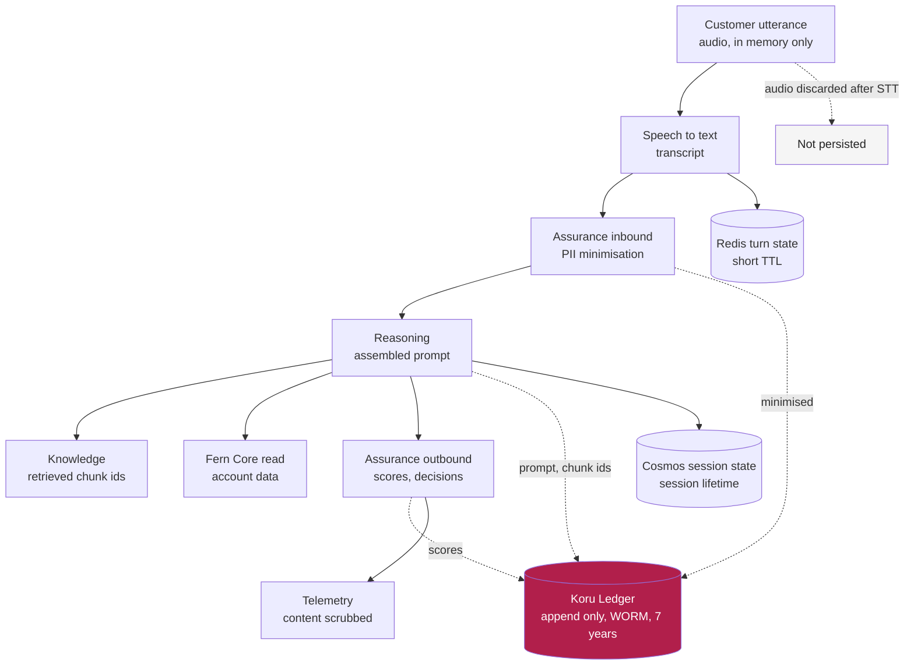
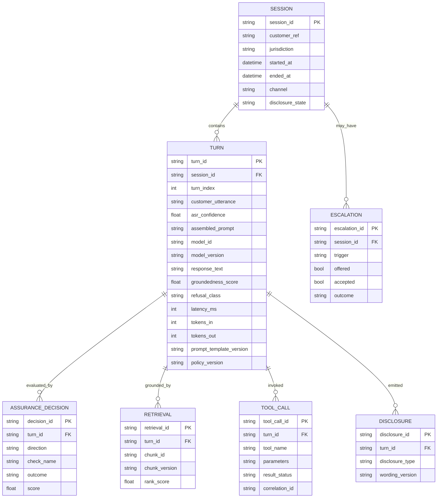
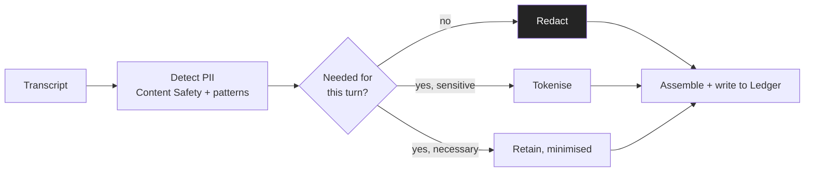
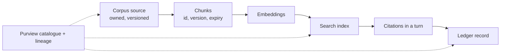

# Data Architecture

**Document ID:** FB-KORU-203
**Version:** 1.0
**Date:** 27 August 2026
**Owner:** Head of Data, Digital Channels
**Status:** Submitted for review

**Related documents**

- [Programme canon](../programme-canon.md) (FB-KORU-000)
- [Solution architecture](solution-architecture.md) (FB-KORU-200)
- [Cloud services catalogue](cloud-services-catalogue.md) (FB-KORU-201)
- [AI architecture](ai-architecture.md) (FB-KORU-202)
- [Network and connectivity](network-and-connectivity.md) (FB-KORU-205)
- [ADR-0003 Jurisdictional isolation](adr/ADR-0003-jurisdictional-isolation.md)
- [ADR-0008 No customer data in training](adr/ADR-0008-no-customer-data-in-training.md)
- [ADR-0013 Immutable interaction ledger](adr/ADR-0013-immutable-interaction-ledger.md)
- [APRA CPG 235 Data risk](../04-compliance/apra/cpg-235-data-risk.md) (FB-KORU-412)
- [Privacy impact assessment](../04-compliance/privacy/privacy-impact-assessment.md) (FB-KORU-440)

---

## 1. Purpose

This document describes how Koru handles data: the domains it touches, the classification scheme it applies, where data may and may not live, how the Koru Ledger records every interaction immutably, how long each data type is kept, how personal information is detected and minimised, how everything is encrypted, and how a customer exercises access and correction rights in each jurisdiction.

Two positions from the canon shape everything below. First, there is no cross-Tasman replication of customer content, transcripts, embeddings or model telemetry, per [ADR-0003](adr/ADR-0003-jurisdictional-isolation.md). Second, every interaction is recorded immutably for seven years with audio never retained, per [ADR-0013](adr/ADR-0013-immutable-interaction-ledger.md). The design reconciles a comprehensive evidence record with a genuine privacy cost, and it treats that cost as a cost, not as a non-issue.

---

## 2. Data domains

Koru originates no system of record. It reads from the bank, records what happened, and grounds itself on approved content. The domains below are the data it touches.

| Domain | Contents | Origin | System of record |
|---|---|---|---|
| Customer identity | Authenticated customer identifier, session token | Fern ID | Fern ID |
| Account data | Balances, transactions, product holdings, read only | Fern Core | Fern Core |
| Conversation content | Transcripts of customer and Koru utterances, assembled prompts | Koru session | Koru Ledger |
| Interaction metadata | Model versions, scores, decisions, latencies, tool calls | Koru planes | Koru Ledger |
| Retrieval corpus | Approved product truth, fees, rates, terms, processes | Product and content owners | Corpus source repository |
| Embeddings | Vectors of corpus chunks and, transiently, of utterances | Embedding pipeline | Corpus index |
| Ephemeral state | Turn state, barge-in flags, counters | Koru Orchestrator | Redis, transient |
| Session state | Conversation state for the session lifetime | Koru Orchestrator | Cosmos DB |
| Operational telemetry | Metrics, logs, traces, scrubbed of content | Every plane | Azure Monitor |

Audio and rendered avatar video are deliberately absent from every durable domain. They exist in memory only for the duration of transcription and synthesis, and are then discarded, per [ADR-0013](adr/ADR-0013-immutable-interaction-ledger.md).

---

## 3. Classification scheme

Koru applies the Fern Bank four-tier classification. Every data element is classified, and the classification drives the encryption, access, residency and retention controls applied to it.

| Class | Definition | Koru examples | Baseline controls |
|---|---|---|---|
| Public | Freely disclosable | Published product names, marketing copy | Integrity controls, no confidentiality control needed |
| Internal | Not for public release, low harm | Aggregated, de-identified service metrics | Access control, encryption in transit |
| Confidential | Harm to a customer or the bank if disclosed | Corpus source documents, tool schemas, prompt templates | Access control, encryption at rest and in transit, private networking |
| Highly Confidential | Serious harm if disclosed | Transcripts, assembled prompts, account data, embeddings of utterances, the Ledger | CMK in Managed HSM, private endpoints, no standing access, in-jurisdiction only |

Conversation content and interaction records are Highly Confidential by default. Embeddings of customer utterances are treated as Highly Confidential personal information, not as anonymous vectors, which is why they never cross the Tasman, per [ADR-0003](adr/ADR-0003-jurisdictional-isolation.md).

---

## 4. Data flow

The flow below traces data through a turn and into the durable stores. Content is minimised before it is recorded, and no content or identifiers leave jurisdiction.

| Stage | Data | Persisted? | Where |
|---|---|---|---|
| Capture | Audio | No | Memory only, discarded after transcription |
| Recognition | Transcript, confidence | Yes, minimised | Ledger |
| Minimisation | PII beyond need redacted | Applied before write | Assurance inbound |
| Assembly | Prompt with PII minimised | Yes | Ledger |
| Retrieval | Chunk identifiers and versions | Yes, referenced not copied | Ledger |
| Account read | Balances, transactions | Not stored by Koru | Fern Core remains system of record |
| Output | Response text, scores, decisions | Yes | Ledger |
| State | Session and turn state | Yes, transient | Cosmos, Redis |

---

## 5. Residency and sovereignty

Koru runs as two sovereign deployments with no shared plane, per [ADR-0003](adr/ADR-0003-jurisdictional-isolation.md). The rules below are enforced in code, not policy, and are tested.

| Data | New Zealand | Australia | Crosses Tasman? |
|---|---|---|---|
| Audio, transcripts, prompts, completions | New Zealand North only | Australia East and Southeast only | No |
| Embeddings of customer utterances | In NZ | In AU | No |
| Customer identifiers, account data | In NZ | In AU | No |
| Session and conversation state | In NZ | In AU | No |
| Ledger records | NZ Ledger | AU Ledger | No, two separate ledgers |
| Aggregated, de-identified service metrics | Exportable | Exportable | Yes, content and identifiers stripped, k-anonymity floor |
| Approved corpus source documents | Published in | Published in | Yes, one way, not customer data |
| Prompt templates, policy and model configuration | Shared | Shared | Yes, not customer data |
| Evaluation datasets | Synthetic only | Synthetic only | Synthetic only |

Enforcement mechanisms:

| Mechanism | Effect |
|---|---|
| Azure Policy allowed-locations initiative per jurisdiction | Denies resource creation outside permitted regions |
| Terraform variable validation | Rejects a region that does not match the deployment jurisdiction |
| Separate state backends and Entra app registrations | A workload in one jurisdiction holds no credential valid in the other |
| Network topology | No peering, no shared hub, no transit between the two deployments |
| Telemetry pipeline scrubbing | Strips content and identifiers before any aggregate export, verified in CI, control KORU-C-24 |

Resilience is delivered by availability zones within jurisdiction, and in Australia by a second Australian region, never by failover across the Tasman. A total loss of New Zealand North takes New Zealand Koru offline until the region recovers, which is accepted because Koru is not on the basic banking path.

---

## 6. The Koru Ledger

The Ledger is the immutable, replayable record of every interaction. It is how every other risk is investigated and how every regulatory and dispute question is answered with evidence rather than reconstruction. The design decisions and the privacy reconciliation are in [ADR-0013](adr/ADR-0013-immutable-interaction-ledger.md); this section is the data architecture view.

### 6.1 What is and is not recorded

| Recorded | Not recorded |
|---|---|
| Transcript of customer utterances | Raw voice audio |
| Transcript of Koru responses | Rendered avatar video |
| Speech recognition confidence per utterance | Voice characteristics or speaker embeddings |
| Assembled prompt, PII minimised | |
| Retrieved chunk identifiers and versions | Full corpus content, referenced not copied |
| Model identity, version, generation parameters | |
| Every Assurance decision, both directions, with scores | |
| Groundedness score and citation map | |
| Every tool call, parameters, result status | Full downstream payloads, referenced by correlation id |
| Entitlement decisions | |
| Disclosure events, type and wording version | |
| Refusals, class and reason | |
| Escalation offers, acceptances, outcomes | |
| Vulnerability and distress protocol invocations | |
| Prompt template and policy configuration versions | |
| Latency per hop, token counts, cost | |
| Session, customer and correlation identifiers | |

### 6.2 Ledger schema

The Ledger is modelled as a session with its turns, and each turn with its decisions, retrievals, tool calls and disclosures. The relational view below is the logical model; physically it is an append-only event stream landing in Event Hubs, queryable in Azure Data Explorer, and archived in immutable Blob.

| Entity | Purpose | Notes |
|---|---|---|
| SESSION | One conversation | Holds disclosure state and jurisdiction |
| TURN | One exchange | The core evidential record, prompt to response with scores |
| ASSURANCE_DECISION | One guardrail check | Both directions, one row per check with outcome and score |
| RETRIEVAL | One retrieved chunk | Chunk id and version, content referenced not copied |
| TOOL_CALL | One tool invocation | Parameters and result status, payloads referenced by correlation id |
| DISCLOSURE | One disclosure event | Type and wording version, evidence of AI disclosure |
| ESCALATION | One handoff | Trigger, offer, acceptance and outcome |

### 6.3 Immutability and replay

| Property | Mechanism |
|---|---|
| Append only | Writer identity holds append permission only, no update or delete role exists |
| Write once, read many | Azure Storage immutable blob, time-based retention 7 years, locked |
| Tamper evidence | Per-record hash, chained per session, periodic anchor digest written separately |
| Legal hold | Applied per session on dispute, complaint or regulatory request, suspends expiry |
| Separation | Dedicated writer identity that no application workload assumes, the Reasoning Plane cannot write directly |
| Replay | A session reconstructed turn by turn with the exact model, prompt, corpus and policy versions in force |

Replay reconstructs what happened and why: the input, the retrieved context, the configuration and the decisions. It does not guarantee that re-running the same input through the same model reproduces the same output, because generative models are non-deterministic and vendor behaviour changes. This limit is stated explicitly in any external evidence, because overstating it would be worse than the limit itself. What can always be stated with certainty is the exact text Koru said, at that time, to that customer, based on those sources, under that configuration.

### 6.4 Access control on the Ledger

Access to the Ledger is not a role, it is a case.

| Control | Detail |
|---|---|
| No standing access | No permanent read role exists on Ledger content |
| Case-based grant | Access is granted per investigation, time-boxed, tied to a case reference, expiring automatically, control KORU-C-25 |
| Every access logged | Access is an auditable event, reviewed monthly by the Privacy Officer, access without a valid case reference is a disciplinary matter |
| No content analytics by default | Aggregate analytics run on metadata and scores, not transcript content, content analysis needs a documented purpose and Privacy Officer approval |
| Customer access | A customer may request their own records under IPP 6 and APP 12, in readable form |

---

## 7. Retention and deletion schedule

Retention is capped and enforced by storage policy, not by a job that might not run. The seven year Ledger retention aligns with existing financial record obligations under AML/CFT in New Zealand and AML/CTF in Australia, so it introduces no new retention concept.

| Data type | Class | Retention | Deletion mechanism |
|---|---|---|---|
| Audio | Highly Confidential | Not retained | Discarded from memory after transcription |
| Avatar video | Highly Confidential | Not retained | Not persisted |
| Ledger records | Highly Confidential | 7 years | Automatic expiry by locked storage policy, unless legal hold |
| Session state, Cosmos | Highly Confidential | Session lifetime plus short grace | Time to live expiry |
| Turn state, Redis | Highly Confidential | Minutes | Short TTL expiry |
| Corpus source documents | Confidential | Version lifetime | Superseded and archived on change |
| Corpus embeddings | Highly Confidential | Index lifetime | Rebuilt on re-embed |
| Operational telemetry | Internal | Per Log Analytics retention | Workspace retention policy |
| Aggregated de-identified metrics | Internal | Per analytics need | Standard lifecycle |

Because Ledger records are subject to statutory retention, an erasure request cannot be fully honoured for those records within the retention period. This is lawful in both jurisdictions and is explained clearly to customers; it is recorded as a residual in the privacy impact assessment, [FB-KORU-440](../04-compliance/privacy/privacy-impact-assessment.md).

---

## 8. Personal information handling

Koru minimises personal information before it is recorded, so the Ledger holds the minimum viable record, not the maximum available one.

| Technique | Where | Purpose |
|---|---|---|
| Detection | Assurance inbound | Identify PII in the transcript before the prompt is assembled |
| Minimisation | Assurance inbound | Remove PII not needed for the turn, before any write |
| Redaction | Assurance inbound | Replace unnecessary PII with placeholders in the recorded prompt |
| Tokenisation | Where a sensitive value must be referenced but not stored in clear | Replace with a token, resolvable only through a controlled path |
| Reference not copy | Knowledge and tool calls | Store chunk ids and correlation ids, not full payloads |

The design principle is that grounding reduces the risk of the model fabricating statements about a customer, and minimisation reduces the sensitivity of what is recorded, so the two controls compound.

---

## 9. Encryption and key management

| Layer | Control |
|---|---|
| In transit | TLS 1.2 minimum everywhere, SRTP and DTLS for media, private networking so traffic does not traverse the public internet |
| At rest | Customer managed keys in Azure Key Vault Managed HSM, FIPS 140-2 Level 3, for every Highly Confidential and Confidential store |
| Key custody | Managed HSM per jurisdiction, keys non-exportable, separation of duties between key administrators and key users |
| Key rotation | Scheduled rotation with re-encryption, key use logged, rotation cadence set by the CISO |
| Highest-value store | The immutable Blob archive carries the strongest key controls as the platform's highest-value target |

**Planned.** Confirmation of the Managed HSM key rotation cadence against the enterprise key management standard. Owner: CISO. Resolve by Phase 0 exit.

Customer data is never used to train or fine-tune models, so there is no model-side copy of customer content to key-manage, per [ADR-0008](adr/ADR-0008-no-customer-data-in-training.md).

---

## 10. Lineage and cataloguing

Microsoft Purview catalogues and classifies the corpus, the state stores and the Ledger, and maintains lineage from corpus source through embedding and index to the citations recorded in the Ledger. This supports the CPG 235 data risk position across the AI lifecycle.

| Capability | Purview role |
|---|---|
| Cataloguing | Registers data assets with owners and classifications |
| Classification | Detects and labels sensitive data against the four-tier scheme |
| Lineage | Traces a citation back to its source document version |
| Evidence | Supports CPG 235 and the privacy assessment with a maintained inventory rather than a manual one |

---

## 11. Retrieval corpus data quality

Because Koru is grounded or silent, the corpus is critical infrastructure: a gap becomes a customer-visible refusal, and a stale entry becomes a conduct risk. The corpus is therefore a governed data asset.

| Attribute | Control |
|---|---|
| Ownership | Every chunk has a named product or content owner accountable for accuracy |
| Versioning | Every chunk is versioned, superseded on change, and the version is recorded in the Ledger when cited |
| Currency | Every chunk carries effective-from and expiry dates, expired chunks are not retrieved |
| Fail closed on staleness | If retrieval returns nothing current and valid, Koru refuses rather than quote stale content, addressing KORU-R-08 |
| Jurisdiction | Each chunk is tagged by jurisdiction so a New Zealand notice period is never quoted in Australia |
| Quality monitoring | A sustained rise in grounding refusals over 5 percentage points pages model risk on-call, usually indicating corpus decay, per [ADR-0007](adr/ADR-0007-grounded-response-only.md) |

**Assumption.** The corpus content operations capacity is sized to keep refusals from gaps within tolerance at Phase 1 volume. Owner: Head of Knowledge and Content Operations. Resolve by Phase 1 ramp gate.

---

## 12. Access and correction rights

Koru holds a record of what it told a customer, and customers can exercise their rights over it in both jurisdictions.

| Right | New Zealand | Australia | Mechanics |
|---|---|---|---|
| Access to own records | Privacy Act 2020, IPP 6 | Privacy Act 1988, APP 12 | Customer requests their Koru interaction records, provided in readable form |
| Correction | IPP 7 | APP 13 | Correction of factual personal information, with the Ledger record annotated not overwritten, because it is immutable |
| Explanation of recording | Disclosed at session start and in the privacy notice | Same | The customer is told the conversation is recorded and why |
| Erasure within retention | Constrained by statutory retention | Constrained by statutory retention | Explained honestly, records under legal or statutory hold cannot be erased early |

Because the Ledger is immutable, a correction is applied as an annotation and forward record, never by altering the original entry. This preserves the evidential integrity that immutability exists to provide while still honouring the correction right. The full assessment of both privacy regimes is in [FB-KORU-440](../04-compliance/privacy/privacy-impact-assessment.md).

---

## 13. Compliance mapping

| Obligation | How the data architecture supports it |
|---|---|
| APRA CPG 235 | The corpus, state and Ledger are governed data assets with owners, quality and lineage |
| APRA CPS 234 | Classification, encryption, private networking and the Ledger evidence base |
| RBNZ BS11 | Two separate ledgers in jurisdiction support statutory management and crisis data needs |
| Privacy Act 2020 (NZ) IPP 5, 6, 7, 9, 12 | Security, access, correction, retention and no cross-border disclosure |
| Privacy Act 1988 (AU) APP 8, 11, 12, 13 | Cross-border, security, access and correction |
| AML/CFT and AML/CTF | Seven year retention aligns with existing record keeping |

---

## 14. Assumptions and planned items

| Item | Type | Owner | Resolve by |
|---|---|---|---|
| Managed HSM key rotation cadence confirmed | Planned | CISO | Phase 0 exit |
| Corpus content operations capacity at Phase 1 volume | Assumption | Head of Knowledge and Content Operations | Phase 1 ramp gate |
| Tokenisation resolution path controls | Planned | Head of Data | Phase 0 exit |
| Purview lineage coverage across the full corpus pipeline | Planned | Head of Data | Phase 0 exit |
| k-anonymity floor value for metrics export | Assumption | Chief Privacy Officer | Phase 0 exit |

---

## 15. Summary

Koru originates no system of record. It reads from the bank, grounds itself on owned, versioned, expiry-checked content, and records every interaction to an immutable, replayable Ledger that never holds audio or video. Everything is classified against four tiers, and Highly Confidential data, which includes transcripts, prompts, account data and utterance embeddings, is encrypted with customer managed keys in Managed HSM, reached only over private endpoints, and kept in jurisdiction. Retention is capped at seven years and enforced by locked storage policy. Personal information is minimised before it is ever written. Access to the Ledger is a time-boxed case, not a standing role. Customers can access and correct their records, with corrections annotated rather than overwritten so the evidential integrity of the immutable record is preserved. No customer data crosses the Tasman, and that constraint is enforced in code and tested.
