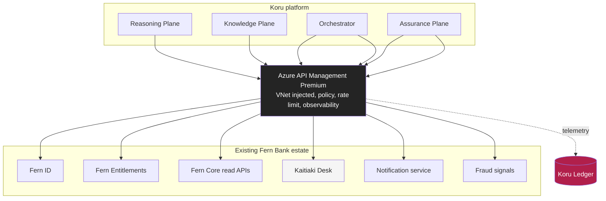
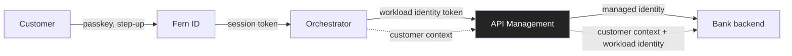
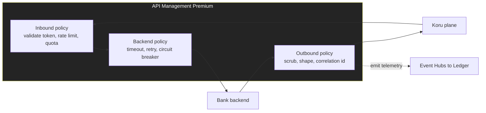
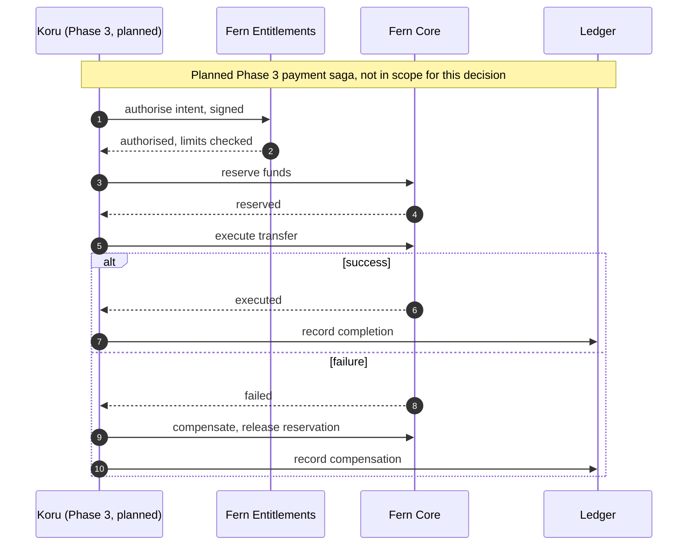
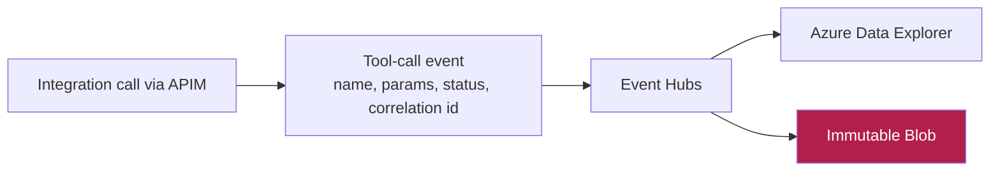
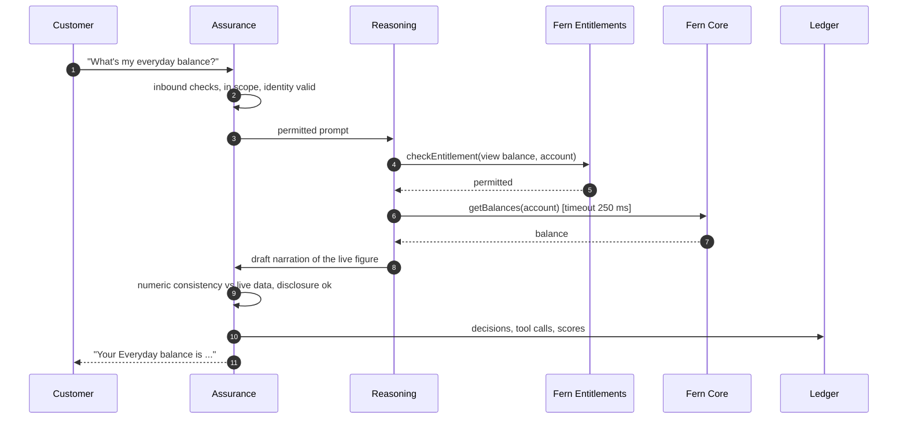
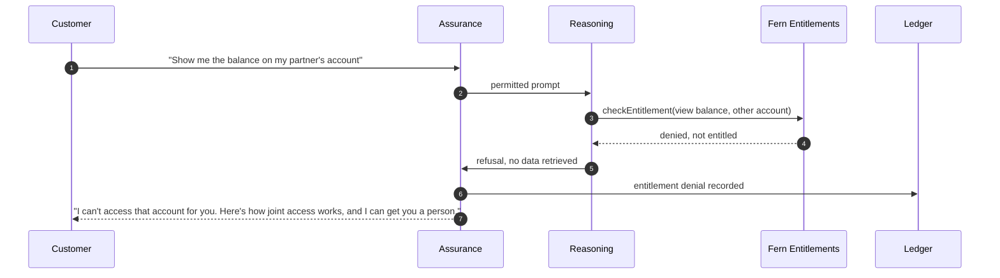
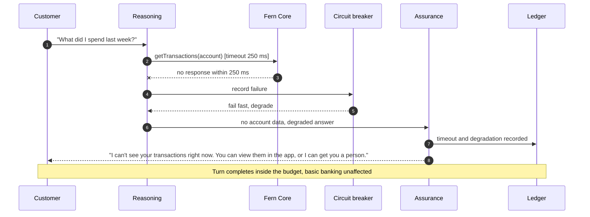
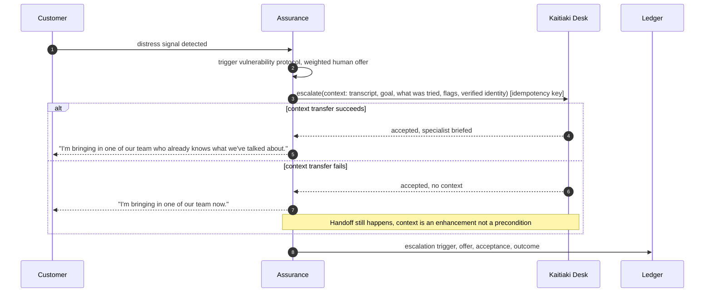

# Integration Architecture

**Document ID:** FB-KORU-204
**Version:** 1.0
**Date:** 27 August 2026
**Owner:** Principal Integration Architect, Digital Channels
**Status:** Submitted for review

**Related documents**

- [Programme canon](../programme-canon.md) (FB-KORU-000)
- [Solution architecture](solution-architecture.md) (FB-KORU-200)
- [Cloud services catalogue](cloud-services-catalogue.md) (FB-KORU-201)
- [AI architecture](ai-architecture.md) (FB-KORU-202)
- [Network and connectivity](network-and-connectivity.md) (FB-KORU-205)
- [ADR-0005 Read-only first](adr/ADR-0005-read-only-first.md)
- [ADR-0013 Immutable interaction ledger](adr/ADR-0013-immutable-interaction-ledger.md)
- [ADR-0014 Human handoff always available](adr/ADR-0014-human-handoff-always-available.md)
- [Service levels](../05-operations/service-levels.md) (FB-KORU-500)
- [Business continuity](../05-operations/business-continuity.md) (FB-KORU-503)

---

## 1. Purpose and principles

This document describes how Koru integrates with the existing bank. Koru is a consumer of existing platforms, not a new system of record. Every integration is read-only in Phase 1, per [ADR-0005](adr/ADR-0005-read-only-first.md), and every one must fit inside the 1.2 second first-word budget or fail gracefully without blocking the turn.

| # | Principle | Consequence |
|---|---|---|
| IP1 | Consume, do not own | Koru reads from Fern Core, Fern ID and Fern Entitlements, and never becomes a system of record |
| IP2 | Read-only in Phase 1 | No integration mutates bank state, enforced by the allow-list and by API Management |
| IP3 | Entitlement before data | Fern Entitlements is checked before any customer-data read, deny closed |
| IP4 | A single governed boundary | Every bank integration crosses Azure API Management, one policy and observability surface |
| IP5 | Fail inside the budget | Every call has a timeout inside the turn budget, a circuit breaker and a defined degradation |
| IP6 | Never block the human path | Escalation to the Kaitiaki Desk always succeeds, even if context transfer fails |
| IP7 | Everything is evidenced | Every integration call emits a Ledger event with a correlation id, per [ADR-0013](adr/ADR-0013-immutable-interaction-ledger.md) |

---

## 2. Integration landscape

Every arrow into the bank crosses API Management. There is no direct point-to-point path from a Koru plane to a bank backend, so policy, rate limiting, authentication and observability are enforced in one place.

---

## 3. API inventory

The table below is the Phase 1 integration contract set. Timeouts are chosen to fit inside the 1.2 second budget for calls on the turn path, and to be generous for calls off it. All calls are read-only except the escalation, complaint and notification calls, which create records outside Fern Core and are idempotent.

| API | Purpose | Protocol | Auth | On turn path | Timeout | Retry | Idempotency | Failure behaviour |
|---|---|---|---|---|---|---|---|---|
| Fern ID validate | Validate the session token, drive step-up | HTTPS REST | Workload identity, Entra | Session start and step-up | 100 ms | 1 retry, 50 ms backoff | Safe, read | Terminate or re-authenticate the session |
| Fern Entitlements check | Authorise a specific data access or action | HTTPS REST | Workload identity | Yes | 120 ms | No retry, deny closed | Idempotent by request | Deny closed, refuse the turn cleanly |
| Fern Core getBalances | Read account balances | HTTPS REST | Workload identity | Yes | 250 ms | 1 retry, idempotent GET | Safe, read | Return no data, Koru says it cannot see the account, offers a human |
| Fern Core getTransactions | Read recent transactions | HTTPS REST | Workload identity | Yes | 250 ms | 1 retry, idempotent GET | Safe, read | As above |
| Kaitiaki Desk escalate | Hand off with context | HTTPS REST, async accept | Workload identity | No, off the latency path | 800 ms | Retry with idempotency key | Idempotency key per escalation | Escalate anyway, transfer context best effort |
| Complaint record | Record a complaint | HTTPS REST | Workload identity | No | 800 ms | Retry with idempotency key | Idempotency key | Record regardless of path |
| Notification send | Send a confirmation or callback booking | HTTPS REST, async | Workload identity | No | 2,000 ms | Retry with backoff | Idempotency key | Queue and retry, never blocks the turn |
| Fraud signal | Report a suspected scam signal | HTTPS REST, async | Workload identity | Optional inline | 150 ms inline, else async | Retry with backoff | Idempotency key | Fire and forget, escalate the customer to a human |

**Assumption.** The 250 ms Fern Core read timeout assumes ExpressRoute-connected read APIs meeting their own latency profile under load. Owner: Principal Integration Architect. Resolve by Phase 0 exit with load testing against the read APIs.

### 3.1 Downstream service level dependencies

| Downstream | Its SLA | Koru dependency | Note |
|---|---|---|---|
| Fern Core read APIs | 99.95 percent | On the turn path for account data | Koru degrades gracefully if unavailable, basic banking unaffected |
| Fern ID | 99.95 percent | Session start | No Koru session without a valid token |
| Fern Entitlements | 99.95 percent | Every customer-data read | Deny closed on failure |
| Kaitiaki Desk | Business hours plus callback | Escalation | Callback booked if no human is available, per [ADR-0014](adr/ADR-0014-human-handoff-always-available.md) |
| Notification | 99.9 percent | Off the turn path | Retried asynchronously |
| Fraud signals | 99.9 percent | Off the turn path | Asynchronous |

Koru's own SLO is 99.5 percent, deliberately lower than the platforms it depends on, because Koru is not on the basic banking path, per [FB-KORU-500](../05-operations/service-levels.md).

### 3.2 Authentication and authorisation model

Koru holds no shared secret with any bank backend. Workloads authenticate with Microsoft Entra workload identity, and the customer's authorisation context is carried explicitly so a backend can make its own decision rather than trusting Koru.

| Layer | Credential | Purpose |
|---|---|---|
| Customer to Fern ID | Passkey and step-up, never voice | Establish the authenticated customer, per [ADR-0004](adr/ADR-0004-no-voice-biometric-authentication.md) |
| Koru plane to API Management | Entra workload identity token | Prove which plane is calling, no secret |
| API Management to backend | Managed identity | Prove the platform, no secret in flight |
| Customer context to backend | Verified customer reference, carried explicitly | The backend authorises against the real customer, not against Koru |

The separation matters: Koru's workload identity proves the calling service, and the customer context proves who the action is for. Fern Entitlements then authorises the specific access for that specific customer, deny closed. A compromised Koru plane cannot act as a customer it was not given a verified context for, and cannot exceed the entitlements that customer holds.

---

## 4. API Management design

API Management Premium is the single governed boundary. It is VNet injected into the integration subnet, internal only, with a self-hosted gateway placed close to on-premises Fern Core where latency requires.

| Concern | Policy |
|---|---|
| Authentication | Validate Entra workload token inbound, managed identity to backends outbound, no secrets in flight |
| Rate limiting | Per-caller and per-subscription rate and quota limits, protecting backends from a Koru surge |
| Timeout and retry | Backend timeout per API from the inventory, bounded retry only for idempotent reads |
| Circuit breaker | Open on sustained backend failure, half-open probe, fail fast while open |
| Correlation | Inject and propagate a correlation id so a Ledger tool-call record links to the downstream call |
| Scrubbing | Strip anything not needed by the caller from the response |
| Observability | Emit call telemetry to Event Hubs for the Ledger and to Azure Monitor for operations |

### 4.1 Subscription model

| Consumer | Subscription | Scope | Rate limit posture |
|---|---|---|---|
| Orchestrator | Dedicated | Fern ID, notification | Sized for session starts |
| Reasoning Plane | Dedicated | Fern Entitlements | Sized for turn rate |
| Knowledge Plane | Dedicated | Fern Core reads | Sized for account-data turns |
| Assurance Plane | Dedicated | Kaitiaki Desk, fraud, complaint | Sized for escalation rate plus headroom |

Separate subscriptions give per-plane rate limits and per-plane revocation, so a fault or abuse in one plane cannot exhaust a backend for the others. This is a bulkhead at the subscription level.

### 4.2 Self-hosted gateway placement

**Planned.** A self-hosted API Management gateway is placed adjacent to on-premises Fern Core, so that policy evaluation happens close to the backend and the ExpressRoute hop is not doubled. Owner: Head of Infrastructure. Resolve by Phase 0 exit. Until then, the managed gateway in the integration subnet fronts the ExpressRoute path.

---

## 5. Contract governance and versioning

| Aspect | Approach |
|---|---|
| Contract ownership | Each API contract is owned by the backend platform team, consumed by Koru against a versioned specification |
| Versioning | Semantic versioning, backward-compatible changes are minor, breaking changes are a new major version and a new API Management revision |
| Consumer-driven checks | Koru maintains contract tests against each backend, run in CI, so a breaking change is caught before deploy |
| Deprecation | A superseded version runs alongside the new one for an agreed window before retirement |
| Change control | Any new integration, any new tool, or any scope expansion returns to ARB under condition C9 |

---

## 6. Idempotency and exactly-once semantics

Reads are naturally idempotent. The record-creating calls, escalation, complaint and notification, are made idempotent with a caller-generated idempotency key so a retry cannot create a duplicate.

| Operation | Idempotency approach |
|---|---|
| Reads (balances, transactions, entitlement) | Naturally idempotent, safe to retry within the timeout |
| Escalation | Idempotency key per escalation, a retry references the same key and does not create a second handoff |
| Complaint | Idempotency key, a retry does not create a duplicate complaint |
| Notification | Idempotency key, at-least-once delivery with de-duplication at the notification service |
| Ledger write | Exactly-once effect through de-duplication on the event key, at-least-once delivery from Event Hubs |

True exactly-once delivery does not exist across a network boundary, so Koru uses at-least-once delivery plus idempotent effects, which gives exactly-once outcomes. The Ledger de-duplicates on the event key so a re-delivered interaction event does not create a duplicate record.

---

## 7. Compensation and saga patterns, Phase 3

Phase 1 is read-only, so there is nothing to compensate. The patterns below are **Planned** for Phase 3 value movement and are documented now so the Board can see that the foundations anticipate them. They are not being requested in this decision, per [ADR-0005](adr/ADR-0005-read-only-first.md) and ARB condition C10.

| Pattern | Phase 3 use |
|---|---|
| Reserve then execute | A value movement reserves before it executes, so a failure releases cleanly |
| Compensating transaction | A failed step is undone by an explicit compensating action, never a silent rollback |
| Signed intent | The customer's intent is signed and verifiable, so the write is attributable |
| Idempotent execution | Execution is keyed so a retry cannot double-move money |
| Ledger of intent and outcome | Every step is recorded, so a partial saga is fully reconstructable |

The write-path threat model and fraud assessment that must precede any of this are a fresh ARB submission, per condition C10.

---

## 8. Resilience patterns

Every integration on the turn path is wrapped so that a slow or failing backend degrades the answer without blocking the turn or cascading across planes.

| Pattern | Configuration | Effect |
|---|---|---|
| Timeout | Per API from the inventory, all inside the 1.2 second budget | A slow backend never stalls the turn |
| Circuit breaker | Open after sustained failures, half-open probe | Fail fast while a backend is down, stop hammering it |
| Bulkhead | Separate connection pools and subscriptions per downstream | One failing backend cannot exhaust resources for others |
| Retry | Bounded, only for idempotent reads, with backoff | Recover from transient blips without amplifying load |
| Fallback | A defined degraded answer per integration | Koru explains the limit and offers a human |
| Load shedding | Shed new session starts before harming active sessions | Protects in-progress conversations under pressure |

### 8.1 Timeout budget within the turn

For an account-data turn, the integration hops sit inside the retrieval and reasoning allocations of the 1.2 second budget in [FB-KORU-200](solution-architecture.md).

| Hop | Timeout | Where it sits in the 1.2 s budget |
|---|---|---|
| Fern Entitlements check | 120 ms | Within the routing and retrieval window |
| Fern Core read | 250 ms | Within the retrieval allocation, parallel to reasoning warm-up |
| Assurance inbound and outbound | 90 ms each | Fixed allocation, both directions |

If the entitlement check or the read exceeds its timeout, the circuit does not wait: Koru returns no account data, explains that it cannot see the account right now, and offers a human, all within the turn rather than overrunning the budget.

---

## 9. Event-driven telemetry to the Ledger

Every integration call, and every plane decision, emits an event to Azure Event Hubs, which lands in the Ledger. This is asynchronous with a synchronous receipt acknowledgement, so the durable write is off the critical path while the guarantee of receipt is on it, per [ADR-0013](adr/ADR-0013-immutable-interaction-ledger.md).

| Event field | Purpose |
|---|---|
| Tool name and parameters | What was called and with what bounded inputs |
| Result status | Success, timeout, circuit open, denied |
| Correlation id | Links the Ledger record to the API Management call and the downstream log |
| Latency | The hop's contribution to the turn budget |

Full payloads are not copied into the Ledger; they are referenced by correlation id, so the sensitive downstream response is not duplicated into the record, consistent with the data minimisation position in [FB-KORU-203](data-architecture.md).

---

## 10. Integration sequences

### 10.1 Authenticated balance enquiry

### 10.2 Entitlement denial

### 10.3 Downstream timeout with graceful degradation

### 10.4 Human handoff with context transfer

The handoff always completes. Context transfer is best effort and never a precondition for reaching a human, per [ADR-0014](adr/ADR-0014-human-handoff-always-available.md).

---

## 11. Compliance mapping

| Obligation | How the integration architecture supports it |
|---|---|
| APRA CPS 230 | Timeouts, circuit breakers and defined degradation are tested operational resilience, not unplanned failure |
| APRA CPS 234 | The single API Management boundary gives one place to enforce and evidence authentication and rate control |
| RBNZ BS11 | Read-only, non-blocking integration keeps basic banking available without Koru |
| Conduct, CoFI and RG 271 | Complaints are captured and routed to a human regardless of path, per [ADR-0014](adr/ADR-0014-human-handoff-always-available.md) |
| Evidence | Every call is Ledgered with a correlation id, per [ADR-0013](adr/ADR-0013-immutable-interaction-ledger.md) |

---

## 12. Assumptions and planned items

| Item | Type | Owner | Resolve by |
|---|---|---|---|
| Fern Core read API latency under load | Assumption | Principal Integration Architect | Phase 0 exit |
| Self-hosted gateway placement near Fern Core | Planned | Head of Infrastructure | Phase 0 exit |
| Kaitiaki Desk context-transfer contract | Planned | Head of Customer Experience | Phase 0 exit |
| Phase 3 saga and compensation design | Planned | Principal Integration Architect | Phase 2 gate |
| Contract tests for every backend in CI | Planned | Principal Integration Architect | Phase 0 exit |

---

## 13. Summary

Koru consumes the existing bank through one governed boundary, API Management, and never becomes a system of record. Every Phase 1 integration is read-only, every customer-data read is gated by an entitlement check that denies closed, and every call has a timeout that fits inside the 1.2 second budget with a circuit breaker and a defined degradation behind it. Escalation to a human always succeeds, with context as an enhancement rather than a precondition. Record-creating calls are idempotent, so a retry never duplicates. Every call is recorded to the Ledger with a correlation id. The Phase 3 write patterns, reserve, execute and compensate with signed intent, are designed for but deliberately withheld, so the foundations anticipate value movement without exposing it in this decision.
