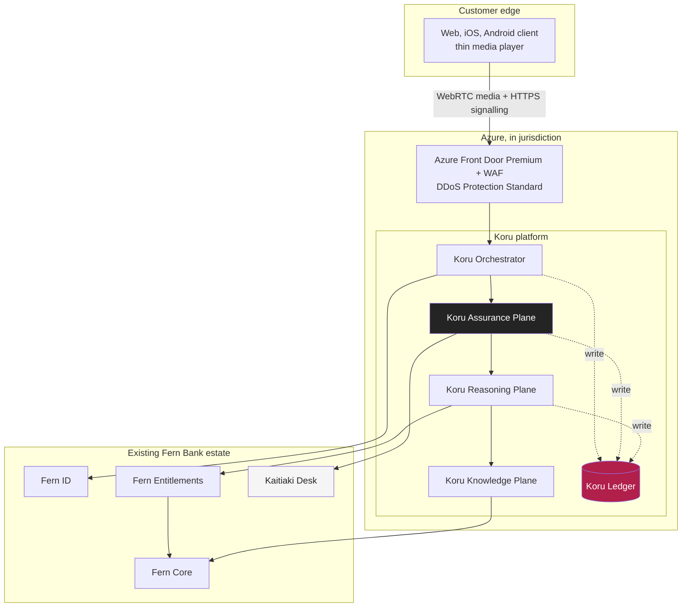
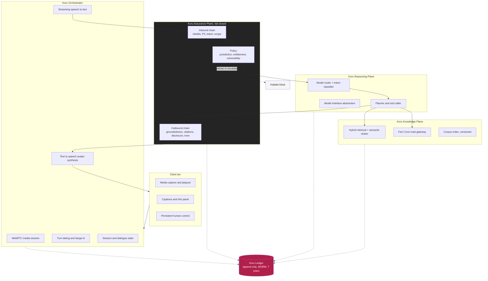
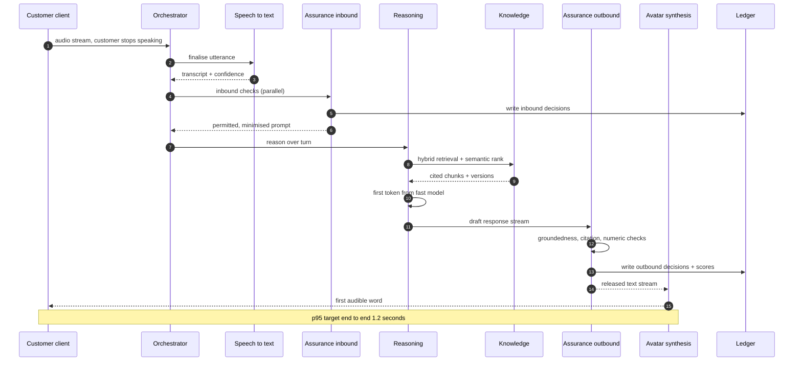
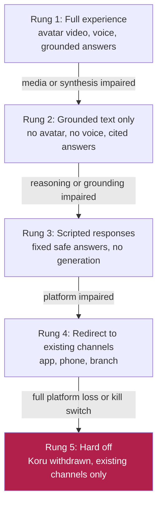
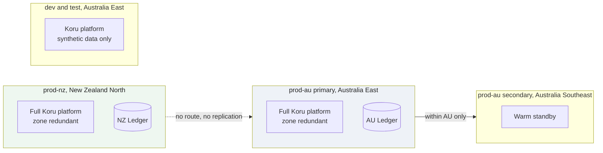
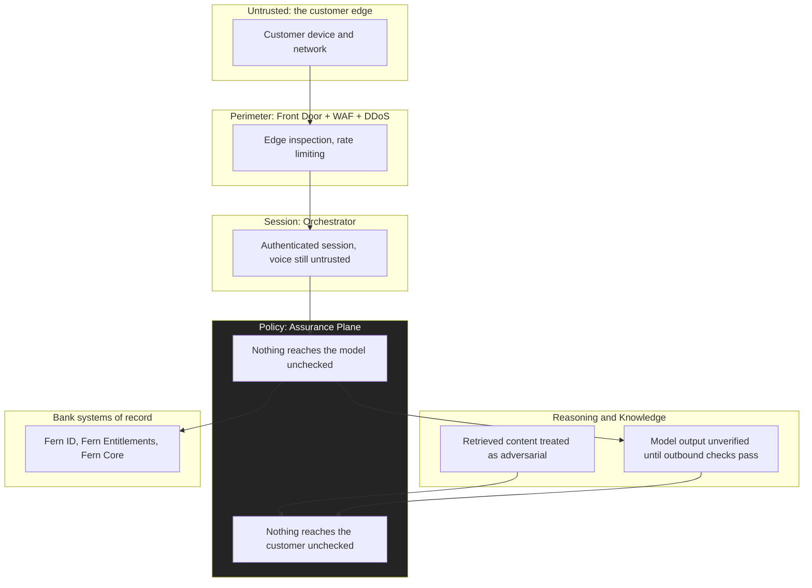

# Solution Architecture

**Document ID:** FB-KORU-200
**Version:** 1.0
**Date:** 27 August 2026
**Owner:** Chief Architect, Digital Channels
**Status:** Submitted for review

**Related documents**

- [Programme canon](../programme-canon.md) (FB-KORU-000)
- [ARB submission](../../ARB-SUBMISSION.md) (FB-KORU-001)
- [Cloud services catalogue](cloud-services-catalogue.md) (FB-KORU-201)
- [AI architecture](ai-architecture.md) (FB-KORU-202)
- [Data architecture](data-architecture.md) (FB-KORU-203)
- [Integration architecture](integration-architecture.md) (FB-KORU-204)
- [Network and connectivity](network-and-connectivity.md) (FB-KORU-205)
- [Architecture decision records](adr/README.md) (FB-KORU-210)
- [Service levels](../05-operations/service-levels.md) (FB-KORU-500)
- [Business continuity](../05-operations/business-continuity.md) (FB-KORU-503)

---

## 1. Purpose and scope

This document is the authoritative description of the Koru solution architecture for the Phase 0 and Phase 1 Architecture Review Board decision. It describes the whole system, plane by plane, including how each plane scales and what happens when it fails. It sets the measurable quality attribute targets the design is held to, budgets the 1.2 second first-word latency target hop by hop, and defines the degradation ladder that keeps a customer served when a plane is impaired.

It is deliberately specific. Where a figure is modelled rather than measured, it is marked as an **Assumption** with an owner and a resolve-by date. Where a capability is not yet built, it is marked **Planned**.

### 1.1 In scope

| Area | Included |
|---|---|
| The five Koru planes | Orchestrator, Assurance, Reasoning, Knowledge, Ledger |
| The client experience | Web, iOS, Android, cloud-rendered avatar over WebRTC |
| Read-only integration | Fern Core read APIs, Fern ID, Fern Entitlements, Kaitiaki Desk |
| Runtime, data and safety services | Container Apps, Cosmos DB, Redis, AI Search, Content Safety |
| Latency budget | End to end, first audible word, p95 1.2 seconds |
| Failure behaviour | Per plane, plus the degradation ladder |
| Deployment topology | prod-nz, prod-au, dev and test |

### 1.2 Out of scope for this decision

| Area | Where it lives |
|---|---|
| Value movement and write paths | Phase 3, a separate ARB gate |
| Personal financial advice | Phase 4, subject to advice licensing |
| Network and private connectivity detail | [FB-KORU-205](network-and-connectivity.md) |
| Model routing, grounding and evaluation detail | [FB-KORU-202](ai-architecture.md) |
| Security controls and threat model | FB-KORU-300, FB-KORU-301 |

### 1.3 The single most important architectural statement

Basic banking never depends on Koru. If Koru is entirely unavailable, every customer can still see balances, move money and reach a person through existing channels. Koru is a new front door onto the bank, not a load-bearing wall. This property is enforced architecturally, not by policy, and it is the foundation of the RBNZ BS11 and APRA CPS 230 positions. It is why the Koru availability service level objective is set at 99.5 percent while Fern Core sits at 99.95 percent, and why Koru is deliberately assessed as supporting, not constituting, a critical operation in Phase 1.

---

## 2. Context and system boundary

Koru sits between the customer and the existing bank. It originates no system of record. It reads from Fern Core, checks entitlement with Fern Entitlements, authenticates through Fern ID, and escalates to the Kaitiaki Desk. Every one of those is an existing, independently governed platform that continues to function whether Koru is present or not.

### 2.1 Actors and external systems

| Actor or system | Role in Koru | Ownership |
|---|---|---|
| Customer | Authenticated personal banking customer, one at a time per session | External |
| Fern ID | Customer identity, authentication, step-up, session token issue | Existing platform |
| Fern Entitlements | Authorisation decision for every data access and every action | Existing platform |
| Fern Core | System of record for accounts, transactions, cards. Read only in Phase 1 | Existing platform |
| Kaitiaki Desk | Human specialists who receive escalations with full context | Existing platform, uplifted |
| Microsoft Azure | AI and hosting platform, registered material service provider | Third party, [ADR-0001](adr/ADR-0001-azure-as-ai-platform.md) |

---

## 3. Quality attributes and measurable targets

An architecture is only as good as the targets it commits to. These are the attributes the design is held to, each with a measurable target, a measurement method and the failure behaviour when the target is missed. Service level objectives are defined in full in [FB-KORU-500](../05-operations/service-levels.md); this table is the architectural commitment they derive from.

| # | Quality attribute | Target | Measured by | Behaviour when missed |
|---|---|---|---|---|
| QA1 | Latency to first audible word | p95 <= 1.2 seconds, p99 <= 1.8 seconds | Client to first synthesis frame, per turn | Degrade rung, then offer human |
| QA2 | Availability | Koru session SLO 99.5 percent monthly | Successful session starts and turns | Error budget burn alert, then degrade |
| QA3 | Groundedness | Score >= 0.95 on every substantive product answer | Assurance outbound scoring | Suppress and refuse the turn |
| QA4 | Unsafe response rate | <= 0.1 percent of turns | Online sampling plus offline suite | Threshold breach halts ramp |
| QA5 | Escalation success | >= 0.99 of customers who want a human get one | Escalation outcome telemetry | Paging incident, manual desk surge |
| QA6 | Ledger durability | RPO <= 15 minutes, no lost interaction records | Ingestion lag and gap detection | Fail closed on write failure |
| QA7 | Recoverability | Koru RTO <= 4 hours within jurisdiction | Continuity test | Degraded fallback keeps serving |
| QA8 | Data residency | Zero cross-Tasman customer data movement | Policy, telemetry, CI test | Deployment blocked by Azure Policy |
| QA9 | Confidentiality | No public data-plane exposure, CMK throughout | Configuration attestation | Private endpoint enforced by policy |
| QA10 | Scalability | 5 percent Phase 1 cohort, headroom to 100 percent | Load test and capacity model | Concurrency cap and queue |

**Assumption.** QA1 is modelled against synthetic traffic and mid-range Android hardware in laboratory conditions. It is not yet validated on real mobile networks in regional New Zealand. Owner: Head of Platform Engineering. Resolve by Phase 0 exit with production-representative field measurement.

### 3.1 Trade-offs made explicit

| We chose | Over | Because |
|---|---|---|
| 99.5 percent Koru availability | Matching Fern Core at 99.95 percent | Koru is not on the basic banking path, so the cost of five nines is unjustified |
| 180ms of assurance latency | A faster in-process guardrail | Provable per-turn control is worth 15 percent of the budget, see [ADR-0006](adr/ADR-0006-assurance-plane-as-a-service.md) |
| Two sovereign deployments | One efficient trans-Tasman platform | A defensible answer to two regulators, see [ADR-0003](adr/ADR-0003-jurisdictional-isolation.md) |
| Refuse when ungrounded | Answer from model knowledge | A confident wrong answer is a conduct failure, see [ADR-0007](adr/ADR-0007-grounded-response-only.md) |
| Cloud-rendered avatar | On-device rendering | Device reach and server-side control, see [ADR-0002](adr/ADR-0002-cloud-rendered-avatar.md) |

---

## 4. Logical architecture

The logical architecture is five planes plus the client. Each plane has a single clear responsibility, its own deployment unit, its own managed identity, and its own owner. The Assurance Plane is the mandatory choke point in both directions. The Ledger is written by every plane and read by almost none.

### 4.1 Plane responsibilities at a glance

| Plane | One-line responsibility | Primary technology | Owner |
|---|---|---|---|
| Orchestrator | Own the media session, the turn and the dialogue state | Container Apps, Azure Communication Services, Azure AI Speech | Digital Channels Engineering |
| Assurance | Enforce safety and policy on every turn, both directions, fail closed | Container Apps, Azure AI Content Safety | Model Risk and Security, jointly |
| Reasoning | Route to a model, plan, call tools, produce a draft answer | Container Apps, Azure AI Foundry, Azure OpenAI | AI Engineering |
| Knowledge | Return grounded, cited, current product truth and account data | Azure AI Search, Fern Core read APIs | Knowledge and Content Operations |
| Ledger | Record every interaction immutably and support replay | Event Hubs, Azure Data Explorer, immutable Blob | Risk and Data |

---

## 5. The five planes in depth

### 5.1 Koru Orchestrator

**Responsibility.** The Orchestrator owns everything about the live session: establishing the WebRTC media session, streaming customer audio into recognition, detecting end of speech, managing barge-in when the customer interrupts, holding per-turn and per-session dialogue state, and driving avatar synthesis on the outbound side. It is the only plane that talks to the client, and it is stateful within a session.

**Technology.**

| Concern | Service | Configuration |
|---|---|---|
| Media transport | Azure Communication Services, WebRTC | UDP media, TURN relay, TLS signalling |
| Speech to text | Azure AI Speech, streaming | Partial results under 300ms, final on endpoint |
| Avatar synthesis | Azure AI Speech, real-time TTS avatar | Streamed video and audio track |
| Runtime | Azure Container Apps, dedicated workload profile | Minimum replicas above zero, session affinity |
| Session state | Azure Cache for Redis | Ephemeral turn state, short TTL |
| Dialogue state | Azure Cosmos DB | Conversation state, session lifetime |

**Interfaces.** Inbound from the client over WebRTC and HTTPS through Front Door. Outbound to the Assurance Plane over the internal network for every recognised utterance. It calls Fern ID to validate the session token at session start and on step-up. It writes session lifecycle events to the Ledger.

**Scaling.** Horizontal, driven by concurrent session count. The binding constraint is concurrent media sessions, not request rate. Container Apps scales on a custom concurrency metric, with a minimum replica floor sized for the modelled peak so that a cold start never lands on the 1.2 second budget. Media capacity is a function of the Azure Communication Services relay, which scales independently.

**Failure behaviour.**

| Failure | Effect | Response |
|---|---|---|
| Speech to text degraded | Recognition confidence drops | Ask the customer to repeat, then offer a human |
| Avatar synthesis unavailable | No video track | Descend to audio only, then to grounded text |
| Media session cannot establish | No WebRTC path | Fall back to text conversation over HTTPS |
| Redis unavailable | No ephemeral turn state | Rebuild state from Cosmos, accept a small latency cost |
| Orchestrator replica loss | Session drop | Client reconnects, session resumes from Cosmos state |

### 5.2 Koru Assurance Plane

**Responsibility.** The Assurance Plane is the enforceable control point. Every inbound turn and every outbound turn crosses it over the network. It runs the inbound chain before the Reasoning Plane ever sees the customer's words, and the outbound chain before a single word reaches synthesis. It fails closed: if it is unhealthy, unavailable or times out, the turn is refused and a human is offered. It is owned jointly by Model Risk and Security, not by product engineering, so a product team cannot ship a change that weakens a guardrail.

**Technology.** Container Apps on a dedicated workload profile, co-located in the same subnet as the Reasoning Plane to avoid a gateway hop. Azure AI Content Safety provides Prompt Shields, groundedness detection, protected material detection and custom categories. Policy is versioned configuration, not code, so a threshold can be changed and rolled back in minutes without a Reasoning Plane deployment.

**The two chains.** The full ordered chains are specified in [ADR-0006](adr/ADR-0006-assurance-plane-as-a-service.md) and elaborated in [FB-KORU-202](ai-architecture.md). In summary:

| Direction | Purpose | Fail behaviour |
|---|---|---|
| Inbound | Session validity, rate and cost limits, prompt shield, PII minimisation, intent and scope, advice boundary, distress detection, jurisdiction and entitlement pre-check | Refuse with the correct class, offer a human |
| Outbound | Groundedness scoring, citation binding, content safety, protected material, advice re-check, disclosure injection, tone and numeric consistency | Suppress and refuse, never leak a draft |

**Non-negotiable property.** There is no network path from the Reasoning Plane to the Orchestrator's synthesis endpoint. The only egress from Reasoning to the customer is through the outbound chain. This is enforced by network security groups and the Azure Firewall egress policy, not by application code.

**Scaling.** Horizontal, and it must scale ahead of the Reasoning Plane, because it is on the path twice per turn. Inbound checks run in parallel so the chain costs the slowest check, not the sum. Outbound checks that do not need the full response run against the token stream as it is generated, overlapping with generation.

**Failure behaviour.** Fail closed, always. An Assurance Plane outage is a full Koru outage by design, because the alternative, letting turns through unchecked, is unacceptable. This is control KORU-C-31. Basic banking is unaffected because it does not traverse Koru.

### 5.3 Koru Reasoning Plane

**Responsibility.** The Reasoning Plane decides which model handles a turn, plans the response, calls tools within an allow-list, and produces a draft answer. It never speaks to the customer directly and it cannot reach synthesis. It is written against an internal model interface, not a vendor SDK, to preserve the portability position in [ADR-0009](adr/ADR-0009-model-portability.md).

**Technology.**

| Concern | Service |
|---|---|
| Fast conversational model, most turns | Azure OpenAI, fast model class |
| Stronger reasoning model, complex turns | Azure OpenAI, reasoning model class |
| Small classifier, routing and intent | Azure AI Foundry hosted small model |
| Tool and function calling | Reasoning Plane orchestration over the model interface |
| Runtime | Container Apps, dedicated D-series workload profile |

**Interfaces.** Receives permitted, minimised prompts from the Assurance Plane inbound chain. Calls the Knowledge Plane for retrieval and Fern Core reads. Calls Fern Entitlements before any data access. Emits a draft response and its supporting citations to the Assurance Plane outbound chain. Writes model identity, version, parameters, token counts and tool calls to the Ledger.

**Scaling.** Horizontal on request concurrency, but the true capacity limit is the provisioned model throughput measured in tokens per minute, not container replicas. Capacity is reserved per jurisdiction. Model routing sheds load from the reasoning model class to the fast model class under pressure, accepting a small quality reduction rather than a latency spike.

**Failure behaviour.**

| Failure | Response |
|---|---|
| Reasoning model class unavailable | Route eligible turns to the fast model, refuse the rest |
| All model classes unavailable | Descend to scripted responses and channel redirection |
| Tool call timeout | Fail the tool, degrade the answer, never block the turn indefinitely |
| Entitlement denial | Refuse cleanly with the reason, offer a human |

### 5.4 Koru Knowledge Plane

**Responsibility.** The Knowledge Plane is the source of truth Koru is allowed to speak from. It performs hybrid retrieval over the approved, versioned product corpus and returns cited chunks with validity windows. It also fronts Fern Core read APIs for the customer's own account data, which is never answered from model memory. If retrieval returns nothing current and valid, it returns empty, which causes the outbound chain to refuse rather than let the model improvise.

**Technology.** Azure AI Search with hybrid vector and keyword retrieval and the semantic ranker. The corpus is owned by Fern Bank in source form, chunked, embedded and indexed, with every chunk carrying an owner and an expiry. Fern Core reads go through a dedicated read gateway with strict timeouts.

**Interfaces.** Called by the Reasoning Plane. Reads the corpus index and calls Fern Core read APIs. Writes retrieved chunk identifiers and versions to the Ledger, referenced not copied.

**Scaling.** Azure AI Search scales by replica and partition. Read throughput scales with replicas, index size with partitions. Retrieval sits on the critical path for most turns, so the index is sized for latency headroom, not just capacity.

**Failure behaviour.**

| Failure | Response |
|---|---|
| Search unavailable | No grounding possible, outbound chain refuses substantive answers |
| Corpus entry expired | Not retrieved, Koru refuses rather than quote stale content, addresses KORU-R-08 |
| Fern Core read timeout | Return no account data, Koru explains it cannot see the account right now, offers a human |
| Partial retrieval | Answer only what is grounded, refuse the rest |

### 5.5 Koru Ledger

**Responsibility.** The Ledger is the immutable, replayable record of every interaction. Every plane writes to it. It records transcripts, assembled prompts with PII minimised, retrieved chunk identifiers, model identity and version, every Assurance decision with scores, tool calls, entitlement decisions, disclosures, refusals, escalations, latencies and costs. It never records raw audio or rendered video. Full schema and privacy controls are in [FB-KORU-203](data-architecture.md) and [ADR-0013](adr/ADR-0013-immutable-interaction-ledger.md).

**Technology.** Azure Event Hubs ingests the interaction event stream. Azure Data Explorer holds the queryable analytics store. Azure Storage immutable Blob with a locked time-based WORM policy and legal hold holds the seven year archive. A dedicated writer identity holds append permission only; no human or workload holds update or delete.

**Interfaces.** Write only from the planes, through the writer identity. Read is not a standing role, it is a time-boxed, case-referenced grant, logged and reviewed monthly. Customers may request their own records.

**Scaling.** Event Hubs scales by throughput unit and partition. Writes are asynchronous with a synchronous acknowledgement of receipt, so the durable write is not on the turn's critical path while the guarantee of receipt still is.

**Failure behaviour.** If the receipt acknowledgement fails, the turn is treated as a failed turn, because an unrecorded interaction is not permitted. This is deliberate: the control evidence position depends on it. Ingestion lag is monitored against the 15 minute RPO.

---

## 6. End-to-end turn and the latency budget

This is a single conversational turn, from the moment the customer stops speaking to the first audible word Koru speaks back. It is the transaction the whole architecture exists to serve, and its p95 budget is 1.2 seconds.

### 6.1 Latency budget, hop by hop

The budget below allocates the 1.2 second p95 across the critical path. Some hops overlap in reality because generation, outbound checking and synthesis are streamed, which is where the headroom for p99 comes from. The allocation is treated as a hard per-hop ceiling for capacity planning.

| # | Hop | p95 allocation | Notes |
|---|---|---|---|
| 1 | Turn-end detection (endpointing) | 150 ms | Silence confirmation, tuned per locale |
| 2 | Final speech recognition flush and normalisation | 90 ms | Partial results already streamed |
| 3 | Assurance inbound chain | 90 ms | Checks run in parallel, cost is the slowest |
| 4 | Model routing and intent classification | 40 ms | Small classifier model |
| 5 | Knowledge retrieval, hybrid plus semantic rank | 170 ms | On the path for most turns |
| 6 | Reasoning first token, fast conversational model | 320 ms | Time to first token, not full response |
| 7 | Assurance outbound gating of first chunk | 90 ms | Streams against generation thereafter |
| 8 | Avatar synthesis, first audio chunk | 180 ms | First video frame budgeted separately at 380 ms |
| 9 | Media encode, downlink and client playout | 70 ms | WebRTC, in region |
| | **Total** | **1,200 ms** | p95 to first audible word |

**Budget governance.** Each hop has a named owner and an alert that fires when its p95 exceeds allocation for a sustained window. A hop that consistently overruns its allocation triggers a design review before the overall SLO is breached. The reasoning first-token hop at 320 ms and the retrieval hop at 170 ms are the two largest controllable allocations and are the first places optimisation effort is spent.

**Assumption.** The 320 ms reasoning first-token allocation assumes the fast conversational model class serving most turns at provisioned throughput. Owner: Head of AI Engineering. Resolve by Phase 0 exit with production-representative load.

---

## 7. Degradation ladder

Koru degrades in defined rungs rather than failing all at once. Each rung is a deliberate, tested experience, not an accident. The customer can also select a lower rung manually at any time, permanently, from a single control. Basic banking is available at every rung, including the last, because it never depended on Koru in the first place.

| Rung | Trigger | Customer experience | What still works |
|---|---|---|---|
| 1 Full | Healthy | Avatar video, voice, grounded cited answers | Everything |
| 2 Grounded text only | Media loss, synthesis failure, packet loss above 5 percent, or customer choice | Text conversation, grounded and cited, reusing Assurance, Reasoning and Knowledge unchanged | All answers, no avatar |
| 3 Scripted | Reasoning or grounding unavailable | Fixed, safe, pre-approved answers and navigation, no generation | Common answers, safe navigation |
| 4 Redirect | Koru platform impaired | Koru explains it cannot help right now and routes to app, phone or branch | Existing channels, full function |
| 5 Hard off | Full platform loss or deliberate kill switch | Koru is withdrawn cleanly, no error loops | Existing channels, full function |

Rung 2 is the same fallback described in the ARB submission as Option B. It is a first class part of the architecture, not an emergency measure, which is what makes the concentration risk in KORU-R-03 survivable and what makes the exit position in [ADR-0009](adr/ADR-0009-model-portability.md) credible. The descent from Rung 1 to Rung 2 is exercised in production annually as part of continuity testing under [FB-KORU-503](../05-operations/business-continuity.md).

---

## 8. Deployment view

Koru runs as two sovereign production deployments and one non-production deployment, per [ADR-0003](adr/ADR-0003-jurisdictional-isolation.md). There is no shared plane and no cross-Tasman route. Configuration, prompts and infrastructure code are shared; customer data never is.

| Deployment | Region | Resilience | Data | Notes |
|---|---|---|---|---|
| prod-nz | New Zealand North | Availability zones, no cross-region failover | NZ customer data, stays in NZ | Total region loss takes NZ Koru offline, basic banking unaffected |
| prod-au primary | Australia East | Availability zones | AU customer data, stays in AU | Primary AU serving |
| prod-au secondary | Australia Southeast | Warm standby within AU | AU customer data, stays in AU | Regional failover within Australia only |
| dev and test | Australia East | Single region | Synthetic data only, never production | No customer data, ever |

Naming follows the canon pattern `fb-koru-<component>-<env>-<region>-<instance>`, for example `fb-koru-orchestrator-prd-nzn-001`, with globally unique alphanumeric resources dropping hyphens, for example `fbkoruledgerprdnzn001`. Enforcement is by Azure Policy allowed-locations initiatives and Terraform variable validation, described in [FB-KORU-205](network-and-connectivity.md).

---

## 9. Trust boundaries

Koru treats the customer's voice as untrusted input on every turn, treats retrieved content as potentially adversarial, and treats the model's own output as unverified until the outbound chain has checked it. The boundaries below are where trust changes, and each is an enforcement point.

| Boundary | Trust change | Enforcement |
|---|---|---|
| Device to edge | Untrusted to rate-limited | Front Door WAF, DDoS Standard, TLS |
| Edge to session | Anonymous to authenticated | Fern ID token validation |
| Session to policy | Authenticated but voice untrusted | Assurance inbound chain, PII minimisation |
| Policy to reasoning | Permitted prompt only | No model access without passing inbound |
| Reasoning to customer | Unverified to verified | Assurance outbound chain, groundedness, citation |
| Reasoning to bank | Requested to authorised | Fern Entitlements check before every read |

Voice is never an authentication factor, per [ADR-0004](adr/ADR-0004-no-voice-biometric-authentication.md). Authentication and authorisation remain entirely with Fern ID and Fern Entitlements. The full zero trust position and control set are in FB-KORU-300.

---

## 10. Capacity model

The capacity model sizes Phase 1 against the modelled volume, with the cohort cap and headroom the ARB conditions require. It is a model, not a measurement, and the field validation in Phase 0 will correct it.

### 10.1 Volume basis

| Basis | Figure |
|---|---|
| Total annual customer conversations across the bank | ~14 million |
| Of which simple enquiries in Koru scope | ~9 million |
| Phase 1 cohort cap | <= 5 percent of digitally active customers |
| Modelled escalation to human | 18 to 25 percent of Koru sessions |
| Kaitiaki Desk headroom, first 90 days | +100 percent over modelled escalation, ARB condition C7 |

### 10.2 Derived load, Phase 1 capped cohort

The figures below are derived from the volume basis at the 5 percent cohort cap and are used to size runtime, model throughput and media capacity. They are modelled, and are the primary target of Phase 0 load testing.

| Dimension | Modelled Phase 1 figure | Sizing driver |
|---|---|---|
| In-scope sessions reachable at 5 percent cohort | ~450,000 per year | Cohort cap on 9 million simple enquiries |
| Busy-hour concurrent sessions | Sized to peak, not average | Orchestrator replicas and media relay |
| Turns per session | 4 to 8 typical | Model token throughput |
| Model throughput reserved | Tokens per minute per jurisdiction | Azure OpenAI provisioned capacity |
| Ledger write rate | One durable record per turn plus session events | Event Hubs throughput units |

**Assumption.** Busy-hour concurrency and turns per session are modelled from contact centre analogues, not measured Koru traffic. Owner: Head of Platform Engineering. Resolve by Phase 1 ramp gate using capped-cohort telemetry.

### 10.3 Scaling levers and limits

| Lever | Scales | Limit |
|---|---|---|
| Orchestrator replicas | Concurrent sessions | Container Apps ceiling, reviewed at Phase 2 |
| Reasoning replicas plus model throughput | Turn rate | Provisioned tokens per minute per jurisdiction |
| Assurance replicas | Turn rate, twice per turn | Must lead Reasoning scaling |
| AI Search replicas and partitions | Retrieval rate and corpus size | Latency headroom, not just capacity |
| Media relay | Concurrent media sessions | Azure Communication Services scaling |
| Event Hubs throughput units | Ledger write rate | Auto-inflate with a ceiling |

When a lever reaches its ceiling, Koru applies a concurrency cap and queues new session starts with an honest wait message, rather than degrading in-progress sessions. New session starts are shed before active sessions are harmed. Because Koru is not on the basic banking path, shedding a Koru session start never prevents a customer from banking.

---

## 11. How the architecture answers the top risks

| Risk | Architectural answer | Reference |
|---|---|---|
| KORU-R-01 wrong answer | Grounded-only responses, citation binding, numeric verification, refusal below 0.95 | [ADR-0007](adr/ADR-0007-grounded-response-only.md), section 5.4 |
| KORU-R-02 prompt injection | Assurance inbound Prompt Shields, retrieved content treated as adversarial, output policy independent of the model | [ADR-0006](adr/ADR-0006-assurance-plane-as-a-service.md), section 9 |
| KORU-R-03 vendor concentration | Model interface abstraction, tested Rung 2 fallback, portability debts named | [ADR-0009](adr/ADR-0009-model-portability.md), section 7 |
| KORU-R-04 vulnerable customer harm | Distress detection in the inbound chain, mandatory human offer, Kaitiaki Desk | [ADR-0014](adr/ADR-0014-human-handoff-always-available.md), section 5.2 |
| KORU-R-05 deepfake voice | Voice is never an authentication factor, treated as untrusted throughout | [ADR-0004](adr/ADR-0004-no-voice-biometric-authentication.md), section 9 |
| KORU-R-06 believes Koru is human | Mandatory disclosure at start, on request and at handoff | [ADR-0012](adr/ADR-0012-mandatory-ai-disclosure.md) |
| KORU-R-07 latency | Hop-by-hop 1.2 second budget, streaming, minimum replica floors | Section 6 |
| KORU-R-08 stale corpus | Every chunk carries an expiry, expired content is not retrieved, Koru refuses | [ADR-0007](adr/ADR-0007-grounded-response-only.md), section 5.4 |

---

## 12. Open items and assumptions register

| Item | Type | Owner | Resolve by |
|---|---|---|---|
| Field latency on regional NZ mobile networks | Assumption | Head of Platform Engineering | Phase 0 exit |
| True escalation rate versus modelled 18 to 25 percent | Assumption | Head of Customer Experience | Phase 1 ramp gate |
| Busy-hour concurrency and turns per session | Assumption | Head of Platform Engineering | Phase 1 ramp gate |
| Reasoning first-token allocation under production load | Assumption | Head of AI Engineering | Phase 0 exit |
| AKS alternative deployment path proven | Planned | Head of Platform Engineering | Phase 0 exit, per [ADR-0010](adr/ADR-0010-container-apps-over-aks.md) |
| Container Apps concurrency ceiling review | Planned | Head of Platform Engineering | Phase 2 |

---

## 13. Summary

Koru is five planes with one enforceable choke point and one immutable record. The Assurance Plane sits between the customer and the model in both directions and fails closed. The Knowledge Plane means Koru speaks only from approved, current, cited sources. The Ledger means every interaction can be replayed with evidence. The degradation ladder means a customer is still served when a plane is impaired, and basic banking is never on the Koru path at all. The 1.2 second latency target is budgeted hop by hop and governed per hop. The two sovereign deployments give a clean answer to two regulators and to any customer who asks where their conversation is stored. Everything the Board is asked to approve in Phase 0 and Phase 1 is bounded by the deliberate decision to withhold write access until the guardrails have been proven against real traffic.
