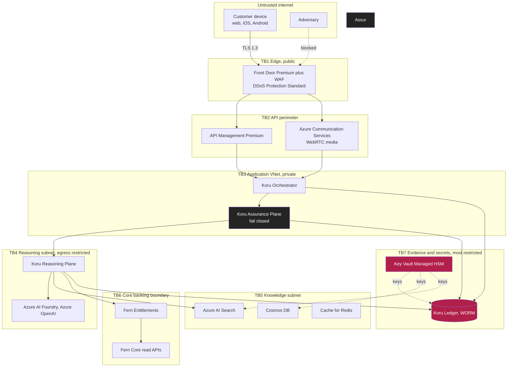
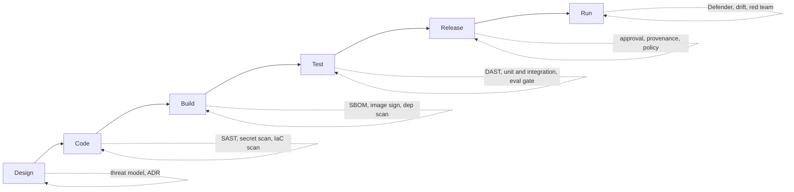

# Security Architecture

**Document ID:** FB-KORU-300
**Version:** 1.0
**Date:** 27 August 2026
**Owner:** Chief Information Security Officer
**Status:** Submitted for ARB review, Phase 0 and Phase 1
**Related documents:** [Threat model](threat-model.md) (FB-KORU-301), [Identity and authentication](identity-and-authentication.md) (FB-KORU-302), [Solution architecture](../02-architecture/solution-architecture.md) (FB-KORU-200), [Network and connectivity](../02-architecture/network-and-connectivity.md) (FB-KORU-205), [APRA CPS 234](../04-compliance/apra/cps-234-information-security.md) (FB-KORU-411), [Control matrix](../04-compliance/control-matrix.md) (FB-KORU-401), [Incident response](../05-operations/incident-response.md) (FB-KORU-502)

---

## 1. Purpose and scope

This document sets out the security architecture for Project Koru, the Fern Bank personal banking avatar. It describes the security principles, the trust boundaries, the layered controls, the key and secret management model, the secure software development lifecycle, the AI-specific control set, and the security testing programme. It is written for the Architecture Review Board, the Chief Information Security Officer, and the security assurance function that will test these controls under APRA CPS 234 and the RBNZ cyber resilience guidance.

Scope is Phase 0, the platform build with synthetic data and no customer traffic, and Phase 1, read-only conversation for authenticated customers. Anything that applies only to a later phase is marked **Planned**. Where a control is designed but not yet implemented or tested, it is marked **Planned** and the residual risk is stated honestly.

This document does not repeat the threat analysis. Threats, attack paths, likelihoods and residual risk ratings live in the [threat model](threat-model.md). This document describes the controls that answer those threats.

---

## 2. Security principles and the zero trust position

Fern Bank operates a zero trust security model. Koru inherits it and extends it to the specific problem of a generative, conversational, real-time system. The principles below are the ones we will be held to, and each maps to controls later in this document.

| # | Principle | What it means for Koru | Primary controls |
|---|---|---|---|
| P1 | Never trust, always verify | Every request between planes is authenticated and authorised on its own merits. No plane trusts another because of network position. | KORU-C-14, KORU-C-18, KORU-C-28 |
| P2 | Assume breach | We design as though any single component is already compromised, and we bound the blast radius accordingly. | KORU-C-31, KORU-C-36, KORU-C-43 |
| P3 | Least privilege | Every identity, human or workload, holds the minimum entitlement for the shortest time. | KORU-C-14, KORU-C-15, KORU-C-18 |
| P4 | Fail closed | When a control cannot make a safe decision, it denies. The Assurance Plane is the reference implementation. | KORU-C-31 |
| P5 | Defence in depth | No single control is load bearing. Each threat meets several independent controls. | Section 5 |
| P6 | Provable control application | We can demonstrate, per interaction, that a control ran and what it decided. Belief is not evidence. | KORU-C-61, KORU-C-27 |
| P7 | Treat all input as hostile | Customer voice, retrieved content and tool responses are untrusted until proven otherwise. | KORU-C-30, KORU-C-39 |
| P8 | Sovereign by construction | Security controls respect the jurisdictional boundary. No control moves customer data across the Tasman. | KORU-C-26 |
| P9 | Secretless where possible | Workloads authenticate with managed identity. Secrets are a last resort, not a default. | KORU-C-14 |
| P10 | Security is not a gate at the end | Controls are embedded in the pipeline and enforced by policy, not by review comments. | KORU-C-68, KORU-C-69 |

The zero trust position is not aspirational. Private endpoints, workload identity, per-tool authorisation and the fail-closed Assurance Plane are the mechanisms that make it real, and they are described below.

---

## 3. Trust boundaries

A trust boundary is a line across which the level of trust changes and across which every crossing is authenticated, authorised and logged. Koru has seven material trust boundaries.

| ID | Boundary | Trust changes from, to | Crossing controls |
|---|---|---|---|
| TB1 | Untrusted internet to edge | Anonymous to rate-limited, WAF-inspected | Front Door WAF, DDoS Protection Standard, TLS 1.3, bot management |
| TB2 | Edge to API perimeter | Inspected to authenticated | API Management Premium, OAuth 2.0, mutual TLS to backend, schema validation |
| TB3 | Perimeter to application VNet | Authenticated to policy-governed | Private endpoints, network security groups, workload identity, Assurance Plane |
| TB4 | Application to Reasoning subnet | Governed to egress-restricted | Assurance Plane choke point, Azure Firewall egress allow-list, no return path to customer |
| TB5 | Reasoning to Knowledge subnet | Model to data | Private endpoints, per-index authorisation, read-only corpus access |
| TB6 | Platform to core banking | Koru to system of record | Fern Entitlements per-call authorisation, Fern Core read-only APIs, API Management, mutual TLS |
| TB7 | Everything to evidence and secrets | Operational to sealed | Managed HSM, WORM immutability, no standing access, dedicated writer identity |

The two boundaries drawn in the Fern Bank magenta, TB7, carry the highest controls in the platform because they hold the keys and the evidence. The Reasoning subnet, TB4, is deliberately isolated: it can be reached only through the Assurance Plane and it has no network path back to the customer. This is the property that makes prompt injection survivable, and it is described in section 8.

---

## 4. Identity and workload identity

Customer identity, step-up authentication, session binding and the rejection of voice biometrics are covered in full in [identity and authentication](identity-and-authentication.md). This section covers workload identity, which is a security architecture concern in its own right.

**No secrets in code, and no secrets in configuration where a managed identity will do.** Every Koru workload authenticates to every Azure service using a Microsoft Entra ID workload identity (a user-assigned managed identity federated to the Container Apps workload). There are no connection strings, no API keys and no client secrets stored in application settings for service-to-service calls.

| Caller | Callee | Auth mechanism | Secret stored |
|---|---|---|---|
| Orchestrator | Assurance Plane | Managed identity, Entra token, audience-scoped | None |
| Assurance Plane | Content Safety, Foundry | Managed identity | None |
| Reasoning Plane | Azure AI Search | Managed identity, index-scoped role | None |
| Reasoning Plane | Fern Entitlements | Managed identity plus signed request | None |
| Any plane | Key Vault Managed HSM | Managed identity, RBAC data-plane role | None |
| Ledger writer | Immutable Storage | Dedicated managed identity, append only | None |
| CI/CD pipeline | Azure subscriptions | Workload identity federation from the pipeline, no stored service principal secret | None |

The residual secrets, and there are always some, are third-party credentials that cannot use Entra, for example a partner webhook signing key. These live in Key Vault, are referenced by managed identity, are never written to logs, and are rotated on the schedule in section 7. This is control KORU-C-14.

Human identity for operators is covered under privileged access management in [identity and authentication](identity-and-authentication.md) and summarised in section 6 of this document.

---

## 5. Defence in depth

No control is load bearing on its own. The table below is the layered model, read from the customer inward. Each layer is independently owned, independently monitored, and independently tested.

| Layer | Purpose | Key Azure and Fern controls | Fails to |
|---|---|---|---|
| L0 Edge | Absorb volumetric and application attack | Front Door Premium, WAF managed and custom rules, DDoS Protection Standard, TLS 1.3, bot management | Rate limit, then block |
| L1 API perimeter | Authenticate and validate every request | API Management Premium, OAuth 2.0, JSON schema validation, quota and spike arrest | Reject request |
| L2 Network | Enforce private connectivity and segmentation | Private Endpoints everywhere, VNet-integrated Container Apps, NSGs, Azure Firewall egress control, no public data plane | Deny by NSG default |
| L3 Identity | Verify who and what | Fern ID, passkeys, workload identity, continuous access evaluation, PIM | Deny token |
| L4 Application | Enforce session and turn integrity | Orchestrator session binding, turn sequencing, input size limits | Terminate session |
| L5 Assurance | Enforce safety and policy per turn | Prompt Shields, PII detection, scope, groundedness, citation, disclosure, tone | Refuse, offer human |
| L6 Authorisation | Decide every action | Fern Entitlements per-tool checks, phase capability set | Deny action |
| L7 Data | Protect data at rest and in use | CMK in Managed HSM, WORM Ledger, residency enforcement, PII minimisation | Deny read, seal write |
| L8 Monitoring | Detect and evidence | Defender for Cloud, Azure Monitor, Sentinel, Ledger, Purview | Alert and preserve |

Layer independence matters more than layer count. A prompt injection that defeats L5 still meets L6, which will refuse a tool call the customer is not entitled to make, and L2, which prevents the Reasoning Plane from exfiltrating anything even if instructed to. The threat model traces each threat through the layers it must defeat.

---

## 6. Network security summary

The full topology is in [network and connectivity](../02-architecture/network-and-connectivity.md). The security-relevant properties are summarised here.

- **Private endpoints everywhere.** Every platform-as-a-service resource, Cosmos DB, AI Search, Key Vault, Storage, Event Hubs, Content Safety, Foundry, is reached over a private endpoint. There is no public data plane. Public network access is disabled at the resource level and enforced by Azure Policy (KORU-C-68).
- **Egress is default deny.** Azure Firewall governs all outbound traffic. The Reasoning Plane subnet has an allow-list containing only the Foundry, Search and Entitlements private endpoints. It cannot reach the public internet. This is control KORU-C-36 and it is the primary containment for data exfiltration and for excessive agency.
- **Segmentation by plane.** Each plane runs in its own subnet with NSGs that deny by default. The only permitted inbound path to the Reasoning subnet is from the Assurance Plane.
- **No lateral path from Reasoning to customer.** There is no network route from the Reasoning Plane to the Orchestrator synthesis endpoint. Output must traverse the Assurance Plane. Enforced by NSG and Firewall, not by application code (see [ADR-0006](../02-architecture/adr/ADR-0006-assurance-plane-as-a-service.md)).
- **Sovereign VNets.** `prod-nz` runs in New Zealand North across availability zones. `prod-au` runs in Australia East with Australia Southeast as the secondary. The VNets do not peer across the Tasman. This is control KORU-C-26.
- **WAF posture.** Front Door WAF runs Microsoft managed rule sets plus custom rules for Koru, in prevention mode, with per-path rate limits. Bot management challenges automated clients before they reach API Management.

---

## 7. Data protection

### 7.1 Classification

Data classification is governed centrally and detailed in [data architecture](../02-architecture/data-architecture.md) and [CPG 235](../04-compliance/apra/cpg-235-data-risk.md). The security-relevant classes for Koru are:

| Class | Examples in Koru | Handling |
|---|---|---|
| Highly sensitive | Transcripts, prompts, retrieved customer data, Ledger records | CMK, private endpoints, no standing access, in-jurisdiction only |
| Sensitive | Corpus content, evaluation sets, telemetry with correlation IDs | CMK, private endpoints, in-jurisdiction |
| Internal | Aggregate metrics, dashboards without content | Platform-managed keys acceptable, access controlled |
| Public | Product marketing content approved for the corpus source | Standard controls |

Voice audio is a special case. It is never written to durable storage. It exists in memory only for the duration of transcription and is then discarded. No speaker embedding is computed or stored. This is control KORU-C-13 and it is a one-way architectural commitment from [ADR-0004](../02-architecture/adr/ADR-0004-no-voice-biometric-authentication.md).

### 7.2 Encryption in transit

| Path | Protocol | Notes |
|---|---|---|
| Customer to edge | TLS 1.3 | TLS 1.2 permitted only for legacy device compatibility, with a strong cipher suite policy. TLS 1.0 and 1.1 disabled. |
| WebRTC media | DTLS-SRTP | Media is encrypted end to end by Azure Communication Services. |
| Edge to API perimeter | TLS 1.3, mutual TLS | Front Door to API Management uses mTLS. |
| Service to service, in VNet | TLS 1.2 or higher, mutual TLS | Managed identity plus mTLS between planes. |
| Service to PaaS over private endpoint | TLS 1.2 or higher | Private link, no traversal of the public internet. |

This is control KORU-C-21.

### 7.3 Encryption at rest and customer managed keys

Every store holding sensitive or highly sensitive data is encrypted at rest with a customer managed key held in Azure Key Vault Managed HSM, FIPS 140-3 Level 3 validated hardware. Microsoft platform keys are not relied on for these stores. This is control KORU-C-22.

| Store | Data | Key | Key location |
|---|---|---|---|
| Koru Ledger, immutable blob | Transcripts, decisions, evidence | `cmk-ledger` | Managed HSM, per jurisdiction |
| Cosmos DB | Session state, conversation working set | `cmk-cosmos` | Managed HSM, per jurisdiction |
| Azure AI Search | Corpus index, embeddings | `cmk-search` | Managed HSM, per jurisdiction |
| Cache for Redis | Ephemeral session cache | `cmk-cache` | Managed HSM, per jurisdiction |
| Event Hubs, Data Explorer | Telemetry stream and store | `cmk-telemetry` | Managed HSM, per jurisdiction |
| Storage, general | Config, artefacts | `cmk-platform` | Managed HSM, per jurisdiction |

Keys never leave the jurisdiction. The New Zealand Managed HSM holds New Zealand keys; the Australian Managed HSM holds Australian keys. There is no shared key material across the Tasman.

### 7.4 Key rotation schedule

| Key type | Rotation | Method | Owner |
|---|---|---|---|
| CMK encryption keys | 12 months, or on demand | Automated key version rotation, re-wrap without data re-encryption | Security Engineering |
| Managed HSM security domain | On personnel change to the quorum, otherwise reviewed annually | Quorum of authorised officers | CISO |
| TLS certificates, public | 90 days | Automated via Key Vault and ACME, alert at 30 days remaining | Platform Engineering |
| TLS certificates, internal mTLS | 90 days | Automated issuance from the private CA | Platform Engineering |
| Workload identity federated credentials | No secret to rotate | Federation, token lifetime 1 hour | Platform Engineering |
| Residual third-party secrets | 90 days | Key Vault rotation policy, dual key overlap | Security Engineering |

Certificate expiry is a named operational alert with a runbook, because an expired internal certificate is a self-inflicted outage. See [runbook](../05-operations/runbook.md) alert A10 and control KORU-C-23.

---

## 8. Secrets management

The default is no secret. Where a secret is unavoidable:

1. It lives in Key Vault or Managed HSM, never in code, container images, environment variables committed to source, or logs.
2. It is referenced at runtime by managed identity, resolved through a private endpoint.
3. It is scoped to the least audience and rotated on the schedule above.
4. Access to read it is logged and monitored. Read by an unexpected identity raises an alert.
5. CI/CD never prints secrets. Pipeline logs are scanned for accidental secret exposure (see section 10), and a detected leak triggers immediate rotation.
6. Pre-commit and pipeline secret scanning (Defender for Cloud, GitHub secret scanning with push protection) block a secret from ever entering the repository.

**Planned.** Automated secret-leak-to-rotation, where a detected secret in a log or repository triggers rotation without human action, is designed but not yet implemented. Until it is, the response is a manual runbook step. Residual risk: a leaked residual secret could be valid for the window between detection and manual rotation.

---

## 9. Container and supply chain security

Koru runs on Azure Container Apps, VNet integrated, on workload profiles. The container and supply chain controls are as follows.

| Control | Detail | ID |
|---|---|---|
| Base image policy | Only Fern Bank golden base images from the internal registry are permitted. Base images are minimal, patched weekly, and scanned daily. Public base images are blocked by Azure Policy. | KORU-C-55 |
| Image signing | Every image is signed with Notation and a key held in Managed HSM. Container Apps admits only signed images from the Fern registry. Unsigned or externally sourced images are rejected. | KORU-C-55 |
| SBOM | A software bill of materials is generated for every build in SPDX format, stored as a build artefact, and retained for the life of the deployment plus seven years for the Ledger writer. | KORU-C-52 |
| Vulnerability gates in CI | Images are scanned with Microsoft Defender for Containers and Trivy. Build fails on any critical vulnerability and on high vulnerabilities without an approved, time-boxed exception. | KORU-C-69 |
| Registry | Azure Container Registry, private endpoint, CMK, quarantine on push until scan passes. | KORU-C-55 |
| Runtime protection | Defender for Containers runtime threat detection on the Container Apps environment. | KORU-C-67 |
| Dependency provenance | Dependencies are pulled through an internal proxy with an allow-list. Direct public package pulls at build time are blocked. | KORU-C-55 |
| Admission control | Azure Policy for Container Apps enforces signed images, no privileged workloads, no host mounts, and CPU and memory limits. | KORU-C-68 |

The model supply chain is a distinct concern. Models are consumed as a managed Azure service, not self-hosted, so the traditional container supply chain does not cover them. Model provenance, version pinning and change detection are handled under model risk (see [model risk management](../04-compliance/ai-governance/model-risk-management.md)) and referenced as threat T-AI-13 in the [threat model](threat-model.md).

---

## 10. Secure software development lifecycle

Security is enforced by the pipeline, not by reviewer goodwill. Each stage has a gate that blocks progression on failure.

| Stage | Security gate | Tooling | Blocks on |
|---|---|---|---|
| Design | Threat model updated for material change, ADR where a decision is contested | STRIDE plus adversarial AI, this repository | Missing threat model for a new trust boundary |
| Code | SAST, secret scanning with push protection, IaC scanning | CodeQL, GitHub secret scanning, Defender for Cloud IaC, Checkov | Critical SAST finding, any secret, high-severity IaC misconfiguration |
| Build | Dependency scan, SBOM generation, image signing | Defender for Containers, Trivy, Notation | Critical dependency CVE, unsigned image |
| Test | DAST, unit and integration tests, the evaluation gate | OWASP ZAP baseline, test suite, Koru eval harness | Failing safety or groundedness eval (condition C1), high DAST finding |
| Release | Manual approval, provenance attestation, Azure Policy compliance | GitHub environments, SLSA-style attestation, Azure Policy | Non-compliant resource, missing approval |
| Run | Posture monitoring, drift detection, periodic red team | Defender for Cloud, Azure Policy, red team programme | N/A, continuous, findings raised as issues |

The evaluation gate at the Test stage is unusual and important. Koru does not release if the evaluation harness shows groundedness below 0.95 or unsafe response rate above 0.1 percent on the regression suite. That is ARB condition C1, wired into the pipeline as a hard gate, not a report. See [observability and evaluation](../05-operations/observability-and-evaluation.md).

---

## 11. AI-specific security controls

STRIDE and conventional application security do not cover the failure modes of a generative system. The controls below are specific to Koru as an AI system, and they are the reason a general-purpose bank security architecture is not sufficient on its own. Each is analysed as a threat in the [threat model](threat-model.md).

| Control | What it defends | Mechanism | ID |
|---|---|---|---|
| Prompt Shields | Direct and indirect prompt injection | Azure AI Content Safety Prompt Shields on every inbound turn and on retrieved content before it enters the prompt | KORU-C-30 |
| Output policy independent of the model | Model producing unsafe, ungrounded or non-compliant output | Assurance Plane outbound chain scores the generated text, does not trust the model to police itself | KORU-C-31, KORU-C-32 |
| Groundedness enforcement | Confident wrong answers | Groundedness score against retrieved sources, threshold 0.95, suppress below (ADR-0007) | KORU-C-32 |
| Citation and numeric binding | Fabricated facts and figures | Every Fern Bank factual claim maps to a retrieved chunk; every number is string-matched to source | KORU-C-33 |
| Content safety categories | Harmful generated content | Content Safety category detection on output | KORU-C-34 |
| Protected material check | Verbatim leakage of copyrighted or protected text | Content Safety protected material detection | KORU-C-39 |
| Tool allow-listing | Excessive agency via tool calling | The Reasoning Plane may call only an explicit, phase-scoped allow-list of tools, each with a schema | KORU-C-35 |
| Reasoning Plane egress restriction | Data exfiltration on instruction | Azure Firewall default-deny egress from the Reasoning subnet, no public internet route | KORU-C-36 |
| Per-tool authorisation | An entitled-looking but unauthorised action | Fern Entitlements decides every tool call independently of the conversation | KORU-C-18 |
| Rate and cost limits | Model denial of wallet | Per-session and per-customer token and request budgets at the Assurance Plane | KORU-C-47 |
| Disclosure enforcement | Customer believing Koru is human | Mandatory disclosure injected on defined triggers (ADR-0012) | KORU-C-38 |
| Prompt and policy versioning | Silent policy weakening | Prompt templates and policy are versioned configuration, recorded in the Ledger | KORU-C-05 |

The architectural spine of this set is the Assurance Plane as a fail-closed, separately owned service (ADR-0006). It gives one enforceable choke point where these controls run and are recorded, which is what lets us prove they ran.

---

## 12. Logging and evidence

Security logging is layered on top of the Koru Ledger, which is the immutable interaction record, and Azure-native security telemetry.

| Source | Destination | Retention | Purpose |
|---|---|---|---|
| Assurance Plane decisions, per turn | Koru Ledger, WORM | 7 years | Prove a control ran and what it decided |
| Platform and application logs | Log Analytics | 90 days hot, 2 years archive | Operations and investigation |
| Security signals | Microsoft Sentinel | 2 years | Detection and correlation |
| Azure activity and resource logs | Log Analytics, immutable | 2 years | Change and access audit |
| Key Vault and HSM access | Log Analytics, Sentinel | 2 years | Detect anomalous key access |
| Ledger access events | Ledger and Sentinel | 7 years | Access to evidence is itself evidence |

Two properties matter for the CISO and for CPS 234. First, the Ledger proves control application per interaction, which is stronger than a code review assertion. Second, access to the Ledger is not a standing role, it is granted per case, time-boxed and reviewed monthly by the Privacy Officer (KORU-C-25, from [ADR-0013](../02-architecture/adr/ADR-0013-immutable-interaction-ledger.md)). Evidence preservation during an incident is covered in [incident response](../05-operations/incident-response.md).

---

## 13. Security testing programme

Controls that are not tested are assumptions. The programme below establishes minimum frequencies. It is a Phase 0 exit gate that the red team exercise is complete with all critical and high findings closed or formally accepted (ARB condition C2).

| Activity | Scope | Frequency | Owner | Gate |
|---|---|---|---|---|
| SAST | All application code | Every pull request and nightly | Security Engineering | Critical blocks merge |
| Dependency scanning | All dependencies and containers | Every build and daily | Security Engineering | Critical blocks build |
| IaC scanning | All Terraform | Every pull request | Platform Engineering | High blocks merge |
| DAST | Exposed surfaces, Orchestrator and APIM | Weekly, and per release | Security Engineering | High blocks release |
| Secret scanning | Repositories and pipeline logs | Continuous, push protection | Security Engineering | Any secret blocks push |
| Penetration test | Full platform, external and authenticated | Before Phase 1, then annually and on major change | Independent third party | Critical and high closed before traffic |
| Red team, conventional | Network, identity, exfiltration | Before Phase 1, then annually | Independent third party | Condition C2 |
| Red team, adversarial AI | Prompt injection, jailbreak, extraction, denial of wallet, output handling | Before Phase 1, then quarterly | Model Risk and Security jointly | Condition C2, and continuous thereafter |
| Cloud posture review | Defender for Cloud secure score, Azure Policy compliance | Continuous, reviewed monthly | Security Engineering | Regression investigated |
| Purple team exercise | Detection and response validation | Quarterly | Security and SRE | Detection gaps remediated |

The adversarial AI red team is quarterly, not annual, because the threat surface moves faster than conventional application security. Its abuse case list and plan are in the [threat model](threat-model.md).

---

## 14. Posture management with Defender for Cloud and Azure Policy

| Capability | Product | Use |
|---|---|---|
| Cloud security posture management | Microsoft Defender for Cloud | Secure score tracked, target 90 percent or above for Koru subscriptions, regressions alerted |
| Workload protection | Defender for Containers, Defender for Storage, Defender for Key Vault, Defender for Resource Manager | Runtime threat detection across the estate |
| Policy enforcement | Azure Policy | Deny public network access, require private endpoints, require CMK, require signed images, enforce tags and residency, deny non-approved regions |
| Regulatory compliance view | Defender for Cloud regulatory compliance | Mapped to CPS 234 control expectations and the CIS Azure benchmark |
| Data governance | Microsoft Purview | Classification, lineage, and sensitivity labelling across the data estate |
| SIEM and SOAR | Microsoft Sentinel | Correlation, detection rules for Koru-specific signals, automated response playbooks |

Azure Policy is the mechanism that makes the zero trust principles non-optional. A resource deployed without a private endpoint, without CMK, or in a non-approved region does not deploy. This is control KORU-C-68, and it enforces the residency hard rule from the [programme canon](../programme-canon.md) at the platform layer, not by policy document.

**Planned.** Sentinel detection rules for Koru-specific adversarial AI signals, for example a spike in Prompt Shield triggers correlated to a single cohort, are designed and will be validated in the Phase 0 purple team exercise.

---

## 15. Control summary

| ID | Control | Range | Status |
|---|---|---|---|
| KORU-C-05 | Policy and prompt as versioned configuration | Governance | Implemented |
| KORU-C-13 | No voiceprint enrolled, stored or compared | Identity | Implemented |
| KORU-C-14 | Workload identity, no secrets in code | Identity | Implemented |
| KORU-C-15 | Privileged access management, JIT and PIM | Identity | Implemented |
| KORU-C-18 | Fern Entitlements per-tool authorisation | Identity | Implemented |
| KORU-C-21 | Encryption in transit, TLS 1.2 or higher | Data | Implemented |
| KORU-C-22 | Encryption at rest, CMK in Managed HSM | Data | Implemented |
| KORU-C-23 | Key and certificate rotation | Data | Implemented |
| KORU-C-25 | Ledger access per case, time-boxed | Data | Implemented |
| KORU-C-26 | No cross-Tasman replication of customer data | Data | Implemented |
| KORU-C-28 | Private endpoints, no public data plane | Data | Implemented |
| KORU-C-30 | Prompt Shields, inbound and on retrieved content | AI safety | Implemented |
| KORU-C-31 | Assurance Plane fail closed | AI safety | Implemented |
| KORU-C-32 | Groundedness enforcement, threshold 0.95 | AI safety | Implemented |
| KORU-C-33 | Citation and numeric binding | AI safety | Implemented |
| KORU-C-34 | Output content safety categories | AI safety | Implemented |
| KORU-C-35 | Tool allow-listing | AI safety | Implemented |
| KORU-C-36 | Reasoning Plane egress restriction | AI safety | Implemented |
| KORU-C-38 | Disclosure enforcement | AI safety | Implemented |
| KORU-C-39 | Protected material and verbatim leakage check | AI safety | Implemented |
| KORU-C-43 | Kill switch, per-tool to global | Resilience | Implemented |
| KORU-C-47 | Rate and cost limits, denial of wallet | Resilience | Implemented |
| KORU-C-52 | SBOM and model provenance | Third party | Implemented |
| KORU-C-55 | Base image, signing, dependency provenance | Third party | Implemented |
| KORU-C-61 | Koru Ledger as evidence backbone | Monitoring | Implemented |
| KORU-C-67 | Defender for Cloud workload protection | Monitoring | Implemented |
| KORU-C-68 | Azure Policy enforcement | Monitoring | Implemented |
| KORU-C-69 | Security testing programme | Monitoring | Partly Planned, red team pre-Phase 1 |

Full traceability from obligation to control to evidence to owner is in the [control matrix](../04-compliance/control-matrix.md).

---

## 16. Residual security risk

We are honest about what these controls do not fully solve.

| Residual risk | Why it remains | Position |
|---|---|---|
| Novel prompt injection technique | The adversarial AI field moves faster than any control set. Prompt Shields catch known classes. | Bounded by egress restriction and per-tool authorisation, so a successful injection cannot exfiltrate or act. Quarterly red team. Residual **Medium**, KORU-R-02. |
| Vendor concentration on Azure | One platform provides edge, identity, models, safety and data. | Accepted and escalated to the Board as KORU-R-03. Tested non-generative fallback. Residual **High**, by decision. |
| Model supply chain change by the vendor | We do not control the model weights or vendor-side changes. | Version pinning, change detection, evaluation on change. Residual **Low to Medium**, KORU-R-12. |
| Leaked residual secret before manual rotation | Automated leak-to-rotation is Planned. | Manual runbook, short window. Residual **Low**. |
| Insider misuse of Ledger access | Access is per case, but a person with a valid case could over-reach. | Monthly Privacy Officer review, full access logging. Residual **Low**, KORU-R-17. |

None of these is presented as solved. KORU-R-03 in particular is presented to the Board for explicit acceptance in the [ARB submission](../../ARB-SUBMISSION.md).

---

## 17. Related documents

- [Threat model](threat-model.md) (FB-KORU-301)
- [Identity and authentication](identity-and-authentication.md) (FB-KORU-302)
- [Solution architecture](../02-architecture/solution-architecture.md) (FB-KORU-200)
- [Network and connectivity](../02-architecture/network-and-connectivity.md) (FB-KORU-205)
- [Data architecture](../02-architecture/data-architecture.md) (FB-KORU-203)
- [APRA CPS 234 information security](../04-compliance/apra/cps-234-information-security.md) (FB-KORU-411)
- [Control matrix](../04-compliance/control-matrix.md) (FB-KORU-401)
- [Incident response](../05-operations/incident-response.md) (FB-KORU-502)
- [ADR-0006 Assurance Plane as a service](../02-architecture/adr/ADR-0006-assurance-plane-as-a-service.md)
- [ADR-0013 Immutable interaction ledger](../02-architecture/adr/ADR-0013-immutable-interaction-ledger.md)
