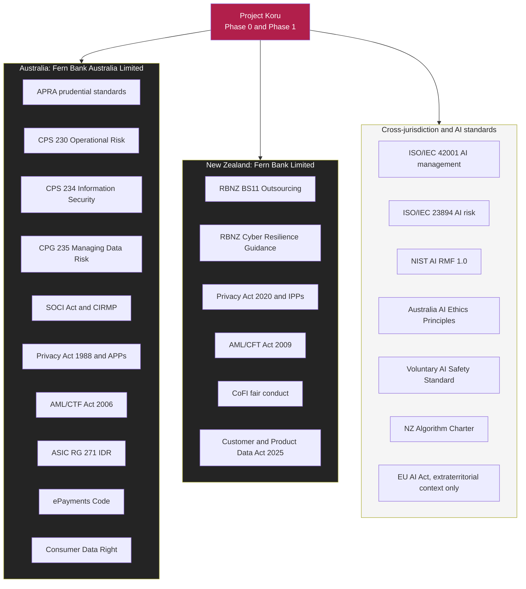
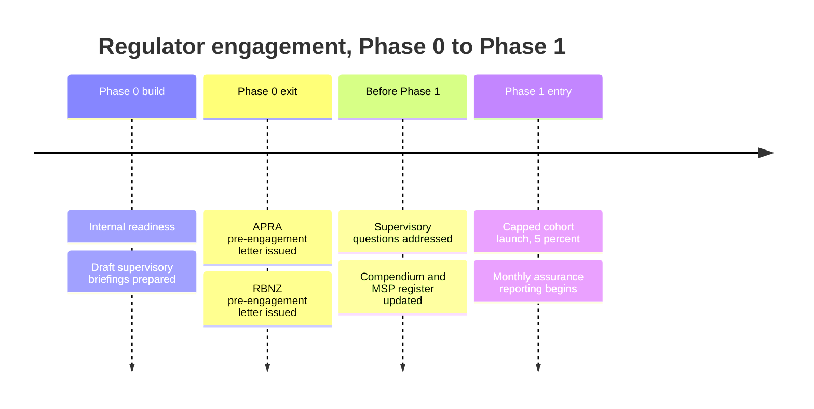

# Regulatory Landscape

**Document ID:** FB-KORU-400
**Version:** 1.0
**Date:** 27 August 2026
**Owner:** Head of Regulatory Compliance
**Status:** Submitted for Architecture Review Board review
**Related documents:** [Programme canon](../programme-canon.md) (FB-KORU-000), [ARB submission](../../ARB-SUBMISSION.md) (FB-KORU-001), [Control matrix](control-matrix.md) (FB-KORU-401), [CPS 230](apra/cps-230-operational-risk.md) (FB-KORU-410), [CPS 234](apra/cps-234-information-security.md) (FB-KORU-411), [CPG 235](apra/cpg-235-data-risk.md) (FB-KORU-412), [BS11](rbnz/bs11-outsourcing.md) (FB-KORU-420), [Cyber resilience](rbnz/cyber-resilience.md) (FB-KORU-421), [Model risk management](ai-governance/model-risk-management.md) (FB-KORU-430), [Responsible AI assessment](ai-governance/responsible-ai-assessment.md) (FB-KORU-431), [Privacy impact assessment](privacy/privacy-impact-assessment.md) (FB-KORU-440)

---

## 1. Purpose and scope

This document is the master regulatory view for Project Koru. It identifies every instrument that binds the programme across both jurisdictions, explains why each applies to a conversational banking avatar, rates its materiality to the Phase 0 and Phase 1 scope, and names the document in this pack that carries the detailed assessment.

It is written for the Architecture Review Board, for General Counsel, and for the two prudential supervisors that Fern Bank answers to: the Reserve Bank of New Zealand (RBNZ) and the Australian Prudential Regulation Authority (APRA). It is a map, not the territory. The clause by clause work sits in the documents this landscape points to.

Fern Bank operates two regulated entities, described in the [programme canon](../programme-canon.md#2-the-entities):

- **Fern Bank Limited**, a New Zealand registered bank supervised by the RBNZ and the Financial Markets Authority (FMA).
- **Fern Bank Australia Limited**, an Australian authorised deposit-taking institution (ADI) supervised by APRA and the Australian Securities and Investments Commission (ASIC).

The architecture is one logical platform with two sovereign deployments. Under [ADR-0003](../02-architecture/adr/ADR-0003-jurisdictional-isolation.md), there is no cross-Tasman replication of customer content, transcripts, embeddings or model telemetry. That single design decision reshapes the regulatory perimeter, and it is referenced throughout this document because it simplifies the cross-border position in both privacy regimes and strengthens the operational resilience position in both prudential regimes.

> **Caveat.** Fern Bank is a fictional institution and this is exercise-grade material for architecture review practice. It is not legal advice. Every regulatory position stated here must be verified against the current published instrument and reviewed by qualified legal counsel in each jurisdiction before any real-world reliance. Regulatory instruments are amended, replaced and reinterpreted. The positions below reflect the drafters' understanding as at 27 August 2026 only.

---

## 2. How to read the materiality rating

Each instrument is rated for its materiality to the Phase 0 and Phase 1 scope only. Later phases move money and give guidance, and they will raise the materiality of several instruments. That is a matter for the Phase 2 and later gates, not this submission.

| Rating | Meaning for Phase 0 and Phase 1 |
|---|---|
| **Critical** | Directly shapes the design. A defect in the position would block launch. |
| **High** | Substantive obligations that Koru must satisfy and evidence. |
| **Medium** | Applies, with obligations that are largely met by existing bank controls that Koru inherits. |
| **Contextual** | Does not bind Koru in Phase 1, but frames the design or applies at a later phase. Tracked so it is not forgotten. |

---

## 3. The regulatory perimeter at a glance

The perimeter has three zones: the Australian prudential and conduct stack, the New Zealand prudential and conduct stack, and a cross-jurisdiction layer of AI management standards that are not law but that the bank has chosen to adopt as its governance backbone.

---

## 4. Master register: prudential and operational instruments

| Instrument | Jurisdiction | Type | Who it binds | Why it applies to Koru | Materiality | Handled in |
|---|---|---|---|---|---|---|
| APRA CPS 230 Operational Risk Management | AU | Enforceable prudential standard | Fern Bank Australia Limited | Koru introduces a new operational process and a material service provider (Microsoft Azure). Requires critical operations identification, tolerance levels, business continuity and service provider management. | **Critical** | [FB-KORU-410](apra/cps-230-operational-risk.md) |
| APRA CPS 234 Information Security | AU | Enforceable prudential standard | Fern Bank Australia Limited | Koru creates and processes sensitive information assets: prompts, transcripts, embeddings, the corpus and the Ledger. Requires classification, control implementation, testing and incident notification. | **Critical** | [FB-KORU-411](apra/cps-234-information-security.md) |
| APRA CPG 235 Managing Data Risk | AU | Prudential practice guide (non-enforceable) | Fern Bank Australia Limited | Koru is a data-intensive AI system. The guide informs how the bank manages data risk across the AI lifecycle, including retrieval corpora and embeddings. | High | [FB-KORU-412](apra/cpg-235-data-risk.md) |
| RBNZ BS11 Outsourcing Policy | NZ | Enforceable policy under the Banking (Prudential Supervision) Act | Fern Bank Limited (net liabilities exceed NZ$10 billion) | Koru is delivered on outsourced Azure infrastructure. BS11 requires the bank to preserve continuity of basic banking services and to maintain a compendium and separation plan. | **Critical** | [FB-KORU-420](rbnz/bs11-outsourcing.md) |
| RBNZ Guidance on Cyber Resilience | NZ | Guidance, principle-based | Fern Bank Limited | Koru expands the bank's attack surface and introduces AI-specific cyber risk. The guidance expects Board oversight, framework assessment and incident reporting. | High | [FB-KORU-421](rbnz/cyber-resilience.md) |
| RBNZ BS13 Liquidity, BPR and related prudential requirements | NZ | Enforceable | Fern Bank Limited | Not engaged by Koru directly. Basic banking services that Koru supports are governed by these, and Koru must not compromise them. | Contextual | [FB-KORU-420](rbnz/bs11-outsourcing.md) |
| Security of Critical Infrastructure Act 2018 (Cth) and CIRMP rules | AU | Legislation | Fern Bank Australia Limited (banking is a critical infrastructure sector asset class) | Koru forms part of the bank's critical infrastructure risk surface. The Critical Infrastructure Risk Management Program (CIRMP) obligations extend to material suppliers and cyber hazards. | Medium | This document, section 7 |

### 4.1 CPS 230 in one paragraph

CPS 230 took effect on 1 July 2025. Existing service provider contracts must comply by the earlier of their next renewal or 1 July 2026. It requires an operational risk management framework, the identification of critical operations and tolerance levels for disruption, Board-approved and regularly tested business continuity plans, a service provider management policy, a register of material service providers provided to APRA, due diligence before entering or materially changing a material arrangement, formal written agreements with minimum content including business continuity and step-in rights, ongoing monitoring, management of fourth party supply chain risk, and internal audit review of critical outsourced arrangements. A material operational risk incident must be notified to APRA within 24 hours. Entering into, materially changing or terminating a material service arrangement, and material offshoring, must also be notified. The full assessment is in [FB-KORU-410](apra/cps-230-operational-risk.md).

### 4.2 CPS 234 in one paragraph

CPS 234 took effect on 1 July 2019. It requires clear roles and responsibilities including Board accountability, an information security capability commensurate with the size and extent of threats and the criticality and sensitivity of information assets, classification of information assets including those managed by third parties, control implementation, systematic testing of control effectiveness, internal audit review, and incident response plans. APRA must be notified within 72 hours of an information security incident that materially affected, or had the potential to materially affect, the entity or the interests of depositors, and within 10 business days of identifying a material information security control weakness that cannot be remediated in a timely manner. Where an incident is notified under CPS 234, a separate CPS 230 notification is not required. The full assessment is in [FB-KORU-411](apra/cps-234-information-security.md).

### 4.3 BS11 in one paragraph

BS11 applies to New Zealand-incorporated registered banks with net liabilities exceeding NZ$10 billion, which includes Fern Bank Limited. It is outcomes-based. The bank must be able to continue daily clearing, settlement and time-critical obligations, monitor and manage its financial position and risks, provide a statutory manager and the Reserve Bank with the systems and data needed for crisis management and resolution, and continue to provide customers with access to basic banking services and account information, even on failure of a parent or a service provider. It requires a compendium of outsourcing arrangements provided to the Reserve Bank, a separation plan tested annually, risk mitigation and prescribed contractual terms, RBNZ non-objection for certain arrangements, and it recognises a Reserve Bank white list of pre-approved lower-risk activities. The full assessment is in [FB-KORU-420](rbnz/bs11-outsourcing.md).

---

## 5. Master register: privacy and data instruments

| Instrument | Jurisdiction | Type | Who it binds | Why it applies to Koru | Materiality | Handled in |
|---|---|---|---|---|---|---|
| Privacy Act 2020 and the 13 Information Privacy Principles | NZ | Legislation | Fern Bank Limited | Koru collects voice audio, transcripts, derived inferences and embeddings, all of which are personal information. IPP1 to IPP13 apply, notably IPP5 security, IPP10 use, IPP11 disclosure and IPP12 cross-border. | **Critical** | [FB-KORU-440](privacy/privacy-impact-assessment.md) |
| Privacy Act 1988 (Cth) and the Australian Privacy Principles | AU | Legislation | Fern Bank Australia Limited | Same personal information as above, in the Australian deployment. APP1, APP3, APP5, APP6, APP8, APP10, APP11, APP12 and APP13 apply. | **Critical** | [FB-KORU-440](privacy/privacy-impact-assessment.md) |
| NZ Notifiable Privacy Breach regime (Privacy Act 2020, Part 6) | NZ | Legislation | Fern Bank Limited | A breach of Koru data that is likely to cause serious harm must be notified to the Privacy Commissioner and affected individuals as soon as practicable. | High | [FB-KORU-440](privacy/privacy-impact-assessment.md) |
| Australian Notifiable Data Breaches scheme | AU | Legislation | Fern Bank Australia Limited | An eligible data breach likely to result in serious harm must be assessed within 30 days and notified to the OAIC and affected individuals. | High | [FB-KORU-440](privacy/privacy-impact-assessment.md) |
| NZ Customer and Product Data Act 2025 | NZ | Legislation, phased commencement by designated sector | Fern Bank Limited | Establishes a consumer data right in New Zealand. Banking is expected to be an early designated sector. Koru must not create a parallel, ungoverned data access path. | Contextual | This document, section 6.3 |
| Australian Consumer Data Right (CDR) | AU | Legislation and rules | Fern Bank Australia Limited | Open banking data sharing. Koru consumes internal data, not CDR data flows, in Phase 1, but must not undermine CDR consent and authorisation boundaries. | Contextual | This document, section 6.3 |

The privacy position is materially simplified by [ADR-0003](../02-architecture/adr/ADR-0003-jurisdictional-isolation.md). Because New Zealand customer content never leaves New Zealand and Australian customer content never leaves Australia, IPP12 and APP8 cross-border disclosure obligations are largely avoided rather than managed. Avoiding an obligation is a more durable position than satisfying it through contractual assurances.

---

## 6. Master register: conduct and financial services instruments

Conduct obligations are where a generative avatar is most likely to cause a compliance failure at scale, because a confidently wrong statement about a fee or a rate is a conduct breach, not a cosmetic defect.

| Instrument | Jurisdiction | Type | Why it applies to Koru | Materiality | Handled in |
|---|---|---|---|---|---|
| Financial Markets (Conduct of Institutions) Amendment Act, the CoFI fair conduct regime | NZ | Legislation, licensed regime | Fern Bank Limited must maintain a fair conduct programme (FCP). Koru is a customer-facing channel and its behaviour must be consistent with the fair conduct principle and the FCP, including the treatment of vulnerable customers. | High | Section 6.1, [FB-KORU-431](ai-governance/responsible-ai-assessment.md) |
| ASIC Regulatory Guide 271, Internal Dispute Resolution | AU | Regulatory guide, enforceable standards | Complaints raised in a Koru session must be recognised and routed into the bank's IDR process within the RG 271 definitions and timeframes. | High | Section 6.2 |
| ePayments Code | AU | Voluntary code, subscribed | Governs electronic payments, unauthorised transactions and mistaken payments. Not engaged in Phase 1 (no value movement) but relevant to Phase 3. | Contextual | Section 6.2 |
| Financial Markets Conduct Act 2013 and the fair dealing provisions | NZ | Legislation | Prohibits misleading and deceptive conduct. A wrong Koru statement about a product is a fair dealing exposure. | Medium | Section 6.1 |
| Australian ASIC Act misleading or deceptive conduct provisions | AU | Legislation | Equivalent to the above in Australia. | Medium | Section 6.1 |
| Financial advice regimes (NZ FAP duties, AU personal advice rules) | Both | Legislation, licensed | Personalised financial advice is a licensed activity. Koru must not cross from information into advice in Phase 1. | High (as a boundary) | [ADR-0011](../02-architecture/adr/ADR-0011-no-personal-advice.md), [FB-KORU-431](ai-governance/responsible-ai-assessment.md) |
| AML/CTF Act 2006 (Cth) | AU | Legislation | Customer interactions and any future value movement engage anti-money laundering obligations, including 7 year record keeping. Koru must not become an unmonitored channel. | Medium | Section 6.4 |
| AML/CFT Act 2009 (NZ) | NZ | Legislation | Equivalent New Zealand obligations, including 7 year record keeping. The Koru Ledger 7 year retention aligns to this. | Medium | Section 6.4 |

### 6.1 Fair conduct, CoFI and misleading conduct

CoFI requires Fern Bank Limited to operate a fair conduct programme that ensures it treats consumers fairly. For Koru the relevant fair conduct behaviours are: not giving misleading information about products, fees or rates; paying due regard to customer interests; and having effective processes for vulnerable customers. Koru meets these through the grounded-only response rule ([ADR-0007](../02-architecture/adr/ADR-0007-grounded-response-only.md), control C-34), the disclosure rule ([ADR-0012](../02-architecture/adr/ADR-0012-mandatory-ai-disclosure.md), control C-33), and vulnerable customer detection and human handoff (controls C-70, C-71, C-74). The fair dealing provisions of the Financial Markets Conduct Act 2013 and the equivalent ASIC Act provisions reinforce that a confidently wrong statement is a legal exposure, which is precisely why Koru is silent rather than speculative when groundedness falls below 0.95.

### 6.2 Complaints and payments

Under ASIC RG 271, an expression of dissatisfaction that meets the complaint definition must be captured and handled within the internal dispute resolution framework. Control C-78 requires the Assurance Plane to detect complaint language, log it to the Ledger, and route it to the bank's IDR workflow so that RG 271 timeframes start correctly. The ePayments Code and its unauthorised and mistaken transaction provisions are not engaged in Phase 1 because Koru moves no money. They are recorded here so that the Phase 3 gate cannot overlook them.

### 6.3 Consumer data rights

Both jurisdictions are building consumer data sharing regimes: the NZ Customer and Product Data Act 2025 and the Australian Consumer Data Right. Koru in Phase 1 reads internal bank data through Fern Core APIs under existing customer authentication and entitlement. It does not create, share or consume accredited data recipient flows. The design position, recorded here and enforced by controls C-12 and C-16, is that Koru must never become a parallel data access path that sidesteps the consent and authorisation architecture these regimes require.

### 6.4 Anti-money laundering

Koru in Phase 1 does not open accounts, move value or change customer records, so it does not perform an AML/CTF designated service directly. It can, however, be a vector for social engineering, which is why voice is never an authentication factor ([ADR-0004](../02-architecture/adr/ADR-0004-no-voice-biometric-authentication.md), control C-13). The Koru Ledger provides an immutable, replayable 7 year record (control C-60) that aligns with the 7 year record keeping obligations under both the AML/CTF Act 2006 and the AML/CFT Act 2009.

---

## 7. Critical infrastructure

Banking is a critical infrastructure sector under the Security of Critical Infrastructure Act 2018 (Cth). The Critical Infrastructure Risk Management Program (CIRMP) obligations require the bank to identify and manage hazards to critical infrastructure assets, including cyber and supply chain hazards, and to adopt or work towards a recognised cyber security framework. Koru is not itself a critical infrastructure asset, because basic banking services do not depend on it, but it is part of the risk surface of assets that are. The Koru controls for third party risk (C-50 to C-59), cyber resilience (C-61, C-66, C-67) and operational resilience (C-40 to C-49) feed the bank's CIRMP. This is rated Medium for Phase 1 and is revisited at each phase gate. New Zealand does not have a directly equivalent single statute, and the RBNZ cyber resilience guidance and the wider all-of-government cyber settings perform a comparable function in that jurisdiction.

---

## 8. Master register: AI standards and frameworks

None of these is law in either jurisdiction. Fern Bank has chosen to adopt them because prudential supervisors increasingly expect regulated entities to manage AI against a recognised framework, and because doing so gives the bank a defensible, externally referenced governance backbone.

| Framework | Type | How Koru uses it | Materiality | Handled in |
|---|---|---|---|---|
| ISO/IEC 42001:2023 AI management systems | International standard | Adopted as the AI management system backbone. Clause by clause gap assessment performed. | High | [FB-KORU-431](ai-governance/responsible-ai-assessment.md) |
| ISO/IEC 23894:2023 AI risk management | International standard | Informs the AI risk methodology and the model risk tiering. | Medium | [FB-KORU-430](ai-governance/model-risk-management.md) |
| NIST AI Risk Management Framework 1.0 | Framework | Mapped to Koru controls through the Govern, Map, Measure and Manage functions. | Medium | [FB-KORU-431](ai-governance/responsible-ai-assessment.md) |
| Australia's AI Ethics Principles | Voluntary principles | Assessed against, principle by principle. | Medium | [FB-KORU-431](ai-governance/responsible-ai-assessment.md) |
| Australian Voluntary AI Safety Standard guardrails | Voluntary standard | The 10 guardrails are used as a Phase 1 readiness checklist. | Medium | [FB-KORU-431](ai-governance/responsible-ai-assessment.md) |
| NZ Algorithm Charter for Aotearoa New Zealand | Public sector commitment | Not binding on a private bank, but adopted voluntarily as a transparency and Te Ao Māori benchmark. | Medium | [FB-KORU-431](ai-governance/responsible-ai-assessment.md) |
| EU AI Act | Foreign legislation | Extraterritorial context only. Fern Bank has no EU establishment or EU customers for Koru, so the Act does not bind the programme. Its risk-tiering language is noted as an emerging global reference point. | Contextual | Section 8.1 |

### 8.1 EU AI Act, extraterritorial context only

The EU AI Act binds providers and deployers that place AI systems on the EU market or whose output is used in the EU. Fern Bank Limited and Fern Bank Australia Limited serve New Zealand and Australian retail customers only, and Koru is deployed exclusively in New Zealand and Australian Azure regions with jurisdictional isolation. The Act therefore does not bind Project Koru. It is recorded here because its classification of certain systems as high-risk, and its transparency obligations for systems that interact with natural persons, are becoming a global reference that supervisors and customers will measure the bank against. Koru's mandatory AI disclosure (control C-33) already meets the substance of the Act's transparency expectation for systems that interact with people, which is a useful, if incidental, alignment.

---

## 9. Jurisdiction comparison

The two prudential regimes ask similar questions in different words. This table lets a reviewer see the parallels and the differences at once.

| Theme | Australia (APRA and others) | New Zealand (RBNZ and others) | Koru position |
|---|---|---|---|
| Operational resilience | CPS 230: critical operations, tolerance levels, 24 hour incident notification | BS11: continuity of basic banking services, compendium, separation plan | Koru supports, does not constitute, a critical operation. Basic banking never depends on it. |
| Information security | CPS 234: classification, control testing, 72 hour and 10 business day notifications | Cyber resilience guidance: Board oversight, framework assessment, report as soon as practicable | One control set, evidenced twice, once per deployment. |
| Third party and outsourcing | CPS 230 material service provider register and minimum contract content | BS11 compendium, separation plan, prescribed contractual terms, non-objection | Azure registered as a material service provider and recorded in the BS11 compendium. |
| Data risk | CPG 235 guidance across the data lifecycle | Privacy Act 2020 and general prudential expectations | One data risk framework, applied per deployment. |
| Privacy | Privacy Act 1988 and 13 APPs, NDB scheme, assess within 30 days | Privacy Act 2020 and 13 IPPs, notifiable breach, as soon as practicable | Sovereign design removes most cross-border exposure. |
| Cross-border data | APP8 cross-border disclosure accountability | IPP12 cross-border disclosure | Largely avoided by architecture, not managed by contract. |
| Conduct | ASIC RG 271 IDR, ePayments Code, misleading conduct | CoFI fair conduct programme, FMC Act fair dealing | Grounded-only responses, complaint detection and routing, vulnerable customer handling. |
| Consumer data | Consumer Data Right | Customer and Product Data Act 2025 | Koru is not a parallel data access path. |
| AI governance | Voluntary AI Safety Standard, AI Ethics Principles | Algorithm Charter (voluntary for a private bank) | ISO/IEC 42001 backbone, assessed against all four. |

The single most important structural difference for Koru is philosophical. CPS 230 asks the bank to define and defend tolerance levels for a critical operation, so the Australian document proves that Koru is not one. BS11 asks the bank to prove that customers keep basic banking on the failure of a service provider, so the New Zealand document proves that basic banking never depended on Koru in the first place. Both conclusions rest on the same architectural fact, stated in the [ARB submission](../../ARB-SUBMISSION.md): if Koru is entirely unavailable, every customer can still see balances, move money and reach a human through existing channels.

---

## 10. The critical position that unifies the pack

> **Koru is assessed as supporting, not constituting, a critical operation in Phase 1. Basic banking services never depend on Koru. If Koru is fully unavailable, customers retain balances, payments and human contact through existing channels. This is enforced architecturally, not by policy.**

This single position is the backbone of the CPS 230 assessment ([FB-KORU-410](apra/cps-230-operational-risk.md)) and the BS11 assessment ([FB-KORU-420](rbnz/bs11-outsourcing.md)). It is why the concentration risk on Microsoft Azure, recorded as KORU-R-03 and accepted at Board level, is a bounded operational risk rather than a threat to the continuity of banking. Reviewers should test this position hard, because if it fails, much of the regulatory comfort in this pack fails with it.

---

## 11. Regulatory engagement plan

Pre-engagement with both supervisors is ARB condition C6 and is a gating condition on Phase 1 traffic.

| Activity | Regulator | Timing | Owner | Status |
|---|---|---|---|---|
| Pre-engagement briefing pack | APRA | Before Phase 1 (ARB C6) | Head of Regulatory Compliance | Planned |
| Pre-engagement briefing pack | RBNZ | Before Phase 1 (ARB C6) | Head of Regulatory Compliance | Planned |
| Material service provider register update | APRA | Before Phase 1 (ARB C4) | Head of Operational Risk | Planned |
| BS11 compendium and separation plan update | RBNZ | Before Phase 1 (ARB C4) | Head of Outsourcing | Planned |
| Notifiable breach and incident pathways tested | Both | Phase 0 exit | CISO and Chief Privacy Officer | Partially met |

---

## 12. Regulatory ownership and accountability

Every regulatory relationship has a single accountable executive, so that a supervisor question never falls between two desks. This mapping is consistent with the three lines of defence model in [FB-KORU-401](control-matrix.md) and the accountabilities in the [ARB submission](../../ARB-SUBMISSION.md).

| Regulator or body | Jurisdiction | Primary relationship owner | Accountable executive | Koru touchpoint |
|---|---|---|---|---|
| APRA | AU | Head of Regulatory Compliance (AU) | Chief Risk Officer | CPS 230, CPS 234, CPG 235 |
| RBNZ | NZ | Head of Regulatory Compliance (NZ) | Chief Risk Officer | BS11, cyber resilience |
| FMA | NZ | Head of Conduct Risk | Chief Executive, Personal Banking | CoFI fair conduct programme |
| ASIC | AU | Head of Conduct Risk | Chief Executive, Personal Banking | RG 271, misleading conduct |
| Office of the Privacy Commissioner | NZ | Chief Privacy Officer | General Counsel | Privacy Act 2020, breach notification |
| Office of the Australian Information Commissioner | AU | Chief Privacy Officer | General Counsel | Privacy Act 1988, NDB scheme |
| Cyber and infrastructure security bodies (NCSC, CERT NZ, ACSC) | Both | Chief Information Security Officer | Chief Information Security Officer | Cyber incident sharing and reporting |

The Board holds ultimate accountability in both jurisdictions. Under CPS 234 the Board of Fern Bank Australia Limited is explicitly accountable for information security, and this cannot be delegated away. The Technology and Operational Risk Committee receives the monthly Koru assurance report required by ARB condition C8, and escalates to the Board Risk Committee on the triggers set out in [FB-KORU-602](../06-delivery/raid-log.md).

---

## 13. How materiality escalates by phase

A reviewer should understand that the ratings in this document are pinned to Phase 0 and Phase 1. The whole point of the phased design is that risk, and therefore regulatory materiality, is admitted deliberately and in sequence. This table shows where each major instrument becomes more demanding, so the Board can see what the later gates will have to prove.

| Instrument | Phase 1 Koru Informs | Phase 2 Koru Assists | Phase 3 Koru Acts | Phase 4 Koru Advises |
|---|---|---|---|---|
| CPS 230 operational risk | Supporting, not critical | Reassess criticality of servicing actions | Value movement raises tolerance stakes | Advice availability may become a customer expectation |
| CPS 234 information security | Read-only, sensitive data | Write paths widen the attack surface | Transaction signing assets become high value | Unchanged in kind, larger in scale |
| BS11 outsourcing | Basic banking independent of Koru | Unchanged, servicing still not basic banking | Must prove value movement has a non-Koru path | Unchanged |
| Privacy | Voice, transcripts, embeddings | Additional servicing data | Payment metadata and intent | Inferences about financial position, higher sensitivity |
| Conduct (CoFI, RG 271) | No advice, grounded information | Complaint and servicing conduct | Payment conduct, ePayments Code engaged | Personal advice licensing determination required |
| AML | Record keeping only | Record keeping only | Designated services likely engaged | Designated services engaged |
| Financial advice | Boundary held by refusal | Boundary held by refusal | Boundary held by refusal | Boundary crossed by design, separate licence |

The steepest escalations are at Phase 3, where value movement engages the ePayments Code and the AML designated services regime, and at Phase 4, where guided budgeting engages the financial advice regimes directly. Neither is being requested now. Recording them here is how the programme keeps faith with the ARB commitment that each phase is a separate gate.

---

## 14. Glossary of regulators and bodies

| Abbreviation | Full name | Role relevant to Koru |
|---|---|---|
| APRA | Australian Prudential Regulation Authority | Prudential supervisor of the Australian ADI. Owns CPS 230, CPS 234, CPG 235. |
| RBNZ | Reserve Bank of New Zealand | Prudential supervisor of the New Zealand registered bank. Owns BS11 and the cyber resilience guidance. |
| FMA | Financial Markets Authority (NZ) | Conduct regulator. Administers the CoFI fair conduct regime. |
| ASIC | Australian Securities and Investments Commission | Conduct and markets regulator. Issues RG 271 and administers the ePayments Code. |
| OPC | Office of the Privacy Commissioner (NZ) | Privacy regulator under the Privacy Act 2020. |
| OAIC | Office of the Australian Information Commissioner | Privacy regulator under the Privacy Act 1988 and the NDB scheme. |
| NCSC | National Cyber Security Centre (NZ) | Cyber threat intelligence and incident coordination for nationally significant organisations. |
| CERT NZ | Computer Emergency Response Team New Zealand | Cyber incident reporting and guidance. Now operates within the NCSC. |
| ACSC | Australian Cyber Security Centre | Australian cyber threat intelligence and incident coordination. |
| Home Affairs | Australian Department of Home Affairs | Administers the Security of Critical Infrastructure Act and CIRMP obligations. |

---

## 15. Coverage summary: instrument to document

| # | Document | ID | Primary instruments covered |
|---|---|---|---|
| 1 | Regulatory landscape | FB-KORU-400 | This master view of all instruments |
| 2 | Control matrix | FB-KORU-401 | Traceability from every obligation to a control |
| 3 | CPS 230 operational risk | FB-KORU-410 | APRA CPS 230, SOCI/CIRMP linkage |
| 4 | CPS 234 information security | FB-KORU-411 | APRA CPS 234 |
| 5 | CPG 235 data risk | FB-KORU-412 | APRA CPG 235 |
| 6 | BS11 outsourcing | FB-KORU-420 | RBNZ BS11 |
| 7 | Cyber resilience | FB-KORU-421 | RBNZ Cyber Resilience Guidance |
| 8 | Model risk management | FB-KORU-430 | ISO/IEC 23894, model governance expectations |
| 9 | Responsible AI assessment | FB-KORU-431 | ISO/IEC 42001, NIST AI RMF, AI Ethics Principles, Voluntary AI Safety Standard, Algorithm Charter, CoFI conduct |
| 10 | Privacy impact assessment | FB-KORU-440 | Privacy Act 2020 (NZ), Privacy Act 1988 (AU), breach regimes |

---

## 16. Gaps and remediation

An honest landscape names what is not yet complete.

| Gap | Instrument affected | Impact | Owner | Target date | Status |
|---|---|---|---|---|---|
| Regulator pre-engagement letters not yet issued | CPS 230, CPS 234, BS11, cyber resilience | Phase 1 cannot start without ARB C6 evidence | Head of Regulatory Compliance | Before Phase 1 entry, Q1 2027 | Planned |
| Microsoft contract not yet uplifted to CPS 230 minimum content | CPS 230, BS11 | Blocks material service provider registration and compendium update (ARB C4) | Head of Procurement | 20 December 2026 | Partially met |
| CoFI fair conduct programme mapping for Koru awaiting sign-off by Conduct Risk | CoFI, RG 271 | Conduct evidence base incomplete for Phase 1 | Head of Conduct Risk | 30 November 2026 | Partially met |
| External legal opinion on the advice boundary not yet received | Financial advice regimes | Phase 1 scope could narrow if the boundary is read more tightly | General Counsel | 30 November 2026 | Planned |
| Consumer data regime designation timing for banking unconfirmed | Customer and Product Data Act 2025, CDR | No immediate impact, but design must not create a parallel data path | Head of Data | Ongoing, reviewed quarterly | Partially met |
| Horizon scanning for AI-specific regulation not yet formalised into a standing process | AI standards, emerging law | Risk of missing a new binding instrument | Head of Regulatory Compliance | 31 January 2027 | Planned |

---

## 17. Reality disclaimer

Fern Bank is a fictional institution. This document is illustrative, exercise-grade material created for architecture review practice, training and demonstration. It references real published instruments from APRA, the RBNZ, the FMA, ASIC, the OAIC and the Office of the Privacy Commissioner, and reflects their intent as understood at the date of writing. It is not legal or regulatory advice. Before any real-world use, every citation must be verified against the current published instrument and the position reviewed by qualified legal, risk and compliance professionals in each jurisdiction. See the [programme canon](../programme-canon.md#9-reality-disclaimer) for the full statement.
