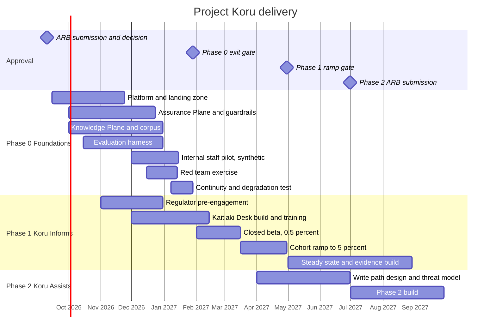
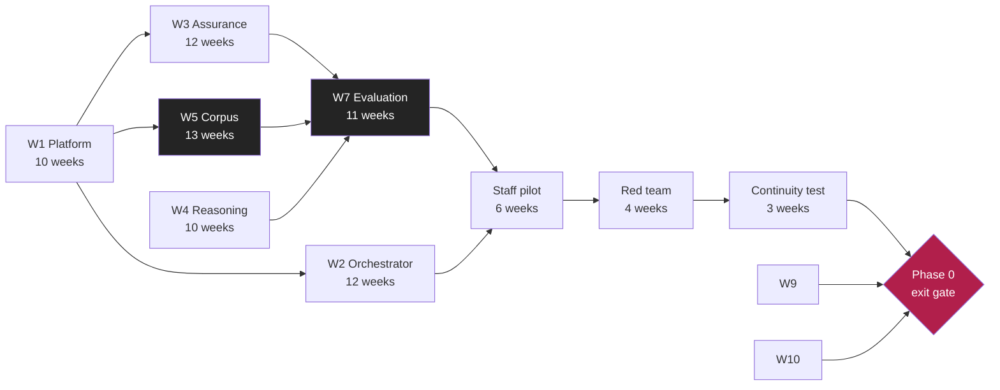

# Roadmap and Delivery Plan

**Document ID:** FB-KORU-600
**Version:** 1.0
**Date:** 27 August 2026
**Owner:** General Manager, Digital Channels
**Status:** Submitted for review

**Related documents:** [ARB submission](../../ARB-SUBMISSION.md) (FB-KORU-001), [Business case](../00-executive/business-case.md) (FB-KORU-011), [Cost model](cost-model.md) (FB-KORU-601), [RAID log](raid-log.md) (FB-KORU-602)

---

## 1. Delivery philosophy

Three principles govern this plan.

**Evidence before capability.** Each phase must produce the evidence that justifies the next. We do not build Phase 3 capability during Phase 1 on the assumption approval will come.

**Gates are real.** A gate that has never stopped anything is a milestone in disguise. Each gate below has explicit, measurable exit criteria and a named accountable owner who can fail it.

**Reversibility over speed.** Where a choice can be deferred cheaply, we defer it. Where it cannot, we make it deliberately and record it as an ADR.

---

## 2. Phase overview

| Phase | Window | Outcome | Gate owner |
|---|---|---|---|
| **Phase 0, Foundations** | Sep 2026 to Jan 2027 | Platform built, guardrails proven, no customer traffic | Chief Architect |
| **Phase 1, Koru Informs** | Feb 2027 to Q4 2027 | Read-only capability live to 5 percent of digitally active customers | GM Digital Channels |
| **Phase 2, Koru Assists** | Q3 2027 onward | Low-risk servicing actions | Requires new ARB submission |
| **Phase 3, Koru Acts** | Q1 2028 onward | Value movement inside limits | Requires new ARB submission |
| **Phase 4, Koru Advises** | Not before 2029 | Guided budgeting and coaching | Requires advice licensing determination |

---

## 3. Phase 0, Foundations

**Window:** 15 September 2026 to 29 January 2027
**Budget:** NZ$5.4m
**Customer exposure:** Nil

### Workstreams

| ID | Workstream | Owner | Key deliverables |
|---|---|---|---|
| **W1** | Platform and landing zone | Head of Infrastructure | Terraform applied to dev and both prod deployments, Azure Policy enforced, private connectivity proven, sovereignty tests passing |
| **W2** | Orchestrator and media | Head of Platform Engineering | WebRTC session establishment, turn taking, barge-in, avatar synthesis, degradation ladder rungs 1 to 4 |
| **W3** | Assurance Plane | Head of Model Risk and CISO jointly | Full inbound and outbound chains, fail-closed behaviour, policy as versioned configuration, Ledger integration |
| **W4** | Reasoning Plane | Head of AI Engineering | Model abstraction layer, routing policy, tool calling with allow-list, prompt lifecycle |
| **W5** | Knowledge Plane and corpus | Head of Product Content | Corpus published with owners and validity windows, ingestion pipeline, hybrid retrieval, citation binding |
| **W6** | Ledger and observability | Head of Data | Immutable Ledger, replay capability, dashboards, alerting, cost observability |
| **W7** | Evaluation harness | Head of Model Risk | Regression suites, golden datasets, scoring pipeline, CI gating, drift detection |
| **W8** | Kaitiaki Desk | Head of Contact Centre | Handoff tooling, context transfer, specialist training, workforce model |
| **W9** | Assurance and regulatory | Head of Compliance | CPS 230 and BS11 uplift, PIA sign-off, contract uplift, regulator pre-engagement |
| **W10** | Experience and accessibility | Head of Customer Experience | Conversation design, disclosure wording, accessibility conformance, community testing |

### Critical path

**The critical path runs through W5 corpus and W7 evaluation, not through the model or the avatar.**

This is the most commonly misunderstood point in the plan. The engineering to make an avatar talk is largely a solved integration problem. The work that determines whether Koru is safe is building an accurate, owned, versioned corpus of product truth, and building an evaluation harness that can prove the system uses it correctly. Both are content and measurement disciplines, not AI engineering, and both are chronically under-resourced in programmes like this.

W5 is resourced accordingly: four full-time product content owners for the duration, not a part-time allocation.

### Phase 0 exit criteria

Every criterion must be met. The gate owner may not waive one without ARB approval.

| # | Criterion | Threshold | Evidence | Maps to |
|---|---|---|---|---|
| G0.1 | Groundedness across the full regression suite | >= 0.95 | Evaluation report signed by Model Risk | ARB C1 |
| G0.2 | Unsafe response rate | <= 0.1 percent | Evaluation report | ARB C1 |
| G0.3 | Refusal accuracy | >= 0.98 | Evaluation report | ARB C1 |
| G0.4 | Independent red team, critical and high findings closed or formally accepted | Zero open critical | Red team report and remediation register | ARB C2 |
| G0.5 | Successful prompt injections reaching a tool call | Zero | Red team report | KORU-R-02 |
| G0.6 | Degradation ladder tested end to end including total AI platform loss | All rungs pass | Continuity test evidence | ARB C3 |
| G0.7 | Basic banking services proven unaffected by total Koru loss | Demonstrated | Continuity test evidence | ARB C3, BS11 |
| G0.8 | Sovereignty controls tested, no cross-Tasman data path | Automated test passing | CI evidence and Azure Policy compliance report | ADR-0003 |
| G0.9 | Latency p95 to first audible word, measured on representative devices and networks | <= 1.2 seconds | Field test report | KORU-R-07 |
| G0.10 | Azure registered as material service provider, contract uplifted, BS11 compendium and separation plan updated | Complete | Legal and Compliance attestation | ARB C4 |
| G0.11 | Privacy impact assessments signed in both jurisdictions | Signed | PIA sign-off | FB-KORU-440 |
| G0.12 | Accessibility conformance assessed, WCAG 2.2 AA, with community testing complete | Report issued | Conformance statement | FB-KORU-103 |
| G0.13 | Kaitiaki Desk staffed and trained to modelled rate plus 100 percent headroom | Staffed | Workforce plan | ARB C7 |
| G0.14 | Regulator pre-engagement letters issued to APRA and RBNZ | Issued | Correspondence record | ARB C6 |
| G0.15 | Runbook validated by an operations dry run, including kill switch | Validated | Dry run report | FB-KORU-504 |

**G0.9 is the criterion most likely to fail.** It is the assumption flagged in the ARB submission as modelled rather than measured. Field testing is scheduled early, in November 2026, specifically so that a failure surfaces with time to respond rather than at the gate.

---

## 4. Phase 1, Koru Informs

**Window:** February 2027 onward
**Budget:** NZ$9.0m over twelve months
**Customer exposure:** Capped, ramped

### Ramp plan

The ramp is deliberately slow and each step has a hold period with defined exit criteria. No step is skipped for commercial reasons.

| Step | Cohort | Duration | Hold criteria to advance |
|---|---|---|---|
| **1.0 Closed beta** | 0.5 percent, opt-in, staff and volunteer customers | 6 weeks | No SEV1 or SEV2. Groundedness holding. Escalation success >= 0.99 |
| **1.1 Limited** | 1 percent, invited | 4 weeks | Complaint rate per 10,000 sessions within tolerance. No systematic error identified |
| **1.2 Expanded** | 2.5 percent | 4 weeks | All above, plus Kaitiaki Desk operating within capacity |
| **1.3 Target** | 5 percent | Steady state | All above sustained for 8 weeks |
| **1.4 Beyond 5 percent** | Requires ARB approval | | Not authorised by this submission |

Each step includes cohort selection that is **deliberately representative**, not skewed to digitally confident customers. A ramp that tests Koru only on the customers who find it easiest tells us nothing about the customers who need it most. Cohort composition is reviewed by the Head of Customer Experience against age, accessibility need, language and rurality distributions.

### Ramp-down triggers

Automatic ramp-down to the previous step occurs on any of:

| Trigger | Action |
|---|---|
| Any SEV1 | Immediate halt, cohort to zero, incident process |
| Groundedness below 0.93 sustained for 4 hours | Automatic ramp-down one step |
| Unsafe response rate above 0.3 percent in any 24 hour window | Automatic ramp-down one step |
| Escalation success below 0.97 | Automatic ramp-down one step |
| Kaitiaki Desk wait time above 8 minutes sustained | Automatic ramp-down one step |
| Complaint rate doubling week on week | Manual review within 24 hours |

Ramp-down is automated where the signal is unambiguous. Ramp-up is always a human decision.

---

## 5. Dependencies

| ID | Dependency | Owner | Needed by | Status | Risk if late |
|---|---|---|---|---|---|
| D1 | Azure New Zealand North capacity for required AI model and speech SKUs | Head of Infrastructure | Oct 2026 | **Open** | Blocks the entire NZ deployment. No workaround consistent with ADR-0003 |
| D2 | Contract uplift with Microsoft to CPS 230 minimum content | Head of Procurement | Dec 2026 | In progress | Blocks Phase 1 entry, ARB C4 |
| D3 | Fern Core read API performance to support the latency budget | Head of Core Banking | Nov 2026 | In progress | Threatens G0.9 |
| D4 | Fern ID passkey rollout to sufficient customer base | Head of Identity | Jan 2027 | On track | Reduces addressable Phase 1 cohort |
| D5 | Product content owners assigned and released from BAU | GM Personal Banking | Sep 2026 | **Open** | Directly on the critical path. The highest-risk dependency in the plan |
| D6 | Kaitiaki Desk recruitment | Head of Contact Centre | Dec 2026 | In progress | Blocks Phase 1 entry, ARB C7 |
| D7 | External legal opinion on the advice boundary, both jurisdictions | General Counsel | Nov 2026 | In progress | Blocks Phase 1 entry, ADR-0011 |
| D8 | Te Ao Māori cultural engagement concluded | Head of Customer Experience | Dec 2026 | In progress | Gates brand launch, FB-KORU-103 |
| D9 | Independent red team vendor engaged | CISO | Nov 2026 | In progress | Blocks Phase 0 exit, ARB C2 |

**D1 and D5 are the two dependencies most likely to move the plan.** D1 is outside Fern Bank's control. D5 is inside our control and is therefore the one we should be most embarrassed to miss.

---

## 6. Governance

| Forum | Cadence | Purpose |
|---|---|---|
| Koru delivery stand-up | Daily | Blockers |
| Koru steering group | Fortnightly | Progress, risk, decisions within delegation |
| Architecture Review Board | At each gate, plus on any ARB C9 change | Design authority |
| Model Risk Committee | Monthly | Model performance, validation, drift |
| Technology and Operational Risk Committee | Monthly | Assurance report per ARB C8 |
| Board Risk Committee | Quarterly, plus on any SEV1 | Oversight, KORU-R-03 acceptance |

### Change control

Per ARB condition C9, the following return to the ARB regardless of delivery pressure:

- Any expansion of the tool scope
- Any model change to a different model family
- Any change to the groundedness threshold, citation requirement or numeric verification rule
- Any change to the refusal policy
- Any change to the disclosure framework
- Any cohort expansion beyond 5 percent
- Any change to the jurisdictional isolation position

---

## 7. Team

| Role | Phase 0 FTE | Phase 1 FTE |
|---|---|---|
| Programme and delivery management | 2.0 | 2.0 |
| Platform and infrastructure engineering | 4.0 | 2.5 |
| Application engineering | 8.0 | 6.0 |
| AI engineering | 4.0 | 3.0 |
| **Product content ownership** | **4.0** | **4.0** |
| Model risk and evaluation | 3.0 | 3.0 |
| Security engineering | 2.0 | 1.5 |
| Experience design and research | 3.0 | 2.0 |
| Accessibility specialist | 1.0 | 0.5 |
| Compliance, privacy and legal | 2.5 | 2.0 |
| Data engineering | 2.0 | 1.5 |
| Site reliability | 1.5 | 2.5 |
| Kaitiaki Desk specialists | 0 | 14.0 |
| **Total** | **37.0** | **44.5** |

Product content ownership stays at 4.0 FTE into Phase 1 rather than tapering. The corpus is not a build artefact that is finished, it is a living asset whose decay is a named risk (KORU-R-08).

---

## 8. What would cause us to stop

Stated plainly, because a roadmap without a stop condition is a commitment device rather than a plan.

| Condition | Action |
|---|---|
| Phase 0 exit criteria G0.1, G0.2 or G0.5 cannot be met after remediation | Stop. Reassess whether the capability is achievable at acceptable risk |
| Latency (G0.9) cannot be achieved on representative devices | Descend to the Option B text-only assistant. The architecture supports this without redesign |
| Azure New Zealand North capacity (D1) unavailable and no in-jurisdiction alternative exists | New Zealand deployment deferred. Australia may proceed independently |
| A SEV1 conduct incident in Phase 1 with systematic root cause | Halt, full review, return to ARB before any resumption |
| Escalation rate materially above 25 percent with no path to improvement | Reassess the business case. The economics do not work |
| Regulator objection in either jurisdiction | Halt in that jurisdiction pending resolution |

Stopping is an acceptable outcome. The purpose of the phased design is to make stopping cheap and early rather than expensive and late.

---

## 9. Reality disclaimer

Fern Bank is a fictional institution and this plan is illustrative, exercise-grade material for architecture review practice. Dates, costs and dependencies are constructed for the exercise. See the [programme canon](../programme-canon.md#9-reality-disclaimer).
