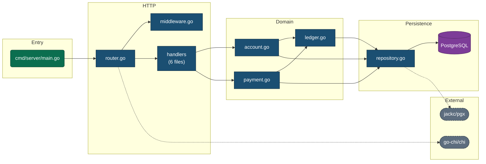

# Skill: Code to Mermaid

**Author:** Isuru Fernando, [@fyzziwizzy](https://github.com/fyzziwizzy)
**Version:** 1.0.0

**Purpose:** Turn a folder of source code into an accurate, readable Mermaid diagram plus a short written summary, saved as a Markdown artifact.

**Trigger:** The user names or points at a source folder and asks for a diagram, a map, an architecture view, or a visualisation.

---

## Part 0: Non negotiable rules

1. **Read before you draw.** Never generate a diagram from the folder name, the README, or assumption. Every node and every edge must trace back to something you actually read in the source.
2. **Never invent edges.** If you cannot find an import, a call, or a config reference that justifies an arrow, do not draw the arrow.
3. **Readability beats completeness.** A diagram nobody can read has zero value. Collapse before you clutter. See Part 5.
4. **Always validate the Mermaid syntax** before presenting it. See Part 7.
5. **State your confidence.** If parts of the codebase were skipped, unreadable, or too large to fully parse, say so explicitly in the summary.

---

## Part 1: Resolve the target folder

1. If the user gave a path, use it. Resolve it to an absolute path.
2. If the user said "this folder" or gave nothing, use the current working directory.
3. Confirm the folder exists and contains source files. If it does not, stop and ask.
4. Report back the resolved absolute path before scanning, so the user can correct you early.

---

## Part 2: Scan the folder

### Always exclude

Skip these directories entirely. They generate enormous noise and tell you nothing about the author's design:

```
.git  .svn  .hg
node_modules  bower_components  jspm_packages
venv  .venv  env  __pycache__  .pytest_cache  .mypy_cache  .tox  site-packages
dist  build  out  target  bin  obj  .next  .nuxt  .output  .parcel-cache
vendor  Pods  Carthage
coverage  .nyc_output
.idea  .vscode  .vs  .gradle  .terraform
*.min.js  *.min.css  *.map  *.lock  *.snap
```

Also skip any path matched by `.gitignore` if one is present.

### Establish scale first

Before reading file contents, count the files and total size. Then choose your approach:

| Scale | Approach |
| :--- | :--- |
| Under 40 source files | Read every file. Full fidelity. |
| 40 to 200 source files | Read all entry points, config, and manifests in full. For the rest, read imports and top level declarations only. |
| 200 to 1000 source files | Work at directory or package level, not file level. Read manifests and entry points fully. Sample representative files per package. |
| Over 1000 source files | Diagram top level architecture only. Tell the user the codebase is large and offer to drill into a named subsystem afterwards. |

### What to read, in order

1. **Manifests and build files.** These declare intent and real dependencies:
   `package.json`, `pyproject.toml`, `requirements.txt`, `setup.py`, `go.mod`, `Cargo.toml`, `pom.xml`, `build.gradle`, `*.csproj`, `*.sln`, `Gemfile`, `composer.json`, `Makefile`, `Dockerfile`, `docker-compose.yml`
2. **Entry points.** Where execution begins:
   `main.*`, `index.*`, `app.*`, `server.*`, `Program.cs`, `Startup.cs`, `__main__.py`, `cmd/*/main.go`, plus anything named in `package.json` under `main`, `bin`, or `scripts.start`
3. **Routing and wiring.** Route tables, dependency injection registration, plugin registries, event bus subscriptions. These reveal edges that plain imports miss.
4. **Source files.** For dependency extraction, see the table below.
5. **Schema and data.** Migrations, ORM models, `.sql`, `.proto`, `.graphql`, OpenAPI specs.

### Dependency extraction by language

| Language | Look for |
| :--- | :--- |
| JavaScript, TypeScript | `import ... from '...'`, `export ... from '...'`, `require('...')`, dynamic `import('...')` |
| Python | `import x`, `from x import y`, `importlib.import_module` |
| C# | `using X.Y;`, namespace declarations, `ProjectReference` in `.csproj` |
| Java, Kotlin | `package`, `import x.y.Z;`, Gradle or Maven module deps |
| Go | `import ( ... )`, module path in `go.mod`, package clause |
| Rust | `mod x;`, `use crate::x`, `[dependencies]` in `Cargo.toml` |
| Ruby | `require`, `require_relative`, `Bundler` groups |
| PHP | `use X\Y;`, `require_once`, `composer.json` autoload |
| SQL | `FOREIGN KEY`, `REFERENCES`, `JOIN` targets |

Classify every dependency as **internal** (resolves inside the scanned folder) or **external** (a third party package). Draw internal edges as solid. Draw external dependencies only when they matter architecturally, for example a database driver, an HTTP framework, or a cloud SDK, and group them into a single `External` subgraph.

---

## Part 3: Choose the diagram type

Pick based on what the code actually is, not on habit.

| Codebase shape | Diagram type | Mermaid header |
| :--- | :--- | :--- |
| Modules or packages importing each other (the default) | Dependency graph | `flowchart LR` |
| Deep folder nesting where layout is the story | Structure tree | `flowchart TD` with `subgraph` per folder |
| Strongly object oriented, inheritance and interfaces matter | Class diagram | `classDiagram` |
| A request or job flows through stages | Sequence diagram | `sequenceDiagram` |
| Database schema, ORM models, migrations | Entity relationship | `erDiagram` |
| Explicit state machine, workflow, or status field | State diagram | `stateDiagram-v2` |
| Services, queues, and datastores talking over a network | Service map | `flowchart LR` with subgraphs per tier |

If two views are genuinely needed, produce two diagrams in the one artifact. Do not force unrelated concerns into a single diagram.

**Direction:** use `LR` when there are more than about 12 nodes, since wide reads better than tall on a screen. Use `TD` for shallow trees and layered architectures.

---

## Part 4: Mermaid syntax rules

These are the failure modes that break real diagrams. Follow them exactly.

### Node identifiers

* Use only letters, digits, and underscores. Convert `src/api/user-service.ts` to `src_api_user_service`.
* Never start an identifier with a digit. Prefix with `n_` if needed.
* **Never use these as bare identifiers:** `end`, `graph`, `subgraph`, `class`, `classDef`, `click`, `style`, `linkStyle`, `direction`, `flowchart`. Lowercase `end` in particular will silently break the whole diagram.
* Keep identifiers stable and unique. Maintain a map from real path to identifier so edges stay consistent.

### Labels

* **Always wrap labels in double quotes.** `A["src/api/user.ts"]` not `A[src/api/user.ts]`. This makes slashes, dots, parentheses, commas, and colons safe.
* For a double quote inside a label, use `#quot;`. For other awkward characters use their HTML entity.
* Keep labels short. Show the file or module name, not the full path. Put the full path in the accompanying legend instead.
* Multi line labels use `<br/>`.

### Edges

* Solid dependency: `A --> B`
* Labelled: `A -->|"calls"| B`
* Weak, optional, or dynamic dependency: `A -.-> B`
* Inheritance or implementation in a flowchart: `A ==> B`
* Do not label every edge. Label only where the relationship is not obvious.

### Shapes, used consistently

| Shape | Syntax | Use for |
| :--- | :--- | :--- |
| Rectangle | `A["Name"]` | Ordinary module or file |
| Rounded | `A("Name")` | Entry point |
| Stadium | `A(["Name"])` | External service or third party package |
| Cylinder | `A[("Name")]` | Datastore, database, cache |
| Hexagon | `A{{"Name"}}` | Configuration or environment |
| Diamond | `A{"Name"}` | Branch or decision point |

### Subgraphs

```
subgraph api["API Layer"]
  direction TB
  a1["routes.ts"]
  a2["handlers.ts"]
end
```

Give every subgraph an explicit identifier and a quoted title. Never nest more than three deep.

### Styling

Apply a small, consistent palette using `classDef`. Do not colour every node individually.

```
classDef entry fill:#0B6E4F,stroke:#083D2C,color:#ffffff
classDef core fill:#1B4F72,stroke:#0E2A3D,color:#ffffff
classDef ext fill:#5D6D7E,stroke:#333F48,color:#ffffff,stroke-dasharray:4 3
classDef data fill:#7D3C98,stroke:#4A235A,color:#ffffff

class main entry
class svc_user,svc_auth core
class db_main data
```

---

## Part 5: Keep it readable

Hard limits. If you exceed one, collapse rather than ship a hairball.

| Limit | Threshold | Action when exceeded |
| :--- | :--- | :--- |
| Nodes | 50 | Collapse leaf files into their parent folder node. Annotate with a count, for example `"handlers<br/>(12 files)"`. |
| Edges | 90 | Drop external and utility edges first, then transitive edges already implied by a path. |
| Subgraph depth | 3 | Flatten the deepest level. |
| Label length | 28 characters | Truncate and record the full name in the legend. |

**Collapsing rules**

* Collapse a folder into one node when every file in it has the same set of outbound dependencies.
* Collapse utility and helper modules that almost everything imports into a single node, and note that it is widely referenced instead of drawing 30 arrows into it.
* Never collapse an entry point. It is the reader's way in.
* When you collapse anything, say so in the summary. Silent omission is misleading.

---

## Part 6: Produce the artifact

Write a Markdown file. Default name `ARCHITECTURE.md`, default location the scanned folder root. If that file already exists, do not overwrite it: write `ARCHITECTURE.generated.md` and tell the user.

Structure the artifact exactly like this:

1. **Title and scope.** What folder was scanned, when, how many files were read, and what was excluded.
2. **Summary.** Three to six sentences in plain language. What the codebase does, how it is organised, where execution begins.
3. **The diagram**, inside a `mermaid` fenced code block.
4. **Legend.** Table mapping every diagram node to its real path and a one line description of its responsibility.
5. **Observations.** Anything a reader would want flagged: circular dependencies, a module everything depends on, an orphaned file nothing imports, a layer being bypassed, a folder with no tests.
6. **Coverage note.** What was skipped or collapsed, and why.

### Worked example of the diagram section



---

## Part 7: Validate before presenting

Run through this checklist every time. Do not skip it.

1. No bare `end`, `class`, `graph`, `style`, `subgraph`, `direction`, or `click` used as a node identifier.
2. Every `subgraph` has a matching `end`.
3. Every label is wrapped in double quotes.
4. Every node referenced in an edge is defined, or is defined implicitly by that edge and only that edge.
5. No duplicate node identifiers with conflicting labels.
6. Every identifier in a `class` statement exists.
7. Node and edge counts are within the Part 5 limits.
8. The diagram opens with a valid header: `flowchart`, `classDiagram`, `sequenceDiagram`, `erDiagram`, or `stateDiagram-v2`.

**Optional machine check.** If Node is available, validate and render:

```
npx -y @mermaid-js/mermaid-cli -i ARCHITECTURE.md -o architecture.png
```

If this succeeds, mention that the diagram was rendered and where the PNG is. If the tool is not installed, do not install it and do not block on it. Fall back to the manual checklist.

---

## Part 8: Present to the user

1. Render the diagram inline in chat so it is visible immediately.
2. Give the path to the saved artifact.
3. Give the three sentence summary.
4. Flag anything notable, especially circular dependencies and orphaned modules.
5. Offer the obvious next steps: drill into a subsystem, switch diagram type, render to PNG, or add the artifact to the repository.

---

## Part 9: Failure handling

| Situation | What to do |
| :--- | :--- |
| Folder is empty or has no recognised source files | Stop. Report what file types were found and ask the user to confirm the path. |
| Language is unfamiliar | Fall back to a folder structure diagram based on layout and file names. Say clearly that dependencies were not extracted. |
| Codebase is enormous | Diagram the top level, report the size, and offer to drill into a named subsystem. |
| Mermaid validation keeps failing | Simplify aggressively: strip styling, strip subgraphs, reduce to nodes and edges only. Ship something correct rather than something ambitious and broken. |
| Circular dependency found | Draw it. Do not silently break the cycle. Highlight it in Observations, since it is usually the most useful thing in the diagram. |
| Files cannot be read due to permissions or encoding | Continue with the rest, and list the unreadable files in the coverage note. |

---

## Part 10: Quality bar

The diagram is good enough to ship when a developer who has never seen the codebase can look at it for thirty seconds and correctly answer:

1. Where does execution start?
2. What are the major parts, and what is each one responsible for?
3. Which parts depend on which?
4. Where does data get stored?
5. Where would I go to change behaviour X?

If the diagram cannot answer all five, it is not finished.

---

## Author

**Isuru Fernando**
[github.com/fyzziwizzy](https://github.com/fyzziwizzy)

Version 1.0.0, first published 26 August 2026.
Contributions and issues welcome via the repository this skill ships in.
